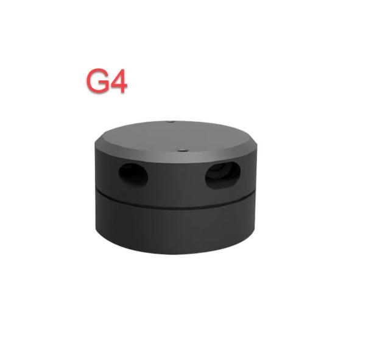

# 3. ROS2-Lidar Course

## 3.1 Lidar Introduction

### 3.1.1 Preface

Lidar, a high-precision and high-speed remote sensing technology, is pivotal in numerous domains, including map creation, autonomous driving, environmental perception, and robot navigation. This document provides an overview of Lidar's principles, components, working mechanisms, application areas, advantages, and development trends.

In autonomous driving and intelligent transportation, Lidar assumes a critical role by offering real-time perception of obstacles, pedestrians, and vehicles on the road, providing precise distance and location information. In robot navigation and environmental perception, Lidar contributes by furnishing accurate maps and information about the surrounding environment. Furthermore, Lidar finds extensive applications in areas such as 3D modeling, map creation, safety monitoring, and remote sensing mapping.


### 3.1.2 Lidar Composition and Classification

Lidar is composed of essential components such as a laser emitter, receiver, photodetector, scanning mechanism, and angle resolver. The laser emitter produces laser beams, while the receiver and photodetector capture reflected light signals. The scanning mechanism is responsible for surveying the surrounding environment, and the angle resolver assists in determining the position of target objects.

Lidar can be categorized into various types based on the scanning method:

**Rotating Lidar**: Achieves omnidirectional scanning horizontally by rotating the emitter or scanning mechanism. Known for high scanning speed and measurement accuracy, it is widely applied in areas such as autonomous driving, 3D environmental modeling, and map creation.

**Solid-State Lidar**: Utilizes solid-state laser emitters, eliminating the need for rotating components. Compact, lightweight, and energy-efficient, solid-state lidar is suitable for applications like mobile devices, drones, and robots.

**Mechanical Lidar**: Employs mechanical components like rotating mirrors or prisms for laser beam scanning. Although offering longer measurement distances and higher accuracy, mechanical lidar tends to have slower scanning speeds. It is commonly used in terrain measurement, building scanning, and navigation.

**Phase-Modulated Lidar**: Measures the distance between target objects and the lidar by altering the phase of the laser beam. Known for high measurement accuracy and a large measurement range, phase-modulated lidar is extensively used in map creation, surveying, and industrial applications.

**Flash Lidar**: Utilizes brief, high-power laser pulses to illuminate the entire scene simultaneously. It captures reflected light signals through an array of receivers, making it suitable for high-speed and high-resolution applications, including rapid scene capture and motion tracking.

###  3.1.3 Switch Lidar Version

Multiple LiDAR sensors, including models like the A1 and G4, are compatible with the robot. To check the current LiDAR model or switch to a different one, follow these steps (applicable to all JetAuto series robots):

(1) Confirm the robot's Lidar version. As shown below, the left image is the A1 Lidar, and the right image is the G4 Lidar.

<p class="common_img" style="text-align:center;">




</p>

(2) Start the robot, and connect it to NoMachine according to the instructions provided in [**1. Quick Start Guide(JetAuto User Manual) ->1.6 Development Environment Setup and Configuration**](1.quick_start_guide.md#development-environment-setup-and-configuration).


(3) After successful connection, double-click .


(4) Click-on Lidar TAB, and select "**G4**", then click-on "**Save**" and "**Apply**" in sequence.


(5) A pop-up window like the one below will appear. The robot's auto-start service will restart, and the LiDAR model will be configured based on the selected option.


(6) After the system completes a restart, click-on "**Quit**" icon.


(7) Finally, click-on  to confirm the Lidar version.


## 3.2 Lidar Working and Ranging Principle

###  3.2.1 Lidar Ranging

Two common methods are employed by Lidar to determine the distance to a target: triangulation and Time of Flight (TOF).

In the case of TOF, as depicted in the diagram, the Lidar initially projects light onto the object. The object reflects the light directly back to the Lidar, which calculates the time it takes for the light to return. The distance between the object and the Lidar is then obtained by multiplying this time by the speed of light.


In triangulation, as illustrated in the diagram, the Lidar undergoes adjustments during manufacturing to ensure that the light does not directly strike the object. Instead, it is projected at a specific angle, a pre-set value that remains constant during operation. The distance from the object to the Lidar can be calculated by incorporating this angle into trigonometric functions.


### 3.2.2 Lidar Working Result

Its working result is as follows. Lidar will emit light and shine it on the object surface. When receiving the light reflected by the object, Lidar will mark the contour of the object at the position where the light is reflected.


## 3.3 Lidar Obstacle Avoidance

The robot senses the distance between itself and an object directly in front of it. Depending on the configured distance, the robot will either turn left or right to avoid obstacles. If no obstacles are detected, it will proceed to move forward.

This game can be activated in two ways: either through a mobile app or by issuing commands after establishing a remote connection to the system.

For instructions on app connection, please consult the tutorial located in [**1.Quick Start Guide(JetAuto User Manual)->1.5 APP Control**](1.quick_start_guide.md#app-control)

(1) Start the robot, and access the robot system desktop using NoMachine.

(2) Click-on  to initiate the command-line terminal.

(3) Execute the command and press Enter to deactivate the automatic start service for the app.

```bash
sudo systemctl stop start_app_node.service
```

(4) Next, type the command and press Enter to activate the robot's auto-start program.

```bash
ros2 launch app lidar_node.launch.py debug:=true
```

(5) Open a new terminal, and execute the command, then press Enter to start the Lidar game.

```bash
ros2 service call /lidar_app/enter std_srvs/srv/Trigger {}
```


(6) Enter the command and hit Enter to launch Lidar obstacle avoidance game.

```bash
ros2 service call /lidar_app/set_running interfaces/srv/SetInt64 "{data: 1}"
```

(7) To stop the current function, enter the command in the terminal and press Enter to execute it.

```bash
ros2 service call /lidar_app/set_running interfaces/srv/SetInt64 "{data: 0}"
```

(8) To exit the game mode, simply press "**Ctrl+C**" in the terminal interface at step (4) or (5).

### 3.3.1 Lidar Following

The robot will detect the distance between itself and objects directly in front of it. If the distance is too close to an obstacle, it will perform a turning maneuver to avoid it.

This game can be activated in two ways: either through a mobile app or by issuing commands after establishing a remote connection to the system.

For instructions on app connection, please consult the tutorial located in [**1.Quick Start Guide(JetAuto User Manual)->1.5 APP Control**](1.quick_start_guide.md#app-control)

(1) Start the robot, and access the robot system desktop using NoMachine.

(2) Click-on  to initiate the command line terminal.

(3) Execute the command and press Enter to deactivate the automatic start service for the app.

```bash
~/.stop_ros.sh
```

(4) Run the command to enable the local services for app-related game and chassis control services.

```bash
ros2 launch app lidar_node.launch.py debug:=true
```

(5) Open a new command-line terminal, and execute the command, then press Enter to start the Lidar game.

```bash
ros2 service call /lidar_app/enter std_srvs/srv/Trigger {}
```


(6) Enter the command and hit Enter to launch Lidar following game.

```bash
ros2 service call /lidar_app/set_running interfaces/srv/SetInt64 "{data: 2}"
```

(7) To stop the current function, just type the command in the terminal and press Enter to execute it.

```bash
ros2 service call /lidar_app/set_running interfaces/srv/SetInt64 "{data: 0}"
```

(8) To stop the process, simply press '**Ctrl+C**' in the terminal window from steps 4) or 5).

### 3.3.2 Lidar Guarding

The robot assesses the distance between itself and an object directly in front. If an object is detected within the configured distance, it will initiate a turn to ensure that the vehicle consistently faces the object.

This game can be activated through two methods: either via a mobile app or by issuing commands after establishing a remote connection to the system.

For instructions on app connection, please consult the tutorial located in [1.Quick Start Guide(JetAuto User Manual)->1.5 APP Control](1.quick_start_guide.md#app-control)

(1) Start the robot, and access the robot system desktop using NoMachine.

(2) Click-on  to open the command line terminal.

(3) Execute the command and press Enter to deactivate the automatic start service for the app.

```bash
sudo systemctl stop start_app_node.service
```

(4) Run the command to enable the local services for app-related game and chassis control services.

```bash
ros2 launch app lidar_node.launch.py debug:=true
```

(5) Open a new ROS2 terminal, and execute the command, then press Enter to start the Lidar game.

```bash
ros2 service call /lidar_app/enter std_srvs/srv/Trigger {}
```


(6) Enter the command and hit Enter to launch Lidar guarding game.

```bash
ros2 service call /lidar_app/set_running interfaces/srv/SetInt64 "{data: 3}"
```

(7) To stop the current function, type the command in the terminal and press Enter.

```bash
ros2 service call /lidar_app/set_running interfaces/srv/SetInt64 "{data: 0}"
```

(8) To exit the game mode, simply press **"Ctrl+C"** in the terminal interface at step (4) or (5).