# 7. ROS2+Machine Learning Courses

## 7.1 Machine Learning Fundamentals

### 7.1.1 Machine Learning Introduction

* **What "Machine Learning" is**

Machine Learning forms the cornerstone of artificial intelligence, serving as the fundamental approach to endow machines with intelligence. It spans multiple interdisciplinary fields such as probability theory, statistics, approximation theory, convex analysis, and algorithm complexity theory.


In essence, machine learning explores how computers can acquire new knowledge or skills by mimicking human learning behaviors and continuously enhancing their performance by reorganizing existing knowledge structures. Practically, it entails utilizing data to train models and leveraging these models for predictions.

For instance, consider AlphaGo, the pioneering artificial intelligence system that triumphed over human professional Go players and even world champions. AlphaGo operates on the principles of deep learning, wherein it discerns the intrinsic laws and representation layers within sample data to extract meaningful insights.

* **Types of Machine Learning**

Machine learning can be broadly categorized into two types: supervised learning and unsupervised learning. The key distinction between these two types lies in whether the machine learning algorithm has prior knowledge of the classification and structure of the dataset.

(1) Supervised Learning

Supervised learning involves providing a labeled dataset to the algorithm, where the correct answers are known. The machine learning algorithm uses this dataset to learn how to compute the correct answers. It is the most commonly used type of machine learning.

For instance, in image recognition, a large dataset of dog pictures can be provided, with each picture labeled as "**dog**". This labeled dataset serves as the "**correct answer**". By learning from this dataset, the machine can develop the ability to recognize dogs in new images.


Model Selection: In supervised learning, selecting the right model to represent the data relationship is crucial. Common supervised learning models encompass linear regression, logistic regression, decision trees, support vector machines (SVM), and deep neural networks. The choice of model hinges on the data's characteristics and the problem's nature.

Feature Engineering: Feature engineering involves preprocessing and transforming raw data to extract valuable features. This encompasses tasks like data cleaning, handling missing values, normalization or standardization, feature selection, and feature transformation. Effective feature engineering can significantly enhance model performance and generalization capabilities.

Training and Optimization: Leveraging labeled training data, we can train the model to capture the data relationship. Training typically involves defining a loss function, selecting an appropriate optimization algorithm, and iteratively adjusting model parameters to minimize the loss function. Common optimization algorithms include gradient descent and stochastic gradient descent.

Model Evaluation: Upon completing training, evaluating the model's performance on new data is essential. Standard evaluation metrics include accuracy, precision, recall, F1 score, and ROC curve. Assessing a model's performance enables us to gauge its suitability for practical applications.

In summary, supervised learning entails utilizing labeled training data to train a model for predicting or classifying new unlabeled data. Key steps encompass selecting an appropriate model, conducting feature engineering, training and optimizing the model, and evaluating its performance. Together, these components constitute the foundational elements of supervised learning.

(2) Unsupervised Learning

Unsupervised learning involves providing an unlabeled dataset to the algorithm, where the correct answers are unknown. In this type of machine learning, the machine must mine potential structural relationships within the dataset.

For instance, in image classification, a large dataset of cat and dog pictures can be provided without any labels. Through unsupervised learning, the machine can learn to divide the pictures into two categories: cat pictures and dog pictures.


### 7.1.2 Common Type of Machine Learning Framework

There are a large variety of machine learning frameworks. Among them, PyTorch, Tensorflow, MXNet and paddlepaddle are common.

* **PyTorch**

PyTorch is a powerful open-source machine learning framework, originally based on the BSD License Torch framework. It supports advanced multidimensional array operations and is widely used in the field of machine learning. PyTorch, built on top of Torch, offers even greater flexibility and functionality. One of its most distinguishing features is its support for dynamic computational graphs and its Python interface.

In contrast to TensorFlow's static computation graph, PyTorch's computation graph is dynamic. This allows for real-time modifications to the graph as computational needs change. Additionally, PyTorch enables developers to accelerate tensor calculations using GPUs, create dynamic computational graphs, and automatically calculate gradients. This makes PyTorch an ideal choice for machine learning tasks that require flexibility, speed, and powerful computing capabilities.


* **Tensorflow**

TensorFlow is a powerful open-source machine learning framework that allows users to quickly construct neural networks and train, evaluate, and save them. It provides an easy and efficient way to implement machine learning and deep learning concepts. TensorFlow combines computational algebra with optimization techniques to make the calculation of many mathematical expressions easier.

One of TensorFlow's key strengths is its ability to run on machines of varying sizes and types, including supercomputers, embedded systems, and everything in between. TensorFlow can also utilize both CPU and GPU computing resources, making it an extremely versatile platform. When it comes to industrial deployment, TensorFlow is often the most suitable machine learning framework due to its robustness and reliability. In other words, TensorFlow is an excellent choice for deploying machine learning applications in a production environment.

* **PaddlePaddle**

PaddlePaddle is a cutting-edge deep learning framework developed by Baidu, which integrates years of research and practical experience in deep learning. PaddlePaddle offers a comprehensive set of features, including training and inference frameworks, model libraries, end-to-end development kits, and a variety of useful tool components. It is the first open-source, industry-level deep learning platform to be developed in China, offering rich and powerful features to developers worldwide.

Deep learning has proven to be a powerful tool in many machine learning applications in recent years. From image recognition and speech recognition to natural language processing, robotics, online advertising, automatic medical diagnosis, and finance, deep learning has revolutionized the way we approach these fields. With PaddlePaddle, developers can harness the power of deep learning to create innovative and cutting-edge applications that meet the needs of users and businesses alike.


* **MXNet**

MXNet is a top-tier deep learning framework that supports multiple programming languages, including Python, C++, Scala, R, and more. It features a dataflow graph similar to other leading frameworks like TensorFlow and Theano, as well as advanced features such as robust multi-GPU support and high-level model building blocks comparable to Lasagne and Blocks. MXNet can run on virtually any hardware, including mobile phones, making it a versatile choice for developers.


MXNet is specifically designed for efficiency and flexibility, with accelerated libraries that enable developers to leverage the full power of GPUs and cloud computing. It also supports distributed computing across dynamic cloud architectures via distributed parameter servers, achieving near-linear scaling with multiple GPUs/CPUs. Whether you're working on a small-scale project or a large-scale deep learning application, MXNet provides the tools and support you need to succeed.

<p id="anchor_7_2"></p>

##  7.2 Machine Learning Application

### 7.2.1 GPU Acceleration

* **GPU Accelerated Computing**

A graphics processing unit (GPU) is a specialized micro processor used to process image in personal computers, workstations, game consoles and mobile devices (phone and tablet). Similar to CPU, but CPU is designed to implement complex mathematical and geometric calculations which are essential for graphics rendering.
GPU-accelerated computing is the employment of a graphics processing unit (GPU) along with a computer processing unit (CPU) in order to accelerate science, analytics, engineering, consumer and cooperation applications. Moreover, GPU can facilitate the applications on various platforms, including vehicles, phones, tablets, drones and robots.

* **Comparison between GPU and CPU**

The main difference between CPU and GPU is how they handle the tasks. CPU consists of several cores optimized for sequential processing. While GPU owns a large parallel computing architecture composed of thousands of smaller and more effective cores tailored for multitasking simultaneously.

GPU stands out for thousands of cores and large amount of high-speed memory, and is initially intended for processing game and computer image. It is adept at parallel computing which is ideal for image processing, because the pixels are relatively independent. And the GPU provides a large number of cores to perform parallel processing on multiple pixels at the same time, but it only improves throughput without alleviating the delay. For example, when receives one message, it will use only one core to tackle this message although it has thousands of cores. GPU cores are usually employed to complete operations related to image processing, which is not universal as CPU.

* **Advantage of GPU**

GPU is excellent in massive parallel operations, hence it has an important role in deep learning. Deep learning relies on neural network that is utilized to analyze massive data at high speed.

For example, if you want to let this network recognize the cat, you need to show it lots of the pictures of cats. And that is the forte of GPU. Besides, GPU consumes less resources than CPU.

### 7.2.2  TensorRT Acceleration

* **TensorRT Introduction**

 TensorRT is a high-performance deep learning inference, includes a deep learning inference optimizer and runtime that delivers low latency and high throughput for inference applications. It is deployed to hyperscale data centers, embedded platforms, or automotive product platforms to accelerate the inference. 

TensoRT supports almost all deep learning frameworks, such as TensorFlow, Caffe, Mxnet and Pytorch. Combing with new NVIDIA GPU, TensorRT can realize swift and effective deployment and inference on almost all frameworks. 

To accelerate deployment inference, multiple methods to optimize the models are proposed, such as model compression, pruning, quantization and knowledge distillation. And we can use the above methods to optimize the models during training, however TensorRT optimize the trained models. It improves the model efficiency through optimizing the network computation graph.  

After the network is trained, you can directly put the model training file into tensorRT without relying on deep learning framework.

* **Optimization Methods**


TensorRT has the following optimization strategies:

① Precision Calibration

② Layer & Tensor Fusion

③ Kernel Auto-Tuning

④ Dynamic Tenser Memory

⑤ Multi-Stream Execution

(1) Precision Calibration

In the training phase of neural networks across most deep learning frameworks, network tensors commonly employ 32-bit floating-point precision (FP32). Following training, since backward propagation is unnecessary during deployment inference, there is an opportunity to judiciously decrease data precision, for instance, by transitioning to FP16 or INT8. This reduction in data precision has the potential to diminish memory usage and latency, leading to a more compact model size.

The table below provides an overview of the dynamic range for different precision:

| Precision |     Dynamic Range     |
| :-------: | :-------------------: |
|   FP32    | −3.4×1038 ~ +3.4×1038 |
|   FP16    |   −65504 ~- +65504    |
|   INT8    |      −128 ~ +127      |

INT8 is limited to 256 distinct numerical values. When INT8 is employed to represent values with FP32 precision, information loss is certain, resulting in a decline in performance. Nevertheless, TensorRT provides a fully automated calibration process to optimally align performance by converting FP32 precision data to INT8 precision, thereby minimizing performance loss.

(2) Layer & Tensor Fusion

While CUDA cores efficiently compute tensor operations, a significant amount of time is still spent on the initialization of CUDA cores and read/write operations for each layer's input/output tensors. This results in GPU resource wastage and creates a bottleneck in memory bandwidth.

TensorRT optimizes the model structure by horizontally or vertically merging layers, reducing the number of layers and consequently decreasing the required CUDA core count, achieving structural optimization.

Horizontal merging combines convolution, bias, and activation layers into a unified CBR structure, utilizing only one CUDA core. Vertical merging consolidates layers with identical structures but different weights into a broader layer, also using only one CUDA core.

Moreover, in cases of multi-branch merging, TensorRT can eliminate concat layers by directing layer outputs to the correct memory address without copying, thereby reducing memory access frequency.

(3) Kernel Auto-Tuning

During the inference calculation process, the neural network model utilizes the GPU's CUDA cores for computation. TensorRT can adjust the CUDA cores based on different algorithms, network models, and GPU platforms, ensuring that the current model can perform computational operations with optimal performance on specific platforms.

(4) Dynamic Tenser Memory

During the utilization of each Tensor, TensorRT allocates dedicated GPU memory to prevent redundant memory requests, thereby reducing memory consumption and enhancing the efficiency of memory reuse.

(5) Multi-Stream Execution

By leveraging CUDA Streams, parallel computation is achieved for multiple branches of the same input, maximizing the potential for parallel operations.

### 7.2.3 Yolov5 Model

* **Yolo Model Series Introduction**

(1) YOLO Series

YOLO (You Only Look Once) is an one-stage regression algorithm based on deep learning.

R-CNN series algorithm dominates target detection domain before YOLOv1 is released. It has higher detection accuracy, but cannot achieve real-time detection due to its limited detection speed engendered by its two-stage network structure.

To tackle this problem, YOLO is released. Its core idea is to redefine target detection as a regression problem, use the entire image as network input, and directly return position and category of Bounding Box at output layer. Compared with traditional methods for target detection, it distinguishes itself in high detection speed and high average accuracy.

(2) YOLOv5

YOLOv5 is an optimized version based on previous YOLO models, whose detection speed and accuracy is greatly improved.

In general, a target detection algorithm is divided into 4 modules, namely input end, reference network, Neck network and Head output end. The following analysis of improvements in YOLOv5 rests on these four modules.

① Input end: YOLOv5 employs Mosaic data enhancement method to increase model training speed and network accuracy at the stage of model training. Meanwhile, adaptive anchor box calculation and adaptive image scaling methods are proposed.

② Reference network: Focus structure and CPS structure are introduced in YOLOv5.

③ Neck network: same as YOLOv4, Neck network of YOLOv5 adopts FPN+PAN structure, but they differ in implementation details.

④ Head output layer: YOLOv5 inherits anchor box mechanism of output layer from YOLOv4. The main improvement is that loss function GIOU_Loss, and DIOU_nms for prediction box screening are adopted.

* **YOLOv5 Model Structure**

(1) Component

① Convolution layer: extract features of the image

Convolution refers to the effect of a phenomenon, action or process that occurs repeatedly over time, impacting the current state of things. Convolution can be divided into two components: "**volume**" and "**accumulation**". "**Volume**" involves data flipping, while "**accumulation**" refers to the accumulation of the influence of past data on current data. Flipping the data helps to establish the relationships between data points, providing a reference for calculating the influence of past data on the current data.


In YOLOv5, the data being processed is typically an image, which is two-dimensional in computer vision. Therefore, the convolution applied is also a two-dimensional convolution, with the aim of extracting features from the image. The convolution kernel is an unit area used for each calculation, typically in pixels. The kernel slides over the image, with the size of the kernel being manually set.

During convolution, the periphery of the image may remain unchanged or be expanded as needed, and the convolution result is then placed back into the corresponding position in the image. For instance, if an image has a resolution of 6×6, it may be first expanded to a 7×7 image, and then substituted into the convolution kernel for calculation. The resulting data is then refilled into a blank image with a resolution of 6×6.


② Pooling layer: enlarge the features of image

The pooling layer is an essential part of a convolutional neural network and is commonly used for downsampling image features. It is typically used in combination with the convolutional layer. The purpose of the pooling layer is to reduce the spatial dimension of the feature map and extract the most important features.

There are different types of pooling techniques available, including global pooling, average pooling, maximum pooling, and more. Each technique has its unique effect on the features extracted from the image.


Maximum pooling can extract the most distinctive features from an image, while discarding the remaining ones. For example, if we take an image with a resolution of 6×6 pixels, we can use a 2×2 filter to downsample the image and obtain a new image with reduced dimensions.


③ Upsampling layer: restore the size of an image

This process is sometimes referred to as "**anti-pooling**". While upsampling restores the size of the image, it does not fully recover the features that were lost during pooling. Instead, it tries to interpolate the missing information based on the available information.

For example, let's consider an image with a resolution of 6×6 pixels. Before upsampling, use 3X3 filter to calculate the original image so as to get the new image.


④ Batch normalization layer: organize data

It aims to reduce the computational complexity of the model and to ensure that the data is better mapped to the activation function.

Batch normalization works by standardizing the data within each mini-batch, which reduces the loss of information during the calculation process. By retaining more features in each calculation, batch normalization can improve the sensitivity of the model to the data.


⑤ RELU layer: activate function

The activation function is a crucial component in the process of building a neural network, as it helps to increase the nonlinearity of the model. Without an activation function, each layer of the network would be equivalent to a matrix multiplication, and the output of each layer would be a linear function of the input from the layer above. This would result in a neural network that is unable to learn complex relationships between the input and output.

There are many different types of activation functions. Some of the most common activation functions include the ReLU, Tanh, and Sigmoid. For example, ReLU is a piecewise function that replaces all values less than zero with zero, while leaving positive values unchanged.


⑥ ADD layer: add tensor

In a typical neural network, the features can be divided into two categories: salient features and inconspicuous features.


⑦ Concat layer: splice tensor

It is used to splice together tensors of features, allowing for the combination of features that have been extracted in different ways. This can help to increase the richness and complexity of the feature set.


(2) Compound Element

When building a model, using only the layers mentioned above to construct functions can lead to lengthy, disorganized, and poorly structured code. By assembling basic elements into various units and calling them accordingly, the efficiency of writing the model can be effectively improved.

① Convolutional unit:

A convolutional unit consists of a convolutional layer, a batch normalization layer, and an activation function. The convolution is performed first, followed by batch normalization, and finally activated using an activation function.

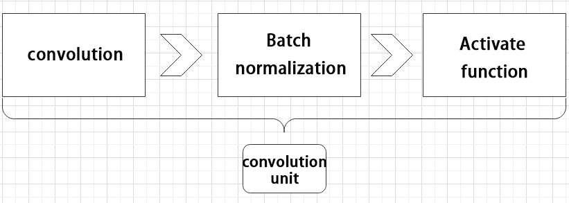

② Focus module

The Focus module for interleaved sampling and concatenation first divides the input image into multiple large regions and then concatenates the small images at the same position within each region to break down the input image into several smaller images. Finally, the images are preliminarily sampled using convolutional units.

As shown in the figure below, taking an image with a resolution of 6×6 as an example, if we set a large region as 2×2, then the image can be divided into 9 large regions, each containing 4 small images.

By concatenating the small images at position 1 in each large region, a 3×3 image can be obtained. The small images at other positions are similarly concatenated, and the original 6×6 image will be broken down into four 3×3 images.


③ Residual unit

The function of the residual unit is to enable the model to learn small changes in the image. Its structure is relatively simple and is achieved by combining data from two paths.

The first path uses two convolutional units to sample the image, while the second path does not use convolutional units for sampling but directly uses the original image. Finally, the data from the first path is added to the second path.


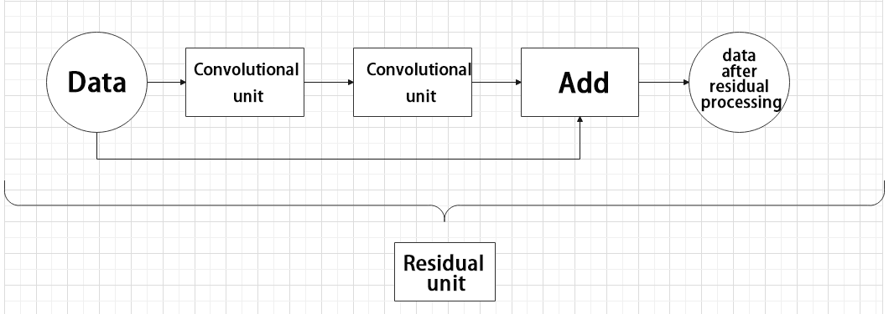

④ Composite Convolution Unit

In YOLOv5, the composite convolution unit is characterized by the ability to customize the convolution unit according to requirements. The composite convolution unit is also realized by superimposing data obtained from two paths.

The first path only has one convolutional layer for sampling, while the second path has 2x+1 convolutional units and one convolutional layer for sampling. After sampling and splicing, the data is organized through batch normalization and then activated by an activation function. Finally, a convolutional layer is used for sampling.'


⑤ Compound Residual Convolutional Unit

The compound residual convolutional unit replaces the 2x convolutional layers in the compound convolutional unit with x residual units. In YOLOv5, the feature of the compound residual unit is mainly that the residual units can be customized according to the needs.

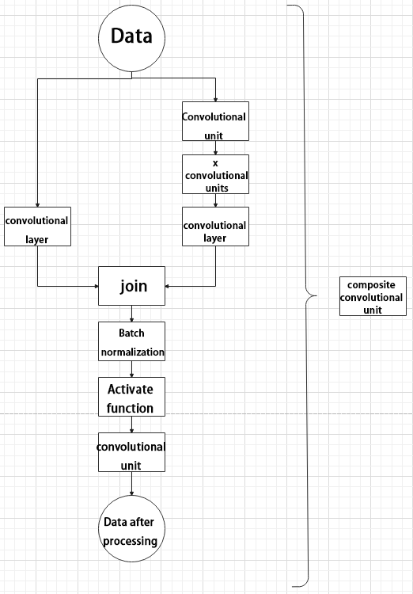

⑥ Composite Pooling Unit

The output data of the convolutional unit is fed into three max pooling layers and an additional copy is kept without processing. Then, the data from the four paths are concatenated and input into a convolutional unit. Using the composite pooling unit to process the data can significantly enhance the features of the original data.

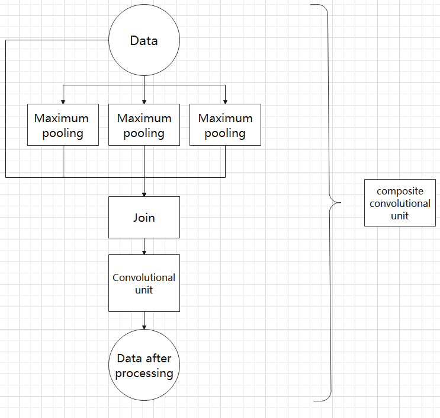

(3) Structure

Composed of three parts, YOLOv5 can output three sizes of data. Data of each size is processed in different way. The below picture is the output structure of YOLOv5.


Below is the output structures of data of three sizes.


### 7.2.4 YOLOv5 Running Procedure 

In this section, we provide an explanation of the model workflow using the anchor boxes, prediction boxes, and prior boxes employed in YOLOv5.

* **Prior Bounding Box**

When an image is input into model, object detection area requires us to offer, while prior bounding box is that box used to mark the object detection area on image before detection.


* **Prediction Box**

The prediction box is not required to set manually, which is the output result of the model. When the first batch of training data is input into model, the prediction box will be automatically generated with it. The position in which the object of same type appear more frequently are set as the center of the prediction box.


* **Anchor Box**

After the prediction box is generated, deviation may occur in its size and position. At this time, the anchor box serves to calibrate the size and position of the prediction box.

The generation position of anchor box is determined by prediction box. In order to influence the position of the next generation of the prediction box, the anchor box is generated at the relative center of the existing prediction box.


* **Realization Process**

After the data is calibrated, a prior bounding box appears on image. Then, the image data is input to the model, the model generates a prediction box based on the position of the prior bounding box. Having generated the prediction box, an anchor box will appear automatically. Lastly, the weights from this training are updated into model.

Each newly generated prediction will be influenced by the last generated anchor box. Repeating the operations above continuously, the deviation of the size and position of the prediction box will be gradually erased until it coincides with the priori box.


<p id="anchor_7_2_5"></p>

###  7.2.5 Image Collecting & Labeling

Given that training the Yolov5 model necessitates a substantial volume of data, our initial step involves collecting and labeling the requisite data in preparation for subsequent model training.

To begin, you can assemble the images that require collection. As an illustration, let's consider the collection of traffic signs.

* **Image Collecting**

(1) Start the robot, and access the robot system desktop using NoMachine.

(2) Click-on  to open the command-line terminal.

(3) Execute the command below and hit enter to terminate the app auto-start service.

```bash
~/.stop_ros.sh
```

(4) Run the  command to initiate the depth camera service.

```bash
sudo systemctl stop start_app_node.service
```

(5) In a new command line terminal, enter the command and press Enter to create a directory for storing the dataset

```bash
mkdir -p ~/my_data
```

(6) Execute the following command to open the image collecting tool.

```bash
cd ~/software/collect_picture && python3 main.py
```


The "**save number**" displayed in the upper left corner represents the image ID, indicating the order in which images are saved. The term "**existing**" denotes the total number of images already saved.

(7) Change the storage path to **'my_data'** folder.


(8) After selecting the corresponding directory, click-on '**Open**' button.


(9) Place the object you want to recognize within the camera's field of view. Click the '**Save (space)**' button or press the Spacebar to capture and save the current image from the camera.


After clicking '**Save (space)**' or pressing the Spacebar, a folder named JPEGImages will be automatically created in the **/home/ubuntu/my_data** directory to store the images.

:::{Note}
To enhance model reliability, capture target recognition content from various distances, rotation angles, and tilt angles.
:::

(10) Once you have finished collecting the images, click-on '**Quit**' button to close the software.


(11) Click on the system status bar to open the file manager, where you can view the saved images.

Next, use the key combination Ctrl+C to exit all open command line terminals. This completes the steps for image collection and annotation.

* **Image Labeling**

Labeling images is crucial for feature datasets as it enables the trained model to understand the categories of significant elements within the image. This understanding empowers the model to recognize these categories in new, previously unseen images.

:::{Note}
The input command should be case sensitive, and keywords can be complemented using Tab key.
:::

(1) Open the command-line terminal, and execute the below command to open the image labeling software.

```bash
python3 ./software/labelImg/labelImg.py
```

The table below outlines the function of each icon:

|                           **Icon**                           | **Shortcut Key** |                       **Function**                        |
| :----------------------------------------------------------: | :--------------: | :-------------------------------------------------------: |
|  |      Ctrl+U      |     Select the directory where the picture is saved.      |
|  |      Ctrl+R      | Select the directory where the calibration data is saved. |
|  |        W         |                   Create annotation box                   |
|  |      Ctrl+S      |                      Save annotation                      |
|  |        A         |               Switch to the previous image                |
|  |        D         |                 Switch to the next image                  |

(2) Click  to open the directory where the images are stored. Select the location as shown in the diagram below:


(3) After clicking the "**Open**" 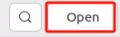 button, the interface shown in the next diagram will appear.

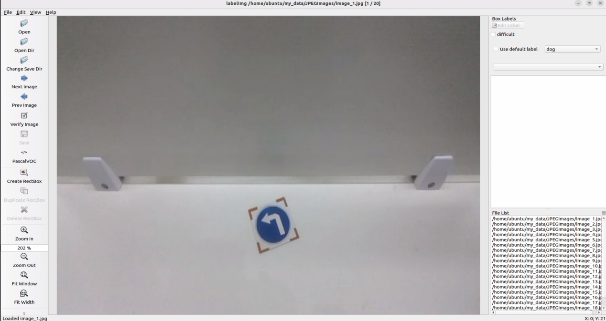

(4)  Click the "**Change Save Dir**" button  and choose the "**Annotations**" directory within the same path as the image collection for storing calibration data.


(5) Click the **"Open"** button  to return to the image annotation interface.

(6)  Press the "**W**" key to begin creating annotation boxes.

(7)  Move the mouse to the desired location, hold down the left mouse button, and drag to create a box that covers the entire target area. Release the mouse button to finalize the selection.


(8)  In the pop-up window, enter a name for the category of the target object (e.g., "**left**"). Click "**OK**" or press the "**Enter**" key to save the category.


(9) Press **Ctrl+S** to save the annotation data for the current image.

(10) Then press the 'd' key to move to the next image. Repeat steps (7) to (9) to annotate all images. When finished, click the close button at the top right of the software to exit 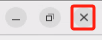.

(11) You can click  on the system status bar to open the file manager and navigate to the directory '/home/ubuntu/my_data/' to view the annotation files for the images.


<p id="anchor_7_2_6"></p>

###  7.2.6 Data Format Conversion

* **Preparation**

Before proceeding with this section, ensure that image collection and annotation have been completed. For detailed operational steps, please refer to the documents located in the "[**7.2.5 Image Collecting and Labeling**](#anchor_7_2_5)" directory.

Prior to feeding the data into the YOLOv5 model for training, it is essential to assign categories to the images and convert the annotated data into the required format.

* **Format Conversion**

Before starting this section, you need to complete the image collection and annotation process.

:::{Note}
The input command should be case sensitive, and keywords can be complemented using Tab key.
:::

(1) Open a new terminal and enter the command to view the file. Tip: If the file does not exist, you can create it by running:

```bash
gedit ~/my_data/classes.names
```

(2) Write the category **'left'** into the text file (if there are multiple different categories, make sure to edit them on separate lines)


(3) After editing, use the shortcut 'Ctrl + S' to save and exit.

:::{Note}
The class names added here must match those used in the image annotation software "**labelImg**".
:::

(4) Then, return to the command line terminal, enter the command to convert the data format, and press Enter:

```bash
python3 ~/software/xml2yolo.py --data ~/my_data --yaml ~/my_data/data.yaml
```


:::{Note}

The paths for `~/software/xml2yolo.py` and  `~/my_data`  must correspond to the actual locations of the files!!!

:::

The above command involves three parameters:

`xml2yolo.py`: This script converts the annotated label format into a format compatible with YOLOv5 for model conversion. Ensure the path is correct!

`my_data`: This represents your annotated folder. Ensure the path is correct!

`data.yaml`: This indicates the format conversion of the entire folder after the model is split. From the command, we can see that the saved directory is within the my_data folder.

The following image is an example of the generated `data.yaml` file:


The text following "**names**" specifies the types of labels, while "**nc**" denotes the number of label categories. "**train**" refers to the training set (used for training in deep learning), with the subsequent parameter indicating the path. "**val**" represents the validation set (used to validate the results during training), and its parameter also indicates the path.

Make sure to adjust these paths based on their actual locations. If you later move the dataset from the robot to a local PC or cloud server to speed up the training process, you'll need to update the paths for "**train**" and "**val**" accordingly.

Finally, an XML file will be generated in the ~/my_data folder, which identifies the paths of the split dataset. You can modify the save location by changing the last parameter in step 4's command, "**~/my_data/data.yaml**". Remember this file's path, as it will be needed for model training later on.

###  7.2.7 Model Training

:::{Note}

The input command should be case sensitive, and the keywords can be complemented using Tab key.

:::

* **Preparation**

After converting the model format, the next step is to proceed with model training. However, before training, ensure that the dataset has been prepared and converted into the required format. For detailed instructions, please refer to "[**7.2.6 Data Format Conversion**](#anchor_7_2_6)".

* **Model Training**

(1) Start the robot, and access the robot system desktop using VNC.

(2) Click-on  to open the command-line terminal.

(3) Execute the command below and hit Enter key to navigate to the designated directory.

```bash
cd ~/third_party_ros2/yolov5/
```

(4) Run the following command to train model.

```bash
python3 train.py --img 640 --batch 64 --epochs 300 --data ~/my_data/data.yaml --weights yolov5n.pt
```

In the command:

**--img** specifies the image size.

**--batch** denotes the number of images processed in each batch.

**--epochs** indicates the number of training iterations.

**--data** is the path to the dataset.

**--weights** is the path to the training files.

Users can adjust these parameters according to their specific requirements. For instance, to enhance model reliability, one can increase the number of training iterations, though this will also extend the training duration.

If the content shown in the picture below appears, it indicates that the training is in progress.


Upon completion of the model training, the path to the generated file will be displayed in the terminal and recorded. This path will be utilized in the subsequent course.


:::{Note}

The path to the generated file may vary and can be located in the corresponding folder within runs/train.

:::

* **Import Training Result (Optional)**

After training the model using an external computer or server, you can import the trained model to the robot motherboard, such as Jetson Orin Nano, and then proceed with model conversion.

Instructions:

(1) Transfer the trained model file to the Jetson Orin Nano board using NoMachine software by simply dragging and dropping it with the left mouse button, as shown in the image below. The red box highlights the trained .pt model, which should be dragged into the remote desktop.

:::{Note}

The image below depicts the remote desktop of our JetAuto robot. Different robot models may present varying remote desktop interfaces, but this does not affect the file transfer process.

:::


After dragging the file into the interface, it will appear as shown below (the content within the red box indicates that the model has been successfully imported to the desktop).


Next, you will need to copy the trained model (for instance, let's consider the best.pt model file) to the following path: "**/third_party/yolov5**".

(2) Right-click and select **'Open Terminal**'.


(3) Enter the command in the terminal to complete copying the model to the yolov5 folder:

```
mv ~/Desktop/best.pt ~/third_party_ros2/yolov5/
```

Next, you can proceed with model conversion and detection based on the content of  **7.2.8 TensorRT Road-Sign Card Detection**.

###  7.2.8 TensorRT Road Sign Detection

* **Preparation**

After extensive training, we obtain a new model. To enhance its performance, we need to convert this new model into a TensorRT-accelerated version.

* **Generate TensonRT Model Engine**

:::{Note}

The input command should be case sensitive, and keywords can be complemented using Tab key.

:::

(1) Start the robot, and access the robot system desktop using NoMachine.

(2) Click-on  to open the command-line terminal.

(3) Execute the command, and hit Enter to navigate to the designated directory.

```bash
cd ~/third_party_ros2/yolov5/
```

(4) Enter the command to convert the .pt file to a .wts file:

```bash
python3 gen_wts.py -t detect -w best.pt -o best.wts
```

The `best.pt` refers to the trained model, as shown in the image below. The trained model named "**best.pt**" has been placed in the path `~/third_party/yolov5`. If you're using your own trained model, simply place it in the same directory and change the name in the command accordingly. If the following image appears, it indicates that the conversion was successful.


(5) Execute the command to navigate to the specified directory:

```
cd ~/third_party_ros2/tensorrtx/yolov5/
```

(6) Enter the command to open the specified file:

```
gedit src/config.h
```

(7) Locate the parameter `kNumClass` in the code shown below. This parameter represents the number of categories for the target detection. Modify the value according to your actual situation, changing it to match your annotated classes.


(8) After making the modifications, press `Ctrl + S` to save and exit the editor.

(9) Next, create a new build directory and enter it:

```
mkdir build && cd build
```

(10) Enter the command to compile the build folder:

```
cmake ..
```


(11) Enter the command to compile the configuration files:

```
make
```

If the following message appears, it indicates that the build was completed successfully.


(12) Copy the generated `best.wts` file to the current directory:

```
cp ~/third_party_ros2/yolov5/best.wts ./
```

(13) Enter the command to generate the TensorRT model engine file:

```
sudo ./yolov5_det -s best.wts best.engine n
```

Since you are already in the directory where the .wts file is located, you can simply enter the name of the .wts file here. **"yolov5n.engine"** is the name of the engine file. If the message **"Build engine successfully!"** appears, it indicates that the engine file was generated successfully.


In the same path, a file named "**libmyplugins.so**" will also be generated for later detection processes. Remember this for future use; when you need to use the `libmyplugins.so` file in the current path, make sure to specify its correct path.

(14) If the generated `best.engine` file has permission issues and cannot be read (locked), as shown in the image below:


Open a terminal in the current directory and enter the command to add permissions:

```
sudo chmod +x+w+r best.engine
```

* **Target Detection**

(1)  Instructions 

① Copy the TensonRT model engine file to the specified folder by entering the command, and then press Enter.

```
cp best.engine libmyplugins.so ~/ros2_ws/src/example/example/yolov5_detect/
```

② Execute the command and hit Enter to terminate the app service.

```
sudo systemctl stop start_app_node.service
```

③ Click-on  to enter file manager, then locate the designated folder.


④ Right click the file `yolo5v_trt.py`, and select  `Open With Text Editor`.


⑤  In the first red box, enter the names of the objects to be recognized (delete the original content). In the first parameter position of the second red box, enter the name of the trained model, and in the second parameter position, specify the **'libmyplugins.so'** file. Here, you can rename it to **"libmyplugins_640.so,"** or users can enter their own file names accordingly.


⑥ Click-on **'Save'** button.


⑦ Run the command, and hit Enter to initiate target detection.

```
python3 ~/ros2_ws/src/example/example/yolov5_detect/yolov5_trt.py 
```

(2) Detection Result

Position the road sign within the camera's field of view. Upon recognition, the road sign will be outlined with a box in the displayed image, accompanied by its category name and the confidence level of detection and recognition. Furthermore, relevant detection information will be printed on the terminal interface.


`class_name` refers to the category name of the recognized target; "**box**" denotes the starting coordinates (upper left corner) and ending coordinates (lower right corner) of the identification box; "**score**" indicates the confidence level of detection and recognition.

### 7.2.9 Traffic Sign Model Training

Please use the actual product names and reference paths as they appear in the document.

For large datasets, it is not recommended to use Jetson Nano for training due to its slower training speed caused by I/O port speed and memory limitations. It is advisable to use a computer equipped with a dedicated graphics card for faster training. The training process remains the same, and you only need to configure the relevant program running environment.

If the performance of traffic sign recognition in the driverless gameplay is poor and you need to train your own model, you can refer to this section for training the traffic sign model.

The screenshots in the following instructions may display different robot host names (though the environment configurations of different robots are roughly the same). Please input them according to the document content; however, it will not affect the execution.

* **Preparation**

(1) Prepare a laptop, or a PC with wireless network card and mouse.

(2) Access the robot system desktop using NoMachine.

* **Training Instructions**

(1) Create Data Set Folder

① Start the robot, and access the robot system desktop using NoMachine.

② Click-on to open the command-line terminal.

③ Execute the  command to terminate the app service.

```bash
sudo systemctl stop start_app_node.service
```

④ Run the command to initiate the camera service.

```bash
ros2 launch peripherals depth_camera.launch.py
```

⑤ Open a new terminal window. Navigate to the directory where the collection tool is stored, then enter the following command to launch the image collection tool.

```bash
cd software/collect_picture && python3 main.py
```


**save number** represents the picture ID, indicating which picture has been saved. "**existing**" denotes the total number of saved images.

⑥ Change the storage path to '**/home/ubuntu/my_data**'.


⑦ Position the target recognition content within the camera's field of view, then click the '**Save (space)**' button or press the space bar to capture and save the current camera image. Upon saving, both the 'save number' and 'existing' counts will increment by 1. These two parameters allow for monitoring of the saved picture names displayed on the current camera screen and the total number of pictures stored in the folder.


Upon selecting the "**Save (space)**" option, a JPEGImages folder will automatically be created within the directory "**/home/ubuntu/my_data**" to store the images.


:::{Note}

* For enhanced model reliability, capture target recognition content from various distances, rotation angles, and tilt angles.

* To guarantee recognition stability, it's advisable to increase the number of training images. It is recommended that each image category comprises at least 200 images for effective model training.

:::

⑧ After image collecting, click-on '**Quit**' to close this software.


⑨ Click-on  to open the file manager, and navigate to the folder as pictured, then you can check the saved pictures.


* **Image Labeling**

:::{Note}

The input command should be case sensitive, and keywords can be complemented using Tab key.

:::

(1) Start the robot, and access the robot system desktop using NoMachine.

(2) Click-on  to open the command-line terminal.

(3) Execute the command to terminate the app service.

```bash
sudo systemctl stop start_app_node.service
```

(4) Create a new terminal, and execute the following command.

```bash
python3 software/labelImg/labelImg.py
```

(5) Upon launching the image annotation tool, the table below outlines the key functions

|                           **Icon**                           | **Shortcut Key** |                       **Function**                        |
| :----------------------------------------------------------: | :--------------: | :-------------------------------------------------------: |
|  |      Ctrl+U      |     Select the directory where the picture is saved.      |
|  |      Ctrl+R      | Select the directory where the calibration data is saved. |
|  |        W         |                   Create annotation box                   |
|  |      Ctrl+S      |                      Save annotation                      |
|  |        A         |               Switch to the previous image                |
|  |        D         |                 Switch to the next image                  |

(6) Press "**Ctrl+U**" to designate the image storage directory as "**/home/ubuntu/my_data/JPEGImages/**", then click the "**Open**" button.


(7) Press "**Ctrl+R**" to specify the calibration data storage directory as "**/home/ubuntu/my_data/Annotations/**". The "**Annotations**" folder is automatically created during image collection. Finally, click the "**Open**" button.


(8) Press the "**W**" key to initiate label box creation. Position the mouse cursor appropriately, then press and hold the left mouse button while dragging to encompass the entire target recognition content within the label box. Release the left mouse button to finalize the selection of the target recognition content.


(9) In the pop-up window, assign a name to the category of the target recognition content, such as "**right**". Once the naming is complete, either click the "**OK**" button or press the "**Enter**" key to save this category.


(10) Use short-cut '**Ctrl+S**' to save the labeled data of the current pictures.

(11) Label the remaining pictures in the same manner as step 9).

(12) Click  in the system status bar to open the file manager. Navigate to the directory "**/home/ubuntu/my_data/Annotations/**" to view the picture annotation file.

* **Generate Related Files**

(1) Click-on  to open the command-line terminal.

(2) Execute the command, and hit Enter key.

```bash
vim ~/my_data/classes.names
```

(3) Press the **"i"** key to enter the editing mode and input the class name of the target recognition content. If multiple class names are required, enter them one per line.


:::{Note}

The class name entered here must match the naming convention used in the image annotation software "**labelImg**" when applicable.

:::

(4) Having finish input, press '**Esc**' key, and input '**:wq**' to save the change and close the file.

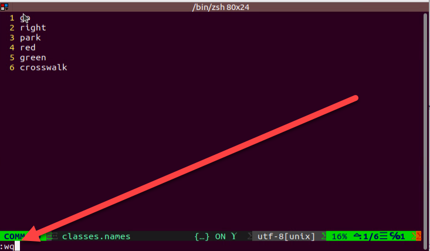

(5) Execute the command to convert the data format by entering the command:

```bash
python3 software/xml2yolo.py --data ~/my_date --yaml ~/my_data/data.yaml
```

The xml2yolo.py script converts annotated files into XML format, organizes the dataset into training and validation sets.

If you encounter the following prompt, the conversion is successful.


The output paths may vary on different robots based on their actual storage locations. However, the generated data.yaml file corresponds to the calibrated dataset.

* **Model Training**

(1) Click-on  to open the command-line terminal.

(2) Execute the command, and hit Enter to navigate to the designated directory.

```bash
cd ~/third_party_ros2/yolov5/
```

(3) Run the command, and hit Enter to train the model.

```bash
python3 train.py --img 640 --batch 8 --epochs 300 --data ~/my_data/data.yaml --weights yolov5n.pt
```

In the command, "**--img**" specifies the image size, "**--batch**" determines the number of images processed in each iteration, and "**--epochs**" denotes the number of training iterations, which impacts the quality of the final model. For quick testing, we've set the number of training iterations to 8, but for optimal results, this value should be adjusted based on your specific requirements and the capabilities of your computer system.

Furthermore, "**--data**" indicates the path to the calibrated dataset, while "**--weights**" refers to the path of the pretrained model. It's crucial to remember whether you're using "**yolov5n.pt**" or "**yolov5s.pt**" as your pretrained model.

Users can customize these parameters according to their specific needs. If model reliability needs to be improved, consider increasing the number of training iterations, keeping in mind that this will also extend the training time.

(4) When the option displayed in the figure below appears, input "**3**" and press Enter.


If the content displayed in the image below appears, it indicates that the training is ongoing.


After the model has been trained successfully, the terminal will print the path containing the file, and you need to record the path which will be required for '**Generate TensorRt Model Engine**'.


:::{Note}

If multiple trainings are conducted, the naming of the "**exp5**" folder mentioned here will vary. For instance, it might be changed to "**exp2**", "**exp3**", and so on. The following steps will be associated with the folder naming used in this step.

:::

* **Generate TensorRT Model Engine**

(1) Click-on  to open the command-line terminal.

(2) Execute the command, and hit Enter to navigate to the designated directory.

```
cd third_party/yolov5
```

(3) Copy the "**best.pt**" file generated after model training to the current directory by executing the command, and then press Enter.

```
cp ~/third_party/yolov5/runs/train/exp5/weights/best.pt ./
```

In command, the path where the file **best.pt** is stored can be modified according to the actual situation.

(4) Enter command and press Enter to convert the .pt file into .wts file.

```
python3 gen_wts.py -t detect -w best.pt -o best.wts
```

If you want to use other models, you only need to replace **"best.pt"** in command with the name of new model file.

(5) Execute the command to navigate to the designated directory.

```
cd ~/third_party_ros2/tensorrtx/yolov5/
```

(6) Run the command, and hit Enter to open the designated file.

```
vim src/config.h
```

(7) Locate the code as shown in the figure below. This parameter represents the number of categories of target recognition content. Simply modify the value according to your specific situation, which is highlighted by the red box in the figure. The "**kNumClass**" parameter signifies the total number of calibrated categories. The current data category, indicated as 1, must be adjusted based on the actual scenario. In this case, it should be changed to 6, representing the six categories of traffic signs. After selecting the number to be modified by clicking the left mouse button, press the "**i**" key on the keyboard to enter the editing mode.


The modification should be done as shown in the picture.


The parameters highlighted in the red box in the figure below determine the size of the input image. The default height and width are both set to 640 pixels, consistent with the images cropped using the image collection tool earlier. It's advisable to retain these default settings unless adjustments are necessary based on specific requirements.


(8) After modification, press **'ctrl +s'** to save the change and exit.

(9) Run the command below to navigate to the 'build' directory newly built.

```
cd ~/third_party/tensorrtx/yolov5/ && mkdir build && cd build
```

(10) Execute the command, and hit Enter to compile build folder.

```
cmake ..
```

(11) Input the command, and hit Enter key to compile the configuration file.

```
make
```

:::{Note}

* If an error occurs during compilation at this stage, you'll need to delete the entire build folder, create a new one, and then repeat steps 10 to 11.

* The deleted build folder contains data related to the initial model training. It's advisable to save this data before deletion.

:::

(12)  Execute the command, and press Enter key to copy the generated best.wts file to the current directory.

```
cp ~/third_party_ros2/yolov5/best.wts ./
```

(13)  Run the command, and hit Enter to generate TensorRT model engine file.

```
sudo ./yolov5_det -s best.wts best.engine n
```

In the command, **"best.wts"** represents the path to the **"best.wts"** file. Since it's currently in the same directory as the .wts file, simply fill in the .wts file name here.
**"best.engine"** is the name of the engine file. You can define this parameter yourself, but it should also be noted by the user.

The last parameter 'n' signifies the YOLOv5 model used in the previous training (9.2.5 model training). If it's "**yolov5s.pt**", this command will change to 's'; if it's "**yolov5n.pt**", this command will change to 'n'.

Upon seeing the prompt **"Build engine successfully!"**, it indicates that the engine file has been generated successfully.

* **Model Usage**

(1) Type the following command:

```bash
cp best.engine libmyplugins.so ~/ros2_ws/src/example/example/yolov5_detect/
```

(2) Execute the following command and hit Enter key to disable the app service.

```bash
sudo systemctl stop start_app_node.service
```

(3) Click-on to navigate to the file manager and direct the designated folder.


(4) Right-click the file **'yolo5v_trt.py'** and select **'Open With Text Editor'.**


(5) In the list at the first red box, enter the names of the objects to be recognized (delete the original content). In the first parameter position of the second red box, enter the name of the trained model. In the second parameter position, enter the 'libmyplugins.so' file, and rename it here to 'libmyplugins_640.so'. Users should fill in the names according to their own file names.


(6)  Click-on **'Save'** button to save the modification.

(7) Run the following command to initiate target detection.

```
python3 ~/ros2_ws/src/example/example/yolov5_detect/yolov5_trt.py 
```

After making the modifications, follow the corresponding 'Autonomous Driving' course documentation to explore the features.

###  7.2.10 Waste Card Model Training

Please ensure that the product names and reference paths mentioned in the document accurately reflect the actual ones.

It's not advisable to utilize Jetson Nano for training when dealing with large datasets. Due to limitations in I/O port speed and memory, the training process may be slow. It's recommended to use a computer equipped with a dedicated graphics card for faster training. The training process remains the same; you only need to configure the relevant program running environment accordingly.

If the recognition performance of the garbage classification gameplay is unsatisfactory and you need to train your own model, you can refer to this section for guidance on physical model training.

* **Preparation**

① Prepare a laptop or a PC equipped with a wireless network card and a mouse.

② Install and open the remote connection tool 'NoMachine'.

* **Training Instructions**

(1)  Prepare Data Set

Photo materials can be sourced from the Internet. To reduce the performance demands for subsequent annotation and training, you can adjust the image resolution to 640\*480. The default resolution for images captured with the "**Capture**" tool is 640*480.

For training purposes here, we utilize selfie picture materials. If you intend to use Internet pictures for training, please refer to **"Mask Image Training"**.

(2) Image Collection

① Start the robot, and access the robot system desktop using NoMachine.

② Click-on  to open the command-line terminal.

③ Execute the command to disable app service.

```bash
sudo systemctl stop start_app_node.service
```

④ Run the below command to enable the camera service.

```bash
ros2 launch peripherals depth_camera.launch.py
```

⑤ Open a new terminal. Navigate to the directory where the collection tool is stored and enter the below command to launch the image collection tool.

```bash
cd software/collect_picture && python3 main.py
```

⑥ Position the card that requires training within the camera's field of view, and click **"Save"** to capture the current image. Ensure that the number of images for each type is consistent. For instance, if you capture 50 images of the banana peel card, you should also capture 50 images of the toothbrush card.


Upon clicking the "**Save (space)**" button, a folder named JPEGImages will be automatically created to store the images in the directory "**/home/ubuntu/my_data**".


:::{Note}

* For enhanced model reliability, it's important to capture the target recognition content from various distances, rotation angles, and tilt angles.

* To ensure stable recognition, increase the number of images used for model training. It's recommended to have at least 200 pictures for each type during training.

:::


⑦ After image collecting, click-on **'Quit'** button to close this software.


⑧ Click-on   to open the file manager, and navigate to the designated storage path to check the stored pictures.

(3) Label Pictures

:::{Note}

The input command should be case sensitive, and keywords can be complemented using Tab key.

:::

① Start the robot, and access the robot system using the remote control software NoMachine.

② Click-on  to open the command-line terminal.

③ Execute the command to disable the app service.

```bash
sudo systemctl stop start_app_node.service
```

④ Create a new terminal, and execute the following command to start the annotation tool.

```bash
python3 ./software/labelImg/labelImg.py
```

⑤ Upon launching the image annotation tool, the table below outlines the key functions.

|                           **Icon**                           | **Shortcut Key** |                       **Function**                        |
| :----------------------------------------------------------: | :--------------: | :-------------------------------------------------------: |
|  |      Ctrl+U      |     Select the directory where the picture is saved.      |
|  |      Ctrl+R      | Select the directory where the calibration data is saved. |
|  |        W         |                   Create annotation box                   |
|  |      Ctrl+S      |                      Save annotation                      |
|  |        A         |               Switch to the previous image                |
|  |        D         |                 Switch to the next image                  |

Press "**Ctrl+U**" to select the image storage directory as "**/home/ubuntu/my_data/JPEGImages/**", then click the "**Open**" button.


⑥ Begin by clicking "**Open Dir**" to access the folder where the pictures are stored. Next, select "**/home/ubuntu/My_Data/JPEGImage**", then click "**Open**" to proceed.

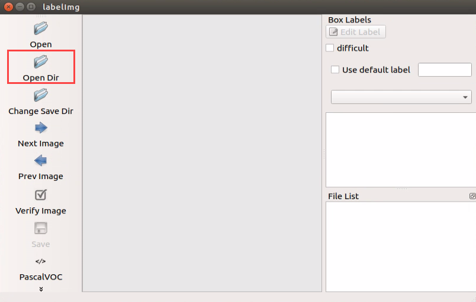

⑦ Click-on '**Create RectBox**' button to create a annotation box.


⑧ Position the mouse cursor appropriately, then press and hold the left mouse button while dragging out a rectangular frame to select the training content in the photo. Let's use bananas as an example.


⑨ After releasing the mouse, enter the category name of this card in the pop-up dialog box, then click "**OK**". For instance, you can enter "**apple**" for apples and "**potato**" for potatoes. (Items of the same type must have the same name)


⑩ After labeling a picture, click-on '**Save**' button, then click-on '**Next Image**' to proceed with the image labeling.


:::{Note}

* While annotating, you can use shortcut keys to expedite the process. For instance, press "**D**" to switch to the next picture and press "**W**" to create a label box.

* You can also use **"Ctrl+V"** to paste the annotation box from the previous picture here. However, note that this method is only applicable to annotations of the same type of image. This is because when pasting the annotation box, it also pastes the name information from the previous picture.
:::

(4)  Generate Related Files

① Click-on  to open the command-line terminal.

② Execute the command, and hit Enter.

```bash
vim ~/my_data/classes.names
```

③ Press the "**i**" key to enter editing mode and include the class name for the target recognition content. When adding multiple class names, each class name should be on a separate line. If you need to enter multiple classes, press enter for a new line and then specify each class accordingly based on the different types.


:::{Note}

The class name added here must match the naming convention used in the image annotation software "**labelImg**".

:::

④ Having finished the input, press '**Esc**' key and type '**:wq**' to save the change and close the file.


⑤ Enter the command to convert the data format and press Enter.

```bash
python3 software/xml2yolo.py --data ~/my_data --yaml ~/my_data/data.yaml
```

This output should reflect the actual storage location of the folder within the robot system. The output paths may vary between different robots, but the data.yaml file generated ultimately corresponds to the calibrated dataset.

(5) Start Training

① Click-on  to open the command-line terminal.

② Run the command to navigate to the specific directory.

```bash
cd ~/third_party_ros2/yolov5/
```

③ Enter the command and press Enter to train the model.

```bash
python3 train.py --img 640 --batch 8 --epochs 300 --data ~/my_data/data.yaml --weights yolov5n.pt
```

In the command, "**--img**" denotes the image size; "**--batch**" indicates the number of individual image inputs processed together; "**--epochs**" represents the number of training iterations, reflecting the frequency of machine learning cycles. This value should be determined based on the final desired model performance. For expedited testing purposes, the number of training iterations is initially set to 8. However, on more capable computer host systems, increasing this value can lead to improved training outcomes.

"**--data**" specifies the path to the dataset folder that has been calibrated. "**--weights**" denotes the path to the pre-trained model file, which serves as the starting point for your own training process. It's important to note whether you're using "**yolov5n.pt**" or "**yolov5s.pt**" as input parameters.

Users have the flexibility to adjust these parameters according to their specific requirements. To enhance the model's reliability, users may consider increasing the number of training iterations, although it's essential to be aware that this will also extend the training duration accordingly.

④ When the terminal prints that Enter your choice, enter '3', and hit Enter.


If the content displayed in the image below appears, it indicates that the training process is currently underway.


Once the model training is completed, the path of the generated file will be printed on the terminal and recorded. This path will be utilized in the subsequent step of "**Generating TensorRT Model Engine**"


:::{Note}

If multiple trainings are conducted, the naming of the **"exp5"** folder mentioned here will vary. For instance, it might be adjusted to **"exp2"**, **"exp3"**, and so forth. The subsequent steps will depend on the folder naming used in this step.

:::

(6) Format Conversion

① Click-on  to open the command-line terminal.

② Execute the command, and hit Enter to navigate to the specific directory.

```
cd third_party/yolov5
```

③ Copy the "**best.pt**" file generated after model training to the current directory by entering the following command, then press Enter.

```
cp ~/third_party/yolov5/runs/train/exp5/weights/best.pt ./ 
```

Users can adjust the path of the "**best.pt**" file in the instructions based on their specific circumstances.

④ Run the command, and hit Enter to convert pt file into wts file.

```
python3 gen_wts.py -t detect -w best.pt -o best.wts
```

If you need to utilize other models, simply replace "**best.pt**" in the command with the name of the respective model file.

⑤ Execute the command to navigate to the specific directory.

```
cd ~/third_party_ros2/tensorrtx/yolov5/
```

⑥ Run the command, and hit Enter key to open the designated file.

```
gedit src/config.h
```

⑦ Locate the code depicted in the figure below. This parameter represents the number of categories for target recognition content. Simply adjust the value according to your specific scenario, as indicated by the position highlighted in the red box in the figure below. The parameter "**kNumClass**" denotes the total number of calibrated data categories. In this instance, it is set to 1.


After modification:


The parameters highlighted in the red box below represent the input image size, with a default height of 640 pixels and a width of 640 pixels. This matches the size of the images cropped using the previous image capture tool, so you can leave the settings as default. If changes are needed, adjust them according to your specific requirements.


⑧ After modification, use short-cut ''

⑨ Run the command to navigate to the build directory newly built.

```
cd ~/third_party/tensorrtx/yolov5/ && mkdir build && cd build
```

⑩ Run the below command, and hit Enter to compile the build folder.

```
cmake .. 
```

⑪ Execute the command, and hit Enter to compile the configuration file.

```
make
```

⑫ Type the command and then press Enter to copy the generated **"best.wts"** file to this directory.

```
cp ~/third_party_ros2/yolov5/best.wts ./
```

⑬ Type the command and then press Enter to generate the TensorRT model engine file.

In the command, "**best.wts**" represents the path to the location of the best.wts file. Since the file is currently in the same directory, you only need to specify the file name "**.wts**" here. "**best.engine**" is the designated name for the engine file. Users can define this parameter according to their preference, but it should be remembered for future reference. The final parameter 'n' signifies the YOLOv5 model utilized in the previous training (in this case,model training). If the model is yolov5s.pt, this command would change to 's'; if it's yolov5n.pt, it would change to 'n'.

Upon successful generation of the engine file, the prompt "**Build engine successfully!**" will appear.

* **Model Usage**

(1) Enter the below command:

```bash
cp best.engine libmyplugins.so ~/ros2_ws/src/example/example/yolov5_detect/
```

(2) Run the following command and hit Enter key to terminate app service.

```bash
sudo systemctl stop start_app_node.service
```

(3) Click-on  to open the file manager, and direct to the designated folder.


(4)  Right-click the file **"yolo5v_trt.py"** and select **"Open With Text Editor"**

```bash
ros2 launch peripherals depth_camera.launch.py
```

(5) In the first red box, enter the names of the objects you want to recognize (delete the original content). In the second red box, enter the name of the trained model in the first parameter field, and the "**libmyplugins.so**" file in the second parameter field. Rename it here to "**libmyplugins_640.so**". Adjust based on your file names.


(6) Click **"Save"** in the top right corner to save the changes.


(7) Enter the following command to start object detection:

```bash
python3 ~/ros2_ws/src/example/example/yolov5_detect/yolov5_trt.py 
```

###  7.2.11 Physical Model Training

:::{Note}

This section provides a general overview. Please refer to the actual product names and reference paths mentioned in the document.

:::

Training large datasets on the robot's controller is not recommended due to its slow training speed caused by limitations in I/O port speed and memory. It is advised to utilize a computer equipped with a dedicated graphics card for faster training. The training process remains the same, and only the relevant program running environment needs to be configured.

If the recognition accuracy of the physical sorting gameplay is inadequate and you require training your own model, you can refer to this section for guidance on physical model training.

* **Preparation**

(1) Prepare a laptop, or a PC with wireless network card and mouse.

(2) Access the robot system desktop using VNC.

* **Training Instructions**

The training steps are akin to those followed for road sign model.

(1)  Image Collecting

① Start the robot, and access the robot system desktop using NoMachine.

② Click-on  to open the command-line terminal.

③ Execute the following command to terminate the app service.

```bash
~/.stop_ros.sh
```

④ Run the command to initiate the camera service.

```bash
ros2 launch peripherals depth_camera.launch.py
```

⑤ Open a new terminal window. Navigate to the directory where the collection tool is stored, then enter the following command to launch the image collection tool.

```bash
cd ~/software/collect_picture && python3 main.py
```


'"**save number**" represents the picture ID, indicating which picture has been saved. "**existing**" denotes the total number of saved images.

⑥ Change the storage path to '**/home/ubuntu/my_data**'.


⑦ Position the target recognition content within the camera's field of view, then click the '**Save (space)**' button or press the space bar to capture and save the current camera image. Upon saving, both the '**save number**' and 'existing' counts will increment by 1. These two parameters allow for monitoring of the saved picture names displayed on the current camera screen and the total number of pictures stored in the folder.


Upon selecting the "**Save (space)**" option, a JPEGImages folder will automatically be created within the directory "**/home/ubuntu/my_data**" to store the images.

:::{Note}

* For enhanced model reliability, capture target recognition content from various distances, rotation angles, and tilt angles.

* To guarantee recognition stability, it's advisable to increase the number of training images. It is recommended that each image category comprises at least 200 images for effective model training.

:::

⑧ After image collecting, click-on '**Quit**' to close this software.


⑨ Click-on   to open the file manager, and navigate to the folder as pictured, then you can check the saved pictures.

(2) Image Labeling

:::{Note}

The input command should be case sensitive, and keywords can be complemented using Tab key.

:::

① Start the robot, and access the robot system desktop using VNC.

② Click-on  to open the command-line terminal.

③ Execute the below command to terminate the app service.

```bash
sudo systemctl stop start_app_node.service
```

④ Execute the below command to enable the image labeling tool.

```bash
python3 ./software/labelImg/labelImg.py
```

⑤ Upon launching the image annotation tool, the table below outlines the key functions

|                           **Icon**                           | **Shortcut Key** |                       **Function**                        |
| :----------------------------------------------------------: | :--------------: | :-------------------------------------------------------: |
|  |      Ctrl+U      |     Select the directory where the picture is saved.      |
|  |      Ctrl+R      | Select the directory where the calibration data is saved. |
|  |        W         |                   Create annotation box                   |
|  |      Ctrl+S      |                      Save annotation                      |
|  |        A         |               Switch to the previous image                |
|  |        D         |                 Switch to the next image                  |

Press "**Ctrl+U**" to designate the image storage directory as "**/home/ubuntu/my_data/JPEGImages/**", then click the "**Open**" button.


⑥ First, click "**Open Dir**" to access the folder where the pictures are stored. Then, select "**/home/ubuntu/My_Data/JPEGImage**" and click "**Open**" to proceed.


⑦ Click-on '**Create RectBox**' button to create a annotation box.


⑧ Position the mouse cursor appropriately, then hold down the left mouse button and drag out a rectangular frame to select the training content in the photo. For instance, let's use an apple as an example.


⑨ After releasing the mouse, enter the category name of this object in the pop-up dialog box, and then click "**OK**". For instance, if it's an apple, enter "**apple**"; if it's a potato, enter "**potato**". (Items of the same type must have the same name.)


⑩ Once you've finished annotating one image, click "**Save**" to save your annotations. Then, click "**Next Image**" to proceed to annotate the next image.


:::{Note}

During annotation, you can utilize shortcut keys to expedite the process. For example, press **"D"** to switch to the next picture and press "**W**" to create a label box.

You can also press "**Ctrl+v**" to paste the annotation box from the previous picture. However, please note that this method is only applicable to annotations of the same type of image. This is because when the annotation box is pasted, it will include the name information from the previous picture.

:::

(3) Generate Related Files

① Click-on  to open the command-line terminal.

② Execute the command, and hit Enter.

```bash
vim ~/my_data/classes.names
```

③ Press the "**i**" key to enter editing mode and insert the class name of the target recognition content. If you need to add multiple class names, ensure each class name is placed on a separate line.

:::{Note}

The class name entered here must match the naming convention used in the image annotation software "**labelImg**".

:::

④ Having finished input, press '**Esc'** key, then input '**:wq**' to save the change and close the file.

⑤ Run the command to convert the data format.

```bash
python3 software/xml2yolo.py --data ~/my_data --yaml ~/my_data/data.yaml
```

This output should be based on the actual storage location of the folder in the robot system. The output paths may vary between different robots, but the final data.yaml file generated corresponds to the calibrated dataset.

(4) Start Training

① Click-on  to open the command-line terminal.

② Run the command to navigate to the specific directory.

```bash
cd ~/third_party_ros2/yolov5/
```

③ Enter the command and press Enter to train the model.

```bash
python3 train.py --img 640 --batch 8 --epochs 300 --data ~/my_data/data.yaml --weights yolov5n.pt
```

In the command, "**--img**" denotes the image size; "**--batch**" indicates the number of individual image inputs processed together; "**--epochs**" represents the number of training iterations, reflecting the frequency of machine learning cycles. This value should be determined based on the final desired model performance. For expedited testing purposes, the number of training iterations is initially set to 8. However, on more capable computer host systems, increasing this value can lead to improved training outcomes.

"**--data**" specifies the path to the dataset folder that has been calibrated. "**--weights**" denotes the path to the pre-trained model file, which serves as the starting point for your own training process. It's important to note whether you're using "**yolov5n.pt**" or "**yolov5s.pt**" as input parameters.

Users have the flexibility to adjust these parameters according to their specific requirements. To enhance the model's reliability, users may consider increasing the number of training iterations, although it's essential to be aware that this will also extend the training duration accordingly.

④ When the terminal prints that Enter your choice, enter '**3**', and hit Enter.


If the content displayed in the image below appears, it indicates that the training process is currently underway.


Once the model training is completed, the path of the generated file will be printed on the terminal and recorded. This path will be utilized in the subsequent step of "**Generating TensorRT Model Engine**".


:::{Note}

If multiple trainings are conducted, the naming of the "**exp5**" folder mentioned here will vary. For instance, it might be adjusted to "**exp2**", "**exp3**", and so forth. The subsequent steps will depend on the folder naming used in this step.

:::

(5)  Format Conversion

① Click-on  to open the command line terminal.

② Execute the command, and hit Enter to navigate to the specific directory.

```
cd third_party/yolov5
```

③ Copy the "**best.pt**" file generated after model training to the current directory by entering the following command, then press Enter.

```
cp ~/third_party/yolov5/runs/train/exp5/weights/best.pt ./ 
```

Users can adjust the path of the "**best.pt**" file in the instructions based on their specific circumstances.

④ Run the command, and hit Enter to convert pt file into wts file.

```
python3 gen_wts.py -t detect -w best.pt -o best.wts
```

If you need to utilize other models, simply replace "**best.pt**" in the command with the name of the respective model file.

⑤ Execute the command to navigate to the specific directory.

```
cd ~/third_party_ros2/tensorrtx/yolov5/
```

⑥ Run the command, and hit Enter key to open the designated file.

```
gedit src/config.h
```

⑦ Locate the code depicted in the figure below. This parameter represents the number of categories for target recognition content. Simply adjust the value according to your specific scenario, as indicated by the position highlighted in the red box in the figure below. The parameter "**kNumClass**" denotes the total number of calibrated data categories. In this instance, it is set to 1.


After modification:


The parameters highlighted in the red box below represent the input image size, with a default height of 640 pixels and a width of 640 pixels. This matches the size of the images cropped using the image capture tool. It's recommended to keep the default settings, but you can adjust them if necessary based on your specific needs.


⑧ After modification, use short-cut 'ctrl +s' save the change and close the file.

⑨ Run the command to navigate to the **build** directory newly built.

```
cd ~/third_party/tensorrtx/yolov5/ && mkdir build && cd build
```

⑩ Run the command, and hit Enter to compile the build folder.

```
cmake .. 
```

⑪ Execute the command, and hit Enter to compile the configuration file.

```
make
```

⑫ Type the command and then press Enter to copy the generated **"best.wts"** file to this directory.

```
cp ~/third_party_ros2/yolov5/best.wts ./
```

⑬ Type the command and then press Enter to generate the TensorRT model engine file.

```
sudo ./yolov5_det -s best.wts best.engine n
```

In the command, **"best.wts"** represents the path to the location of the best.wts file. Since the file is currently in the same directory, you only need to specify the file name **".wts"** here. **"best.engine"** is the designated name for the engine file. Users can define this parameter according to their preference, but it should be remembered for future reference. The final parameter 'n' signifies the YOLOv5 model utilized in the previous training (in this case, 9.2.5 model training). If the model is yolov5s.pt, this command would change to 's'; if it's yolov5n.pt, it would change to 'n'.
Upon successful generation of the engine file, the prompt **"Build engine successfully!"** will appear.

*  **Model Usage**

(1) In the command line terminal from the previous section, continue by entering the command to copy the TensorRT model engine file to the specified folder. After entering the command, press Enter.

```bash
cp best.engine libmyplugins.so ~/ros2_ws/src/example/example/yolov5_detect/
```

(2) Execute the below command and hit Enter key to terminate the app service.

```bash
sudo systemctl stop start_app_node.service
```

(3) Click-on  to open the file manager and direct to the designated folder.


(4) Right-click the file **"yolo5v_trt.py"** and select **"Open With Text Editor."**


(5) In the first red box, enter the names of the objects you want to recognize (delete the original content). In the second red box, enter the name of the trained model in the first parameter field, and the "**libmyplugins.so**" file in the second parameter field. Rename it here to "**libmyplugins_640.so**". Adjust based on your file names.


(6) Click "**Save**" in the top right corner to save the changes.


(7) Enter the following command to start object detection:

```bash
python3 ~/ros2_ws/src/example/example/yolov5_detect/yolov5_trt.py
```
### 7.2.12 FAQ

If multiple training attempts fail, you can follow these steps:

(1) Click  on the system desktop to open the command line terminal. Enter the following commands in order to increase the swap memory space:

```
sudo swapoff /swapfile
sudo rm /swapfile
sudo fallocate -l 6G /swapfile
sudo chmod 600 /swapfile
sudo mkswap /swapfile
sudo swapon /swapfile
```

(2) Return to the model training steps of the corresponding course section and continue from there.

## 7.3 MediaPipe Man-Robot Interaction

### 7.3.1 MediaPipe Introduction

* **MediaPipe Description**

MediaPipe is an open-source framework of multi-media machine learning models. Cross-platform MediaPipe can run on mobile devices, workspace and servers, as well as support mobile GPU acceleration. It is also compatible with TensorFlow and TF Lite Inference Engine, and all kinds of TensorFlow and TF Lite models can be applied on it. Besides, MediaPipe supports GPU acceleration of mobile and embedded platform.


* **MediaPipe Pros and Cons**

(1) MediaPipe Pros

① MediaPipe supports various platforms and languages, including iOS, Android, C++, Python, JAVAScript, Coral, etc.

② Swift running. Models can run in real-time.

③ Models and codes are with high reuse rate.

(2) MediaPipe Cons

① For mobile devices, MediaPipe will occupy 10M or above.

② As it greatly depends on Tensorflow, you need to alter large amount of codes if you want to change it to other machine learning frameworks, which is not friendly to machine learning developer.

③ It adopts static image which can improve efficiency, but make it difficult to find out the errors.

* **How to use MediaPipe**

The figure below shows how to use MediaPipe. The solid line represents the part to coded, and the dotted line indicates the part not to coded. MediaPipe can offer the result and the function realization framework quickly.


(1) Dependency

MediaPipe utilizes OpenCV to process video, and uses [FFMPEG](https://www.ffmpeg.org/) to process audio data. Furthermore, it incorporates other essential dependencies, including OpenGL/Metal, Tensorflow, and Eigen.

For seamless usage of MediaPipe, we suggest gaining a basic understanding of OpenCV.

(2) MediaPipe Solutions

Solutions is based on the open-source pre-constructed sample of TensorFlow or TFLite. MediaPipe Solutions is built upon a framework, which provides 16 Solutions, including face detection, Face Mesh, iris, hand, posture, human body and so on.

* **MediaPipe Learning Resources**

MediaPipe website：<https://developers.google.com/mediapipe>

MediaPipe Wiki：<http://i.bnu.edu.cn/wiki/index.php?title=Mediapipe>

MediaPipe github：<https://github.com/google/mediapipe>

Dlib website: <http://dlib.net/>

dlib github: <https://github.com/davisking/dlib>

### 7.3.2 Image Background Segmentation

This lesson provides instructions on utilizing MediaPipe's selfie segmentation model to accurately segment trained models, such as human faces and hands, from their backgrounds. Once separated, you can easily add virtual backgrounds to these models.

* **Program Logic**

To begin, import the selfie segmentation model from MediaPipe and subscribe to the corresponding topic to access the live camera feed.

Next, flip the image and apply the segmentation to the background image. For improved boundary segmentation, implement dual-border segmentation.

Finally, complete the process by replacing the background with a virtual background.

* **Operation Steps**

(1) Start the robot, and enter the robot system desktop using NoMachine.

(2) Click-on  to open the command-line terminal.

(3) Run the command to disable app auto-start app service.

```bash
sudo systemctl stop start_app_node.service
```

(4) Execute the command to enable the camera node.

```bash
ros2 launch peripherals depth_camera.launch.py
```

(5) Enter the command to start background segmentation

```bash
cd ~/ros2_ws/src/example/example/mediapipe_example && python3 self_segmentation.py
```

(6) To close this feature, press the '**Esc**' key to exit the camera image interface.

(7) Next, press "**Ctrl+C**" in the terminal. If it fails to close, please try again.

*  **Program Outcome**

Once the feature is activated, the screen changes to a gray virtual background, and when a hand enters the frame, it is automatically separated from the background.

<p style="text-align:center;" class="common_img">

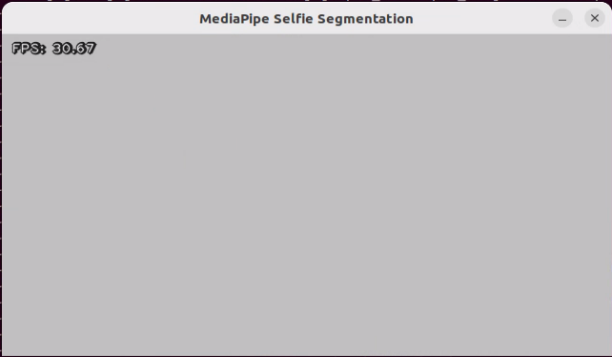


</p>

* **Program Analysis**

The source code of this program locates in:[/ros2_ws/src/example/example/mediapipe_example/self_segmentation.py](../_static/source_code/mediapipe_example.zip)


(1) Function

Main:

{lineno-start=79}

```python
def main():
    node = SegmentationNode('self_segmentation')
    try:
        rclpy.spin(node)
    except KeyboardInterrupt:
        node.destroy_node()
        rclpy.shutdown()
        print('shutdown')
    finally:
        print('shutdown finish')
```

Used to start the background control node.

(2) Class

SegmentationNode：

{lineno-start=13}

```python
class SegmentationNode(Node):
    def __init__(self, name):
        rclpy.init()
        super().__init__(name)
        self.running = True
        self.mp_selfie_segmentation = mp.solutions.selfie_segmentation
        self.mp_drawing = mp.solutions.drawing_utils
        self.fps = fps.FPS()
        self.image_queue = queue.Queue(maxsize=2)
        self.BG_COLOR = (192, 192, 192)  # gray
        self.image_sub = self.create_subscription(Image, '/depth_cam/rgb/image_raw', self.image_callback, 1)
        self.get_logger().info('\033[1;32m%s\033[0m' % 'start')
        threading.Thread(target=self.main, daemon=True).start()
```

Init：

{lineno-start=15}

```python
    def __init__(self, name):
        rclpy.init()
        super().__init__(name)
        self.running = True
        self.mp_selfie_segmentation = mp.solutions.selfie_segmentation
        self.mp_drawing = mp.solutions.drawing_utils
        self.fps = fps.FPS()
        self.image_queue = queue.Queue(maxsize=2)
        self.BG_COLOR = (192, 192, 192)  # gray
        self.image_sub = self.create_subscription(Image, '/depth_cam/rgb/image_raw', self.image_callback, 1)
        self.get_logger().info('\033[1;32m%s\033[0m' % 'start')
        threading.Thread(target=self.main, daemon=True).start()
```

Initialize the parameters required for background segmentation, call the image callback function, and start the model recognition function.

image_callback：

{lineno-start=29}

```python
    def image_callback(self, ros_image):
        cv_image = self.bridge.imgmsg_to_cv2(ros_image, "rgb8")
        rgb_image = np.array(cv_image, dtype=np.uint8)
        if self.image_queue.full():
            # If the queue is full, remove the oldest image(如果队列已满，丢弃最旧的图像)
            self.image_queue.get()
            # Put the image into the queue(将图像放入队列)
        self.image_queue.put(rgb_image)
```

Image callback function, used to read data from the camera node and enqueue it.

Main:

{lineno-start=39}

```python
    def main(self):
        with self.mp_selfie_segmentation.SelfieSegmentation(
            model_selection=1) as selfie_segmentation:
            bg_image = None
            while self.running:
                try:
                    image = self.image_queue.get(block=True, timeout=1)
                except queue.Empty:
                    if not self.running:
                        break
                    else:
                        continue
                # To improve performance, optionally mark the image as not writeable to
                # pass by reference.
                image.flags.writeable = False
                results = selfie_segmentation.process(image)
                image.flags.writeable = True
                image = cv2.cvtColor(image, cv2.COLOR_RGB2BGR)
                # Draw selfie segmentation on the background image.
                # To improve segmentation around boundaries, consider applying a joint
                # bilateral filter to "results.segmentation_mask" with "image".
                condition = np.stack(
                        (results.segmentation_mask,) * 3, axis=-1) > 0.1
                # The background can be customized.
                #   a) Load an image (with the same width and height of the input image) to
                #      be the background, e.g., bg_image = cv2.imread('/path/to/image/file')
                #   b) Blur the input image by applying image filtering, e.g.,
                #      bg_image = cv2.GaussianBlur(image,(55,55),0)
                if bg_image is None:
                  bg_image = np.zeros(image.shape, dtype=np.uint8)
                  bg_image[:] = self.BG_COLOR
                output_image = np.where(condition, image, bg_image)
                self.fps.update()
                result_image = self.fps.show_fps(output_image)
                cv2.imshow('MediaPipe Selfie Segmentation', result_image)
                key = cv2.waitKey(1)
                if key == ord('q') or key == 27:   # Press Q or Esc to quit(按q或者esc退出)
                    break
        cv2.destroyAllWindows()
        rclpy.shutdown()
```

Load the model from MediaPipe, input the image, and display the output image using OpenCV.

### 7.3.3 3D Object Detection

* **Program Logic**

To get started, import the 3D Objectron module from MediaPipe, and subscribe to the topic message to receive the real-time camera image.

Next, flip the image to ensure proper alignment for 3D object detection.

Finally, draw the 3D boundary frame on the image.

* **Operation Steps**

(1) Start the robot, and enter the robot system desktop using NoMachine.

(2) Click-on  to open the command-line terminal.

(3) Run the command to disable app auto-start app service.

```bash
sudo systemctl stop start_app_node.service
```
(4) Execute the following command to enable the camera node:

```bash
ros2 launch peripherals depth_camera.launch.py 
```
(5) Open a new command-line terminal and hit Enter key to initiate the game program.

```bash
cd ~/ros2_ws/src/example/example/mediapipe_example && python3 objectron.py
```

(6) To close this game, press the "**Esc**" key in the image interface to exit the camera image interface.

(7) Press "**Ctrl+C**" in the command line terminal interface. If the closure fails, please try again repeatedly.

* **Program Outcome**

Once the game starts, the 3D frame will be drawn around the boundary of the recognized object. The system can identify several objects, including a cup (with handle), shoe, chair, and camera.


* **Program Analysis**

The program file corresponding to this section of the course documentation is located at: [/ros2_ws/src/example/example/mediapipe_example/objectron.py](../_static/source_code/mediapipe_example.zip)


(1) Function

Main:

{lineno-start=74}

```python
def main():
    node = ObjectronNode('objectron')
    try:
        rclpy.spin(node)
    except KeyboardInterrupt:
        node.destroy_node()
        rclpy.shutdown()
        print('shutdown')
    finally:
        print('shutdown finish')
```

Used to initiate 3D detection node.

(2) Class

ObjectronNode：

{lineno-start=13}

```python
class ObjectronNode(Node):
    def __init__(self, name):
        rclpy.init()
        super().__init__(name)
        self.running = True
        self.mp_objectron = mp.solutions.objectron
        self.mp_drawing = mp.solutions.drawing_utils
        self.fps = fps.FPS()
        self.image_queue = queue.Queue(maxsize=2)
        self.image_sub = self.create_subscription(Image, '/depth_cam/rgb/image_raw', self.image_callback, 1)
        self.get_logger().info('\033[1;32m%s\033[0m' % 'start')
```

Init：

{lineno-start=14}

```python
    def __init__(self, name):
        rclpy.init()
        super().__init__(name)
        self.running = True
        self.mp_objectron = mp.solutions.objectron
        self.mp_drawing = mp.solutions.drawing_utils
        self.fps = fps.FPS()
        self.image_queue = queue.Queue(maxsize=2)
        self.image_sub = self.create_subscription(Image, '/depth_cam/rgb/image_raw', self.image_callback, 1)
        self.get_logger().info('\033[1;32m%s\033[0m' % 'start')
        threading.Thread(target=self.main, daemon=True).start()
```

Initialize the parameters required for 3D recognition, call the image callback function, and start the model recognition function.

image_callback：

{lineno-start=28}

```python
    def image_callback(self, ros_image):
        cv_image = self.bridge.imgmsg_to_cv2(ros_image, "rgb8")
        rgb_image = np.array(cv_image, dtype=np.uint8)
        if self.image_queue.full():
            # If the queue is full, remove the oldest image(如果队列已满，丢弃最旧的图像)
            self.image_queue.get()
            # Put the image into the queue(将图像放入队列)
        self.image_queue.put(rgb_image)
```

Image callback function, used to read data from the camera node and enqueue it.

Main:

{lineno-start=35}

```python
    def main(self):
        with self.mp_objectron.Objectron(static_image_mode=False,
                                max_num_objects=1,
                                min_detection_confidence=0.4,
                                min_tracking_confidence=0.5,
                                model_name='Cup') as objectron:
            while self.running:
                try:
                    image = self.image_queue.get(block=True, timeout=1)
                except queue.Empty:
                    if not self.running:
                        break
                    else:
                        continue
                # To improve performance, optionally mark the image as not writeable to
                # pass by reference.
                image.flags.writeable = False
                results = objectron.process(image)

                # Draw the box landmarks on the image.
                image.flags.writeable = True
                image = cv2.cvtColor(image, cv2.COLOR_RGB2BGR)
                if results.detected_objects:
                    for detected_object in results.detected_objects:
                        self.mp_drawing.draw_landmarks(
                          image, detected_object.landmarks_2d, self.mp_objectron.BOX_CONNECTIONS)
                        self.mp_drawing.draw_axis(image, detected_object.rotation,
                                             detected_object.translation)
                self.fps.update()
                result_image = self.fps.show_fps(cv2.flip(image, 1))
                # Flip the image horizontally for a selfie-view display.
                cv2.imshow('MediaPipe Objectron', result_image)
                key = cv2.waitKey(1)
                if key == ord('q') or key == 27:  #  Press Q or Esc to quit(按q或者esc退出)
                    break

        cv2.destroyAllWindows()
        rclpy.shutdown()
```

Read the model inside MediaPipe, input the image, draw the edges of the objects after obtaining the output image, and display using OpenCV.

### 7.3.4 Face Detection

In this lesson, we'll use MediaPipe's face detection model to detect faces in the frame. MediaPipe's face detection is an ultra-fast solution that supports multiple faces and identifies 6 key landmarks. It's built on BlazeFace, a lightweight and highly efficient face detector optimized for mobile GPU inference.

* **Program Logic**

To begin, import the human face detection model from MediaPipe and subscribe to the relevant topic message to obtain the live camera feed.

Next, utilize OpenCV to flip the image and convert the color space for further processing.

Then, using the face detection model's minimum confidence threshold, determine whether a human face has been successfully detected. If a human face is recognized, proceed to collect the necessary information about each detected face, including the bounding frame and the 6 key points (right eye, left eye, nose tip, right ear, and left ear).

Finally, frame the human face and mark the 6 key points on each detected face for visual clarity and further analysis.

* **Operation Steps**

(1) Start the robot, and enter the robot system desktop using NoMachine.

(2) Click-on  to start the command-line terminal.

(3) Run the command to disable app auto-start app service.

```bash
~/.stop_ros.sh
```
(4) Execute the command to enable the camera node.

```bash
ros2 launch peripherals depth_camera.launch.py
```

(5) Open a new command-line terminal and execute the following command.

```bash
cd ~/ros2_ws/src/example/example/mediapipe_example && python3 face_detect.py
```

(6) If you need to close this game, you need to press the "**Esc**" key in the image interface to exit the camera image interface.

(7) Then press "**Ctrl+C**" in the command line terminal interface. If closing fails, please try again.

* **Program Outcome**

After the game starts, depth camera will start detecting human face, and human face will framed on the live camera feed.

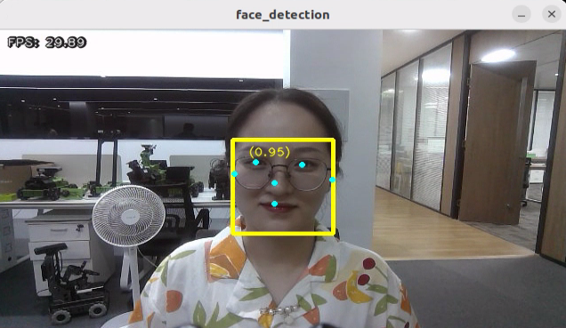

* **Program Analysis**

The source code of this program is saved in [/ros2_ws/src/example/example/mediapipe_example/face_detect.py](../_static/source_code/mediapipe_example.zip)


(1) Function

Main：

{lineno-start=65}

```python
def main():
    node = FaceDetectionNode('face_detection')
    try:
        rclpy.spin(node)
    except KeyboardInterrupt:
        node.destroy_node()
        rclpy.shutdown()
        print('shutdown')
    finally:
        print('shutdown finish')
```

Used to initiate face detection node.

(2) Class

FaceDetectionNode：

{lineno-start=17}

```python
class FaceDetectionNode(Node):
    def __init__(self, name):
        rclpy.init()
        super().__init__(name)
        self.running = True
        model_path = os.path.join(os.path.abspath(os.path.split(os.path.realpath(__file__))[0]), 'model/detector.tflite')
        base_options = python.BaseOptions(model_asset_path=model_path)
        options = vision.FaceDetectorOptions(base_options=base_options)
        self.detector = vision.FaceDetector.create_from_options(options)
        self.fps = fps.FPS()
        self.image_queue = queue.Queue(maxsize=2)
```

Init：

{lineno-start=20}

```python
        self.running = True
        model_path = os.path.join(os.path.abspath(os.path.split(os.path.realpath(__file__))[0]), 'model/detector.tflite')
        base_options = python.BaseOptions(model_asset_path=model_path)
        options = vision.FaceDetectorOptions(base_options=base_options)
        self.detector = vision.FaceDetector.create_from_options(options)
        self.fps = fps.FPS()
        self.image_queue = queue.Queue(maxsize=2)
        self.image_sub = self.create_subscription(Image, '/depth_cam/rgb/image_raw', self.image_callback, 1)
        self.get_logger().info('\033[1;32m%s\033[0m' % 'start')
        threading.Thread(target=self.main, daemon=True).start()
```

Initialize the parameters required for face recognition, call the image callback function, and start the model recognition function.

image_callback：

{lineno-start=34}

```python
    def image_callback(self, ros_image):
        cv_image = self.bridge.imgmsg_to_cv2(ros_image, "rgb8")
        rgb_image = np.array(cv_image, dtype=np.uint8)
        if self.image_queue.full():
            # If the queue is full, discard the oldest image(如果队列已满，丢弃最旧的图像)
            self.image_queue.get()
            # Put the image into the queue(将图像放入队列)
        self.image_queue.put(rgb_image)
```

Image callback function, used to read data from the camera node and enqueue it.

Main:

{lineno-start=43}

```python
    def main(self):
        while self.running:
            try:
                image = self.image_queue.get(block=True, timeout=1)
            except queue.Empty:
                if not self.running:
                    break
                else:
                    continue
            image = cv2.flip(image, 1)
            mp_image = mp.Image(image_format=mp.ImageFormat.SRGB, data=image)
            detection_result = self.detector.detect(mp_image)

            annotated_image = visualize(image, detection_result)
            self.fps.update()
            result_image = self.fps.show_fps(cv2.cvtColor(annotated_image, cv2.COLOR_RGB2BGR))
            cv2.imshow('face_detection', result_image)
            key = cv2.waitKey(1)
            if key == ord('q') or key == 27: # Press Q or Esc to quit(按q或者esc退出)
              break

        cv2.destroyAllWindows()
        rclpy.shutdown()
```

Read the model from MediaPipe, input the image, and after obtaining the output image, use OpenCV to draw the facial keypoints and display the feedback image.

### 7.3.5 3D Face Detection

In this program, MediaPipe Face Mesh is utilized to detect human face within the camera image.

MediaPipe Face Mesh is a powerful model capable of estimating 468 3D facial features, even when deployed on a mobile device. It employs machine learning to infer the 3D face contour accurately. Additionally, this model ensures real-time detection by utilizing a lightweight model architecture and GPU acceleration.

Furthermore, this model is integrated with a face conversion module that compensates for any differences between face landmark estimation and AR (Augmented Reality) applications. It establishes a metric 3D space and utilizes the facial landmark screen positions to estimate facial conversion within this space. The facial conversion data consists of common 3D primitives, including facial gesture conversion matrices and triangle facial mesh information.

* **Program Logic**

Firstly, you need to learn that machine learning pipeline is composed of two real-time deep neural network models. The system consists of two components: a face detector that processes the entire image and calculates the locations of faces, and a 3D face landmark model that uses these locations to predict an approximate 3D surface through regression.

To achieve 3D facial landmarks, we utilize transfer learning and train a network with multiple objectives: predicting 3D landmark coordinates on synthetic rendered data and 2D semantic contours on annotated real-world data simultaneously. This approach yields plausible 3D landmark predictions not only based on synthetic data but also on real-world data.

The 3D landmark network takes cropped video frames as input without requiring additional depth input. The model outputs the location of a 3D point and the probability that a face appears in the input and is properly aligned.

Once the face mesh model is imported, real-time images can be obtained from the camera by subscribing to topic messages.

Next, image preprocessing techniques like flipping the image and converting the color space are applied. The face detection model's minimum confidence is then used to determine whether the face has been successfully detected.

Finally, the detected face on the screen is projected into a 3D grid for visualization and display.

* **Operation Steps**

(1) Start the robot, and enter the robot system desktop using NoMachine.

(2) Click-on  to open the command-line terminal.

(3) Run the command to disable app auto-start app service.

```bash
sudo systemctl stop start_app_node.service
```

(4) Run the following command to enable the camera node.

```bash
ros2 launch peripherals depth_camera.launch.py
```

(5) Execute the command to enable the function program:

```bash
cd ~/ros2_ws/src/example/example/mediapipe_example && python3 face_mesh.py
```

(6) If you need to close this game, you need to press the "**Esc**" key in the image interface to exit the camera image interface.

(7) Then press "**Ctrl+C**" in the command line terminal interface. If closing fails, please try again.

* **Program Outcome**

After starting the game, when the depth camera detects a face, it will outline the face in the feedback image.


* **Program Analysis**

The source code of this program is located in [/ros2_ws/src/example/example/mediapipe_example/face_mesh.py](../_static/source_code/mediapipe_example.zip)


(1) Function

Main：

{lineno-start=}

```python
def main():
    node = FaceMeshNode('face_landmarker')
    try:
        rclpy.spin(node)
    except KeyboardInterrupt:
        node.destroy_node()
        rclpy.shutdown()
        print('shutdown')
    finally:
        print('shutdown finish')
```

Used to initiate the 3D face detection node.

(2) Class

FaceMeshNode：

{lineno-start=17}

```python
class FaceMeshNode(Node):
    def __init__(self, name):
        rclpy.init()
        super().__init__(name)
        self.running = True
        model_path = os.path.join(os.path.abspath(os.path.split(os.path.realpath(__file__))[0]), 'model/face_landmarker_v2_with_blendshapes.task')
        base_options = python.BaseOptions(model_asset_path=model_path)
        options = vision.FaceLandmarkerOptions(base_options=base_options,
                                       output_face_blendshapes=True,
```

Init：

{lineno-start=19}

```python
        rclpy.init()
        super().__init__(name)
        self.running = True
        model_path = os.path.join(os.path.abspath(os.path.split(os.path.realpath(__file__))[0]), 'model/face_landmarker_v2_with_blendshapes.task')
        base_options = python.BaseOptions(model_asset_path=model_path)
        options = vision.FaceLandmarkerOptions(base_options=base_options,
                                       output_face_blendshapes=True,
                                       output_facial_transformation_matrixes=True,
                                       num_faces=1)
        self.detector = vision.FaceLandmarker.create_from_options(options)

        self.fps = fps.FPS()

        self.image_queue = queue.Queue(maxsize=2)
        self.image_sub = self.create_subscription(Image, '/depth_cam/rgb/image_raw', self.image_callback, 1)
        self.get_logger().info('\033[1;32m%s\033[0m' % 'start')
        threading.Thread(target=self.main, daemon=True).start()
```

Initialize the parameters required for 3D face detection, call the image callback function, and start the model recognition function.

image_callback：

{lineno-start=39}

```python
    def image_callback(self, ros_image):
        cv_image = self.bridge.imgmsg_to_cv2(ros_image, "rgb8")
        rgb_image = np.array(cv_image, dtype=np.uint8)
        if self.image_queue.full():
            # If the queue is full, discard the oldest image(如果队列已满，丢弃最旧的图像)
            self.image_queue.get()
            # Put the image into the queue(将图像放入队列)
        self.image_queue.put(rgb_image)
```

The image callback function is used to retrieve data from the camera node and encapsulate it into a queue.

Main:

{lineno-start=48}

```python
    def main(self):
        while self.running:
            try:
                image = self.image_queue.get(block=True, timeout=1)
            except queue.Empty:
                if not self.running:
                    break
                else:
                    continue
            image = cv2.flip(image, 1)
            mp_image = mp.Image(image_format=mp.ImageFormat.SRGB, data=image)
            detection_result = self.detector.detect(mp_image)
            annotated_image = draw_face_landmarks_on_image(image, detection_result)
            self.fps.update()
            result_image = self.fps.show_fps(cv2.cvtColor(annotated_image, cv2.COLOR_RGB2BGR))
            cv2.imshow('face_landmarker', result_image)
            key = cv2.waitKey(1)
            if key == ord('q') or key == 27:  # Press Q or Esc to quit(按q或者esc退出)
                break
        cv2.destroyAllWindows()
        rclpy.shutdown()
```

Reading the model inside MediaPipe, inputting the image, and then using OpenCV to draw facial keypoints on the output image, and display the feedback image.

### 7.3.6 Hand Key Point Detection

MediaPipe's hand detection model is employed to showcase the key points of the hand and the connecting lines of these key points on the live camera feed.

MediaPipe Hands is an advanced hand and finger detection model that delivers high-fidelity results. Through the power of machine learning (ML), it accurately infers 21 3D landmarks of the hand from a single frame.

* **Program Logic**

Firstly, it's important to understand that MediaPipe's palm detection model employs a machine learning pipeline consisting of multiple models (including a linear model). This model processes the entire image and returns an oriented hand bounding box. On the other hand, the hand landmark model operates on cropped image regions defined by the palm detectors and provides high-fidelity 3D hand keypoints.

To begin, after importing the palm detection model, we subscribe to the topic message to obtain real-time camera images.

Next, various image pre-processing steps, such as flipping the image and converting the color space, are applied. These steps significantly reduce the need for data augmentation for the hand landmark model.

Furthermore, our pipeline allows for generating crops based on hand landmarks identified in the previous frame. The palm detection is invoked only when the landmark model is unable to recognize the presence of the hand accurately.

Afterward, by comparing the minimum confidence level of the hand detection model, we determine whether the palm has been successfully detected.

Lastly, the hand keypoints are detected and drawn on the camera image to visualize the detected hand in real-time.

* **Operation Steps**

(1) Start the robot, and enter the robot system desktop using NoMachine.

(2) Click-on  to start the command-line terminal.

(3) Run the command to disable app auto-start app service.

```bash
sudo systemctl stop start_app_node.service
```

(4) Execute the command to enable the camera node:

```bash
ros2 launch peripherals depth_camera.launch.py
```

(5) In a new command line terminal, enter the command and press Enter to run the function program.

```bash
cd ~/ros2_ws/src/example/example/mediapipe_example && python3 hand.py
```

(6) If you need to close this game, you need to press the "**Esc**" key in the image interface to exit the camera image interface.

(7) Then press "**Ctrl+C**" in the command line terminal interface. If closing fails, please try again.

* **Program Outcome**

Once the game starts, the depth camera will begin detecting the hand and display the hand key points on the camera image, with the key points connected.


* **Program Analysis**


The program file corresponding to this section of the course documentation is located at: [/ros2_ws/src/example/example/mediapipe_example/hand.py](../_static/source_code/mediapipe_example.zip)

(1) Function

**Main：**

{lineno-start=64}

```python
def main():
    node = HandNode('hand_landmarker')
    try:
        rclpy.spin(node)
    except KeyboardInterrupt:
        node.destroy_node()
        rclpy.shutdown()
        print('shutdown')
    finally:
        print('shutdown finish')
```

Used to initiate the 3D face detection node.

(2) Class

HandNode：

{lineno-start=17}

```python
class HandNode(Node):
    def __init__(self, name):
        rclpy.init()
        super().__init__(name)
        self.running = True
        model_path = os.path.join(os.path.abspath(os.path.split(os.path.realpath(__file__))[0]), 'model/hand_landmarker.task')
        base_options = python.BaseOptions(model_asset_path=model_path)
        options = vision.HandLandmarkerOptions(base_options=base_options,
                                       num_hands=2)
        self.detector = vision.HandLandmarker.create_from_options(options)
        self.fps = fps.FPS()
        self.image_queue = queue.Queue(maxsize=2)
        self.image_sub = self.create_subscription(Image, '/depth_cam/rgb/image_raw', self.image_callback, 1)
        self.get_logger().info('\033[1;32m%s\033[0m' % 'start')
```

Init：

{lineno-start=19}

```python
        rclpy.init()
        super().__init__(name)
        self.running = True
        model_path = os.path.join(os.path.abspath(os.path.split(os.path.realpath(__file__))[0]), 'model/hand_landmarker.task')
        base_options = python.BaseOptions(model_asset_path=model_path)
        options = vision.HandLandmarkerOptions(base_options=base_options,
                                       num_hands=2)
        self.detector = vision.HandLandmarker.create_from_options(options)
        self.fps = fps.FPS()
        self.image_queue = queue.Queue(maxsize=2)
        self.image_sub = self.create_subscription(Image, '/depth_cam/rgb/image_raw', self.image_callback, 1)
        self.get_logger().info('\033[1;32m%s\033[0m' % 'start')
        threading.Thread(target=self.main, daemon=True).start()
```

Initialize the parameters required for hand keypoint detection, call the image callback function, and start the model recognition function.

image_callback：

{lineno-start=34}

```python
    def image_callback(self, ros_image):
        cv_image = self.bridge.imgmsg_to_cv2(ros_image, "rgb8")
        rgb_image = np.array(cv_image, dtype=np.uint8)
        if self.image_queue.full():
            # If the queue is full, remove the oldest image(如果队列已满，丢弃最旧的图像)
            self.image_queue.get()
            # Put the image into the queue(将图像放入队列)
        self.image_queue.put(rgb_image)
```

The image callback function is used to read data from the camera node and enqueue it.

Main:

{lineno-start=43}

```python
    def main(self):
        while self.running:
            try:
                image = self.image_queue.get(block=True, timeout=1)
            except queue.Empty:
                if not self.running:
                    break
                else:
                    continue
            image = cv2.flip(image, 1)
            mp_image = mp.Image(image_format=mp.ImageFormat.SRGB, data=image)
            detection_result = self.detector.detect(mp_image)
            annotated_image = draw_hand_landmarks_on_image(image, detection_result)
            self.fps.update()
            result_image = self.fps.show_fps(cv2.cvtColor(annotated_image, cv2.COLOR_RGB2BGR))
            cv2.imshow('hand_landmarker', result_image)
            key = cv2.waitKey(1)
            if key == ord('q') or key == 27:  # Press Q or Esc to quit(按q或者esc退出)
                break
        cv2.destroyAllWindows()
        rclpy.shutdown()
```

Read the model from MediaPipe, input the image, and after obtaining the output image, use OpenCV to draw the key points of the hand and display the feedback image.

### 7.3.7 Body Key Points Detection

The MediaPipe body detection model is utilized to detect key points on the human body, which are then displayed on the live camera feed. This implementation incorporates MediaPipe Pose, a high-fidelity posture tracking model that leverages BlazePose to infer 33 3D key points. Additionally, this approach offers support for the ML Kit Pose Detection API.


* **Program Logic**

Firstly, import body detection model.

Subsequently, flip over the image and convert the color space of the image. Check whether the human body is successfully detected based on the minimum confidence of the body detection model.

Next, define the tracked posture by comparing the minimum tracking confidence. If the confidence does not meet the minimum threshold, perform automatic human detection on the next input image.

In the pipeline, a detector is employed to initially localize the region of interest (ROI) corresponding to a person's pose within a frame. Subsequently, a tracker utilizes the cropped ROI frame as input to predict pose landmarks and segmentation masks within the ROI.

For video applications, the detector is invoked selectively, only when necessary. Specifically, it is used for the first frame or when the tracker fails to recognize the body pose in the preceding frame. In all other frames, the pipeline derives ROIs based on the pose landmarks detected in the previous frame.

After MediaPipe body detection model is imported, access the live camera feed through subscribing the related topic message.

Lastly, draw the key points representing the human body.

* **Operation Steps**

(1) Start the robot, and enter the robot system desktop using VNC.

(2) Click-on  to start the command-line terminal.

(3) Run the command to disable app auto-start app service.

```bash
sudo systemctl stop start_app_node.service
```

(4) Execute the command to enable the camera node:

```bash
ros2 launch peripherals depth_camera.launch.py
```

(5) In a new command line terminal, enter the command and press Enter to execute the program

```bash
cd ~/ros2_ws/src/example/example/mediapipe_example && python3 pose.py
```

(6) If you need to close this game, you need to press the "**Esc**" key in the image interface to exit the camera image interface.

(7) Then press "**Ctrl+C**" in the command line terminal interface. If closing fails, please try again.

* **Program Outcome**

After the game starts, depth camera will begin detecting human pose, and body key points can be displayed and connected on the live camera feed.


* **Program Analysis**

The program file is saved in: [/ros2_ws/src/example/example/mediapipe_example/pose.py](../_static/source_code/mediapipe_example.zip)


(1) Function

Main：

{lineno-start=65}

```python
def main():
    node = PoseNode('pose_landmarker')
    try:
        rclpy.spin(node)
    except KeyboardInterrupt:
        node.destroy_node()
        rclpy.shutdown()
        print('shutdown')
    finally:
        print('shutdown finish')
```

Used to initiate the 3D face detection node.

(2) Class

PoseNode：

{lineno-start=17}

```python
class PoseNode(Node):
    def __init__(self, name):
        rclpy.init()
        super().__init__(name)
        self.running = True
        model_path = os.path.join(os.path.abspath(os.path.split(os.path.realpath(__file__))[0]), 'model/pose_landmarker.task')
        base_options = python.BaseOptions(model_asset_path=model_path)
        options = vision.PoseLandmarkerOptions(
            base_options=base_options,
            output_segmentation_masks=True)
        self.detector = vision.PoseLandmarker.create_from_options(options)
        self.fps = fps.FPS()
        self.image_queue = queue.Queue(maxsize=2)
        self.image_sub = self.create_subscription(Image, '/depth_cam/rgb/image_raw', self.image_callback, 1)
```

Init：

{lineno-start=18}

```python
    def __init__(self, name):
        rclpy.init()
        super().__init__(name)
        self.running = True
        model_path = os.path.join(os.path.abspath(os.path.split(os.path.realpath(__file__))[0]), 'model/pose_landmarker.task')
        base_options = python.BaseOptions(model_asset_path=model_path)
        options = vision.PoseLandmarkerOptions(
            base_options=base_options,
            output_segmentation_masks=True)
        self.detector = vision.PoseLandmarker.create_from_options(options)
        self.fps = fps.FPS()
        self.image_queue = queue.Queue(maxsize=2)
        self.image_sub = self.create_subscription(Image, '/depth_cam/rgb/image_raw', self.image_callback, 1)
        self.get_logger().info('\033[1;32m%s\033[0m' % 'start')
        threading.Thread(target=self.main, daemon=True).start()
```

Initialize the parameters required for limb detection, call the image callback function, and start the model recognition process.

image_callback：

{lineno-start=34}

```python
    def image_callback(self, ros_image):
        cv_image = self.bridge.imgmsg_to_cv2(ros_image, "rgb8")
        rgb_image = np.array(cv_image, dtype=np.uint8)
        if self.image_queue.full():
            # If the queue is full, remove the oldest image(如果队列已满，丢弃最旧的图像)
            self.image_queue.get()
            # Put the image into the queue(将图像放入队列)
        self.image_queue.put(rgb_image)
```

Image callback function, used to read data from the camera node and enqueue it.

Main:

{lineno-start=43}

```python
    def main(self):
        while self.running:
            try:
                image = self.image_queue.get(block=True, timeout=1)
            except queue.Empty:
                if not self.running:
                    break
                else:
                    continue
            image = cv2.flip(image, 1)
            mp_image = mp.Image(image_format=mp.ImageFormat.SRGB, data=image)
            detection_result = self.detector.detect(mp_image)
            annotated_image = draw_pose_landmarks_on_image(image, detection_result)
            self.fps.update()
            result_image = self.fps.show_fps(cv2.cvtColor(annotated_image, cv2.COLOR_RGB2BGR))
            cv2.imshow('pose_landmarker', result_image)
            key = cv2.waitKey(1)
            if key == ord('q') or key == 27:   # Press Q or Esc to quit(按q或者esc退出)
                break
        cv2.destroyAllWindows()
        rclpy.shutdown()
```

Read the model inside MediaPipe, input the image, and after obtaining the output image, use OpenCV to draw facial keypoints and display the feedback image.

<p id="anchor_7_1_8"></p>

### 7.3.8 Fingertip Trajectory Recognition

Identify hand joints using MediaPipe's hand detection model. Once a specific gesture is recognized, the robot will initiate fingertip locking on the screen, track the fingertips, and generate their movement trajectory.

* **Program Logic**

First, invoke the MediaPipe hand detection model to capture the camera image. Next, flip and process the image to extract hand information. Utilizing the connection lines between key points of the hand, calculate the finger angles to determine the gesture. Upon recognition of a specific gesture, the robot will proceed to identify and lock the fingertips on the screen, simultaneously tracing the movement trajectory of the fingertips on the display.

* **Operation Steps**

:::{Note}
The input command should be case sensitive, and the keyword can be complemented by "**Tab**" key.
:::

(1) Start the robot, and enter the robot system desktop using VNC.

(2) Click-on  to start the command-line terminal.

(3) Run the command to disable app auto-start app service.

```bash
sudo systemctl stop start_app_node.service
```
(4) Execute the command to enable the camera node:

```bash
ros2 launch peripherals depth_camera.launch.py
```

(5) In a new command terminal, enter the below command and press Enter to run the program:
```bash
cd ~/ros2_ws/src/example/example/mediapipe_example && python3 hand_gesture.py
```
(6) The program will launch the camera's image interface. For detailed recognition steps, please refer to [**7.1.8 Fingertip Trajectory Recognition->Program Outcome**](#anchor_7_1_8).
(7) To close this function, press the "**Esc**" key in the image interface to exit the camera view.
(8) Then press "**Ctrl+C**" in the command line terminal interface. If closing fails, please try again.

* **Program Outcome**

Once the game starts, position your hand within the camera's field of view. Upon recognition, the hand keypoints will be highlighted on the camera feed.

If the robot detects the **"1"** gesture, the trajectory of your fingertip motion will begin to be recorded on the camera feed. If it detects the **"5"** gesture, the recorded fingertip trajectory will be cleared.

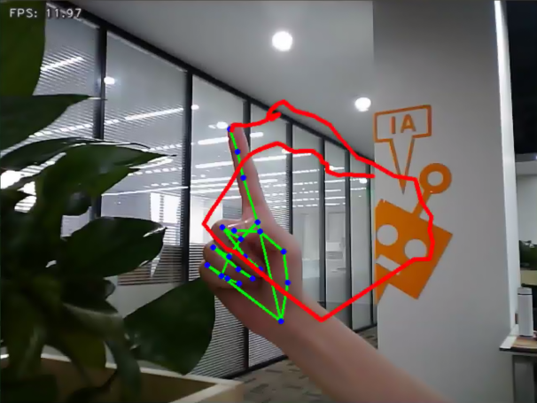


* **Program Analysis**

The program file is saved in [/ros2_ws/src/example/example/mediapipe_example/hand_gesture.py](../_static/source_code/mediapipe_example.zip)


:::{Note}
Prior to making any alterations to the program, ensure to create a backup of the original factory program. Modify it only after creating the backup. Directly editing the source code file is prohibited to prevent inadvertent parameter modifications that could render the robot dysfunctional and irreparable!
:::

Based on the game's impact, the process logic of this game is organized as depicted in the figure below:

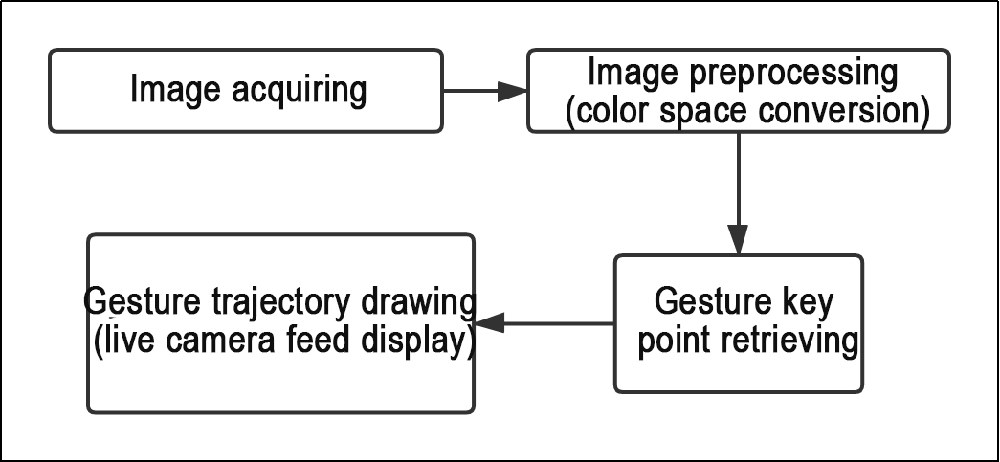

As depicted in the image above, the purpose of this game is to capture an image using the camera, preprocess it by converting its color space for easier identification, extract feature points corresponding to hand gestures from the converted image, and determine different gestures (based on angles) through logical analysis of key feature points. Finally, the trajectory of the recognized gesture is drawn on the display screen.

The program's logic flowchart extracted from the program files is illustrated in the figure below.


From the above diagram, it can be seen that the program's logical flow is mainly divided into initialization functions and recognition processing functions. The following document content will be written according to the program logic flow chart mentioned above.

(1) Function

Main:

{lineno-start=212}

```python
def main():
    node = HandGestureNode('hand_gesture')
    try:
        rclpy.spin(node)
    except KeyboardInterrupt:
        node.destroy_node()
        rclpy.shutdown()
        print('shutdown')
    finally:
        print('shutdown finish')
```

The main function is used to start the fingertip trajectory recognition node.

get_hand_landmarks:

{lineno-start=19}

```python
def get_hand_landmarks(img, landmarks):
    """
    Convert landmarks from normalized output of Mediapipe to pixel coordinates(将landmarks从medipipe的归一化输出转为像素坐标)
    :param img: Image corresponding to pixel coordinates(像素坐标对应的图片)
    :param landmarks: Normalized key points(归一化的关键点)
    :return:
    """
    h, w, _ = img.shape
    landmarks = [(lm.x * w, lm.y * h) for lm in landmarks]
    return np.array(landmarks)
```

Convert the normalized data from madipipe into pixel coordinates.

hand_angle：

{lineno-start=30}

```python
def hand_angle(landmarks):
    """
    Calculate the bending angle of each finger(计算各个手指的弯曲角度)
    :param landmarks: The key points of the hand(手部关键点)
    :return: Each finger's angle(各个手指的角度)
    """
    angle_list = []
    # thumb 大拇指
    angle_ = vector_2d_angle(landmarks[3] - landmarks[4], landmarks[0] - landmarks[2])
    angle_list.append(angle_)
    # index finger 食指
    angle_ = vector_2d_angle(landmarks[0] - landmarks[6], landmarks[7] - landmarks[8])
    angle_list.append(angle_)
    # middle finger 中指
    angle_ = vector_2d_angle(landmarks[0] - landmarks[10], landmarks[11] - landmarks[12])
    angle_list.append(angle_)
    # ring finger 无名指
    angle_ = vector_2d_angle(landmarks[0] - landmarks[14], landmarks[15] - landmarks[16])
    angle_list.append(angle_)
    # pinky 小拇指
    angle_ = vector_2d_angle(landmarks[0] - landmarks[18], landmarks[19] - landmarks[20])
    angle_list.append(angle_)
    angle_list = [abs(a) for a in angle_list]
    return angle_list
```

After extracting the hand feature points into the 'results' variable, it is necessary to logically process these points. By evaluating the angular relationship between the feature points, specific finger types (thumb, index finger) can be identified. The 'hand_angle' function accepts the landmark feature point set (results) as input, and subsequently employs the 'vector_2d_angle' function to compute the angles between the corresponding feature points. The feature points corresponding to the elements of the landmark set are depicted in the figure below:

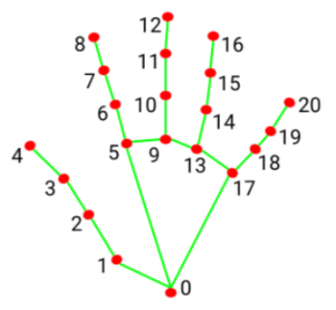

Taking the thumb's angle calculation as an example: the vector_2d_angle function is used to calculate the angle between joint points. landmarks\[3\], landmarks\[4\], landmarks\[0\], and landmarks\[2\] correspond to feature points 3, 4, 0, and 2 in the hand feature extraction diagram. By calculating the angles of these joint points, the thumb's posture characteristics can be determined. Similarly, the processing logic for the other finger joints is analogous.

To ensure the accuracy of recognition, the parameters and basic logic (addition and subtraction of angle calculations) in the hand_angle function should remain at their default settings.

h_gesture：

{lineno-start=55}

```python
def h_gesture(angle_list):
    """
    Determine the gesture made by the fingers based on the two-dimensional features(通过二维特征确定手指所摆出的手势)
    :param angle_list: The angles of each finger's bending(各个手指弯曲的角度)
    :return : Gesture name string(手势名称字符串)
    """
    thr_angle = 65.
    thr_angle_thumb = 53.
    thr_angle_s = 49.
    gesture_str = "none"
    if (angle_list[0] > thr_angle_thumb) and (angle_list[1] > thr_angle) and (angle_list[2] > thr_angle) and (
            angle_list[3] > thr_angle) and (angle_list[4] > thr_angle):
        gesture_str = "fist"
    elif (angle_list[0] < thr_angle_s) and (angle_list[1] < thr_angle_s) and (angle_list[2] > thr_angle) and (
            angle_list[3] > thr_angle) and (angle_list[4] > thr_angle):
        gesture_str = "hand_heart"
    elif (angle_list[0] < thr_angle_s) and (angle_list[1] < thr_angle_s) and (angle_list[2] > thr_angle) and (
            angle_list[3] > thr_angle) and (angle_list[4] < thr_angle_s):
        gesture_str = "nico-nico-ni"
    elif (angle_list[0] < thr_angle_s) and (angle_list[1] > thr_angle) and (angle_list[2] > thr_angle) and (
            angle_list[3] > thr_angle) and (angle_list[4] > thr_angle):
        gesture_str = "hand_heart"
    elif (angle_list[0] > 5) and (angle_list[1] < thr_angle_s) and (angle_list[2] > thr_angle) and (
            angle_list[3] > thr_angle) and (angle_list[4] > thr_angle):
        gesture_str = "one"
    elif (angle_list[0] > thr_angle_thumb) and (angle_list[1] < thr_angle_s) and (angle_list[2] < thr_angle_s) and (
            angle_list[3] > thr_angle) and (angle_list[4] > thr_angle):
        gesture_str = "two"
    elif (angle_list[0] > thr_angle_thumb) and (angle_list[1] < thr_angle_s) and (angle_list[2] < thr_angle_s) and (
            angle_list[3] < thr_angle_s) and (angle_list[4] > thr_angle):
        gesture_str = "three"
    elif (angle_list[0] > thr_angle_thumb) and (angle_list[1] > thr_angle) and (angle_list[2] < thr_angle_s) and (
            angle_list[3] < thr_angle_s) and (angle_list[4] < thr_angle_s):
        gesture_str = "OK"
    elif (angle_list[0] > thr_angle_thumb) and (angle_list[1] < thr_angle_s) and (angle_list[2] < thr_angle_s) and (
            angle_list[3] < thr_angle_s) and (angle_list[4] < thr_angle_s):
        gesture_str = "four"
    elif (angle_list[0] < thr_angle_s) and (angle_list[1] < thr_angle_s) and (angle_list[2] < thr_angle_s) and (
            angle_list[3] < thr_angle_s) and (angle_list[4] < thr_angle_s):
        gesture_str = "five"
    elif (angle_list[0] < thr_angle_s) and (angle_list[1] > thr_angle) and (angle_list[2] > thr_angle) and (
            angle_list[3] > thr_angle) and (angle_list[4] < thr_angle_s):
        gesture_str = "six"
    else:
        "none"
    return gesture_str
```

After identifying the different finger types of the hand and determining their positions on the image, logical recognition processing of various gestures can be performed by implementing the 'h_gesture' function.

In the `h_gesture` function depicted above, the parameters `thr_angle`, `thr_angle_thenum`, and `thr_angle_s` represent the angle threshold values for corresponding gesture logic points. These values have been empirically tested to ensure stable recognition effects. It is not recommended to alter them unless the logic processing effect is unsatisfactory, in which case adjustments within a range of ±5 values are sufficient. The `angle_list[0,1,2,3,4]` corresponds to the five finger types associated with the palm.

Here's an example using the gesture "**one**":


The code presented represents the logical angle evaluation of the fingers for the "**one**" gesture. `angle_list[0]>5` checks whether the angle value of the thumb joint feature point in the image is greater than 5. `angle_list[1]<thr_angle_s` checks if the angle feature of the index finger joint feature point is less than the predetermined value `thr_angle_s`. Similarly, `angle_list[2]<thr_angle`verifies if the angle feature of the middle finger feature point is less than the predetermined value 'thr_angle'. The logical processing for the other two fingers, `angle_list[3]` and `angle_list[4]`, follows a similar method. When the above conditions are met, the current gesture feature is recognized as "**one**", and the same principle applies to recognizing other gesture features.

Different gesture recognitions involve distinct logical processing, but the overall logical framework remains similar. For recognizing other gesture features, refer to the previous paragraph.

draw_points:

{lineno-start=107}

```python
def draw_points(img, points, thickness=4, color=(255, 0, 0)):
    points = np.array(points).astype(dtype=np.int64)
    if len(points) > 2:
        for i, p in enumerate(points):
            if i + 1 >= len(points):
                break
            cv2.line(img, p, points[i + 1], color, thickness)
```

Draw the currently recognized hand shape and each joint point.

(2) Class

State:

{lineno-start=101}

```python
class State(enum.Enum):
    NULL = 0
    START = 1
    TRACKING = 2
    RUNNING = 3
```

An enumeration class used to set the current state of the program.

HandGestureNode：

{lineno-start=107}

```python
def draw_points(img, points, thickness=4, color=(255, 0, 0)):
    points = np.array(points).astype(dtype=np.int64)
    if len(points) > 2:
        for i, p in enumerate(points):
            if i + 1 >= len(points):
                break
            cv2.line(img, p, points[i + 1], color, thickness)

class HandGestureNode(Node):
    def __init__(self, name):
        rclpy.init()
        super().__init__(name)
        self.running = True
        self.drawing = mp.solutions.drawing_utils

        self.hand_detector = mp.solutions.hands.Hands(
            static_image_mode=False,
            max_num_hands=1,
            min_tracking_confidence=0.05,
            min_detection_confidence=0.6
        )
        
        self.fps = fps.FPS()  #  FPS calculator(fps计算器)
        self.state = State.NULL
        self.points = []
        self.count = 0
        self.image_queue = queue.Queue(maxsize=2)
        self.image_sub = self.create_subscription(Image, '/depth_cam/rgb/image_raw', self.image_callback, 1)
        self.get_logger().info('\033[1;32m%s\033[0m' % 'start')
        threading.Thread(target=self.main, daemon=True).start()
```

The HandGestureNode is a fingertip trajectory recognition node that contains three functions: an initialization function, a main function, and an image callback function.

Init:

{lineno-start=116}

```python
    def __init__(self, name):
        rclpy.init()
        super().__init__(name)
        self.running = True
        self.drawing = mp.solutions.drawing_utils

        self.hand_detector = mp.solutions.hands.Hands(
            static_image_mode=False,
            max_num_hands=1,
            min_tracking_confidence=0.05,
            min_detection_confidence=0.6
        )
        
        self.fps = fps.FPS()  #  FPS calculator(fps计算器)
        self.state = State.NULL
        self.points = []
        self.count = 0
        self.image_queue = queue.Queue(maxsize=2)
        self.image_sub = self.create_subscription(Image, '/depth_cam/rgb/image_raw', self.image_callback, 1)
        self.get_logger().info('\033[1;32m%s\033[0m' % 'start')
        threading.Thread(target=self.main, daemon=True).start()
```

Initialize each component needed and call the camera node.

<p id="anchor_7_1_9"></p>

### 7.3.9 Posture Control

The human posture estimation model, trained using the MediaPipe machine learning framework, detects the human body feature in the captured image, identifies relevant joint positions, and subsequently recognizes a variety of sequential actions. This process enables direct control of the robot through somatosensory input.

Viewed from the perspective of the robot, the following actions correspond to specific movements:

① If the user lifts their left arm, the robot will move a certain distance to the right.

② If the user lifts their right arm, the robot will move a certain distance to the left.

③ If the user lifts their left leg, the robot will move forward a certain distance.

④ If the user lifts their right leg, the robot will move backward a certain distance.

* **Program Logic**

First, import MediaPipe's human pose estimation model and subscribe to topic messages to obtain real-time footage from the camera.

MediaPipe is an open-source multimedia machine learning model application framework that runs cross-platform on mobile devices, workstations, and servers. It supports mobile GPU acceleration and inference engines such as TensorFlow and TF Lite.

Next, utilize the built model to detect key points of the human body in the screen. Connect these key points to display the human body and determine the human body posture.

Finally, if a specific action is detected in the human body posture, the robot will respond accordingly.

* **Operation Steps**

:::{Note}
The input command should be case sensitive, and keywords can be complemented using Tab key.
:::

(1) Start the robot, and enter the robot system desktop using VNC.

(2) Click-on  to start the command-line terminal.

(3) Run the command to disable app auto-start app service.
```bash
sudo systemctl stop start_app_node.service
```
(4) Execute the command to run the game program:
```bash
ros2 launch example body_control.launch.py
```
(5) If you need to close this gameplay, you need to press the "**Esc**" key in the image interface to exit the camera image interface.

(6) Then press "**Ctrl+C**" in the command line terminal interface. If closing fails, please try again.

* **Program Outcome**

Once the game is initiated, stand within the camera's field of view. When a person is detected, the screen will display key points of the body and lines connecting them.

From the perspective of the robot, lifting the left arm will cause the robot to turn left; lifting the right arm will make the robot turn right; lifting the left leg will make the robot move forward a certain distance; lifting the right leg will make the robot move backward a certain distance.


* **Program Analysis**

The program file is saved in [ros2_ws/src/example/example/body_control/include/body_control.py](../_static/source_code/body_control.zip)


:::{Note}
Prior to making any alterations to the program, ensure to create a backup of the original factory program. Modify it only after creating the backup. Directly editing the source code file is prohibited to prevent inadvertent parameter modifications that could render the robot dysfunctional and irreparable!
:::

The game process logic is outlined below:


①  Capture an image through the camera.

② After performing a demonstration action, the car will execute the corresponding action.

③  From the car's perspective, lifting the left arm will cause the car to turn left; lifting the right arm will cause the car to turn right in a circle; lifting the left leg will make the car move forward a certain distance; lifting the right leg will make the car move backward a certain distance.

The program's logic flowchart, obtained from the program files, is presented below:


① Initialization function (init(self.name)) defines relevant parameters, including:

* Definition of the image tool (self.drawing) object.

* Points used to draw recognized features.

* Definition of the limb detection object (self.body_detector).

② Identified feature points' output results undergo logical processing for recognition.

③ Actions are determined and stored based on key point distance conditions.

④ Finally, the output results are generated, and the car executes corresponding actions.

(1) Function

Main：

{lineno-start=272}

```python
def main():
    node = BodyControlNode('body_control')
    rclpy.spin(node)
    node.destroy_node()
```

Used to start the body sensation control node.

get_joint_landmarks：

{lineno-start=47}

```python
def get_joint_landmarks(img, landmarks):
    """
    将landmarks从medipipe的归一化输出转为像素坐标(Convert landmarks from medipipe's normalized output to pixel coordinates)
    :param img: 像素坐标对应的图片(picture corresponding to pixel coordinate)
    :param landmarks: 归一化的关键点(normalized keypoint)
    :return:
    """
    h, w, _ = img.shape
    landmarks = [(lm.x * w, lm.y * h) for lm in landmarks]
    return np.array(landmarks)
```

Used to convert the recognized information into pixel coordinates.

joint_distance：

{lineno-start=58}

```python
def joint_distance(landmarks):
    distance_list = []

    d1 = landmarks[LEFT_HIP] - landmarks[LEFT_SHOULDER]
    d2 = landmarks[LEFT_HIP] - landmarks[LEFT_WRIST]
    dis1 = d1[0]**2 + d1[1]**2
    dis2 = d2[0]**2 + d2[1]**2
    distance_list.append(round(dis1/dis2, 1))
   
    d1 = landmarks[RIGHT_HIP] - landmarks[RIGHT_SHOULDER]
    d2 = landmarks[RIGHT_HIP] - landmarks[RIGHT_WRIST]
    dis1 = d1[0]**2 + d1[1]**2
    dis2 = d2[0]**2 + d2[1]**2
    distance_list.append(round(dis1/dis2, 1))
    
    d1 = landmarks[LEFT_HIP] - landmarks[LEFT_ANKLE]
    d2 = landmarks[LEFT_ANKLE] - landmarks[LEFT_KNEE]
    dis1 = d1[0]**2 + d1[1]**2
    dis2 = d2[0]**2 + d2[1]**2
    distance_list.append(round(dis1/dis2, 1))
   
    d1 = landmarks[RIGHT_HIP] - landmarks[RIGHT_ANKLE]
    d2 = landmarks[RIGHT_ANKLE] - landmarks[RIGHT_KNEE]
    dis1 = d1[0]**2 + d1[1]**2
    dis2 = d2[0]**2 + d2[1]**2
    distance_list.append(round(dis1/dis2, 1))
    
    return distance_list
```

Used to calculate the distance between each joint point based on pixel coordinates.

(2) Class

{lineno-start=87}

```python
class BodyControlNode(Node):
    def __init__(self, name):
        rclpy.init()
        super().__init__(name, allow_undeclared_parameters=True, automatically_declare_parameters_from_overrides=True)
        self.name = name
        self.drawing = mp.solutions.drawing_utils
        self.body_detector = mp_pose.Pose(
            static_image_mode=False,
            min_tracking_confidence=0.5,
            min_detection_confidence=0.5)
        self.running = True
        self.fps = fps.FPS()  # fps计算器(FPS calculator)
        signal.signal(signal.SIGINT, self.shutdown)

        self.move_finish = True
        self.stop_flag = False
        self.left_hand_count = []
        self.right_hand_count = []
        self.left_leg_count = []
        self.right_leg_count = []

        self.detect_status = [0, 0, 0, 0]
```

This class is the body control node.

Init:

{lineno-start=86}

```python
    def __init__(self, name):
        rclpy.init()
        super().__init__(name, allow_undeclared_parameters=True, automatically_declare_parameters_from_overrides=True)
        self.name = name
        self.drawing = mp.solutions.drawing_utils
        self.body_detector = mp_pose.Pose(
            static_image_mode=False,
            min_tracking_confidence=0.5,
            min_detection_confidence=0.5)
        self.running = True
        self.fps = fps.FPS()  #  FPS calculator(fps计算器)
        signal.signal(signal.SIGINT, self.shutdown)
```

Initialize the parameters required for body control, read the image callback node from the camera, initialize nodes such as servos, chassis, buzzers, motors, etc., and finally start the main function within the class.4

get_node_state：

{lineno-start=134}

```python
    def get_node_state(self, request, response):
        response.success = True
        return response
```

Set the initialization state of the current node.

shutdown：

{lineno-start=138}

```python
    def shutdown(self, signum, frame):
        self.running = False
```

Program exit callback function used to terminate recognition.

image_callback：

{lineno-start=141}

```python
    def image_callback(self, ros_image):
        cv_image = self.bridge.imgmsg_to_cv2(ros_image, "rgb8")
        rgb_image = np.array(cv_image, dtype=np.uint8)
        if self.image_queue.full():
            # If the queue is full, discard the oldest image(如果队列已满，丢弃最旧的图像)
            self.image_queue.get()
        # Put the image into the queue(将图像放入队列)
        self.image_queue.put(rgb_image)

```

Image node callback function used to process images and enqueue them.

Move:

{lineno-start=150}

```python
    def move(self, *args):
        self.mecanum_pub.publish(args[0])
        time.sleep(args[1])
        self.mecanum_pub.publish(Twist())
        time.sleep(0.1)
        self.stop_flag =True
        self.move_finish = True
```

Movement strategy function that moves the vehicle according to the recognized limb actions.

buzzer_warn:

{lineno-start=158}

```python
    def buzzer_warn(self):
        msg = BuzzerState()
        msg.freq = 1900
        msg.on_time = 0.2
        msg.off_time = 0.01
        msg.repeat = 1
        self.buzzer_pub.publish(msg)
```

Buzzer control function used for buzzer alarms.

image_proc:

{lineno-start=166}

```python
    def image_proc(self, image):
        image_flip = cv2.flip(cv2.cvtColor(image, cv2.COLOR_RGB2BGR), 1)
        results = self.body_detector.process(image)
        if results is not None and results.pose_landmarks is not None:
            if self.move_finish:
                twist = Twist()
                landmarks = get_joint_landmarks(image, results.pose_landmarks.landmark)
                distance_list = (joint_distance(landmarks))
              
                if distance_list[0] < 1:
                    self.detect_status[0] = 1
                if distance_list[1] < 1:
                    self.detect_status[1] = 1
```

Function for recognizing limbs, which invokes the model to draw key points of the human body based on the recognized information, and then performs movements according to the recognized posture.

Main:

{lineno-start=248}

```python
    def main(self):
        while self.running:
            try:
                image = self.image_queue.get(block=True, timeout=1)
            except queue.Empty:
                if not self.running:
                    break
                else:
                    continue
            try:
                result_image = self.image_proc(np.copy(image))
            except BaseException as e:
                self.get_logger().info('\033[1;32m%s\033[0m' % e)
                result_image = cv2.flip(cv2.cvtColor(image, cv2.COLOR_RGB2BGR), 1)
            self.fps.update()
            result_image = self.fps.show_fps(result_image)
            cv2.imshow(self.name, result_image)
            key = cv2.waitKey(1)
            if key == ord('q') or key == 27:  # Press q or esc to exit(按q或者esc退出)
                self.mecanum_pub.publish(Twist())
                self.running = False
```

The main function within the BodyControlNode class, used to input image information into the recognition function and display the returned image.

### 7.3.10 Human Body Tracking

:::{Note}

This game is best suited for indoor environments. Outdoor settings may significantly interfere with its effectiveness!

:::

Utilize the yolov5 framework to import a pre-trained human pose model for detecting human bodies. The center point of the detected human body will be indicated in the returned image. When a human body approaches, the robot will retreat; conversely, if the human body is distant, the robot will move forward. This ensures that the distance between the human body and the robot remains approximately 3 meters at all times.

* **Program Logic**

First, import the human pose estimation model from yolov5, and subscribe to topic messages to obtain real-time camera images. Next, utilize the trained model to detect key points of the human body in the images, and calculate the coordinates of the human body's center point based on all detected key points. Finally, update the PID controller based on the coordinates of the human body's center point and the screen's center point to control the robot's movement in sync with the human body's movement.

* **Operation Steps**

:::{Note}

When entering commands, strict case sensitivity is required, and you can use the "**Tab**" key to complete keywords.

:::

(1) Click-on  to start the command-line terminal.

(2) Run the command to disable app auto-start app service.

```
sudo systemctl stop start_app_node.service
```

(3) Enter the following command and press Enter:

```
ros2 launch example body_track.launch.py
```

(4) To exit this activity, press the '**Esc**' key in the image interface to exit the camera view.

(5) Press '**Ctrl+C**' in the command line terminal to close all windows. If you encounter any issues closing them, please try again.

* **Program Outcome**

Upon initiating the game, the camera captures the human body within its field of view. Once detected, the center point of the human body is highlighted in the displayed image.

From the robot's perspective, if the human body is in close proximity, the robot will retreat. Conversely, if the human body is distant, the robot will move forward, ensuring that the distance between the human body and the robot remains approximately 3 meters at all times.


* **Program Analysis**

The program file is saved in [ros2_ws/src/example/example/body_control/include/body_track.py](../_static/source_code/body_control.zip)


:::{Note}

Prior to making any alterations to the program, ensure to create a backup of the original factory program. Modify it only after creating the backup. Directly editing the source code file is prohibited to prevent inadvertent parameter modifications that could render the robot dysfunctional and irreparable!

:::

Based on the game's effectiveness, the procedural logic is delineated as follows:


① The car captures images through the camera.

② It identifies the human body's position in the image and calculates the distance between the human body and the car.

③ Finally, the car adjusts its movement to follow within the preset distance limit.

The program's logic flowchart, derived from the program files, is illustrated below:


Initialization Function of the BodyControlNode Class:

**Configuration of Linear and Angular Speed**: Adjusts the car's speed based on the detected distance from the human body.

**Definition of Chassis Publisher**: Publishes the chassis's position and orientation to control the car's forward and backward movement.

**Yolov5 Human Body Detection**: Utilizes the yolov5 single-target detection algorithm to detect human bodies and obtain their positions.

**PID Parameter Initialization**: Initializes parameters related to the PID controller, governing sensitivity to the distance between the car and the human body.

(1) Function

Main：

{lineno-start=179}

```
def main():
    node = BodyControlNode('body_control')
    rclpy.spin(node)
    node.destroy_node()
```

Used to start the human tracking node.10.4.2 Class

{lineno-start=29}

```
class BodyControlNode(Node):
    def __init__(self, name):
        rclpy.init()
        super().__init__(name, allow_undeclared_parameters=True, automatically_declare_parameters_from_overrides=True)
        self.name = name
       
        self.pid_d = pid.PID(0.1, 0, 0)
        #self.pid_d = pid.PID(0, 0, 0)
        
        self.pid_angular = pid.PID(0.002, 0, 0)
        #self.pid_angular = pid.PID(0, 0, 0)
```

This class is the human tracking node.

Init:

{lineno-start=31}

```
        rclpy.init()
        super().__init__(name, allow_undeclared_parameters=True, automatically_declare_parameters_from_overrides=True)
        self.name = name
       
        self.pid_d = pid.PID(0.1, 0, 0)
        #self.pid_d = pid.PID(0, 0, 0)
        
        self.pid_angular = pid.PID(0.002, 0, 0)
        #self.pid_angular = pid.PID(0, 0, 0)
        
        self.go_speed, self.turn_speed = 0.007, 0.04
```

Initialize the parameters required for human tracking, read nodes such as the camera's image callback, depth information, chassis, YOLOv5 recognition, etc., and then synchronize the time to align depth information and image information, finally start the main function within the class.

get_node_state：

{lineno-start=80}

```
    def get_node_state(self, request, response):
        response.success = True
        return response
```

Set the initialization state of the current node.

shutdown：

{lineno-start=84}

```
    def shutdown(self, signum, frame):
        self.running = False
```

Program exit callback function used to terminate recognition.

get_object_callback：

{lineno-start=87}

```
    # Obtain target detection result(获取目标检测结果)
    def get_object_callback(self, msg):
        for i in msg.objects:
            class_name = i.class_name
            if class_name == 'person':
                if i.box[1] < 10:
                    self.center = [int((i.box[0] + i.box[2])/2), int(i.box[1]) + abs(int((i.box[1] - i.box[3])/4))]
                else:
                    self.center = [int((i.box[0] + i.box[2])/2), int(i.box[1]) + abs(int((i.box[1] - i.box[3])/3))]
```

Callback function for YOLOv5 recognition node, which converts recognition information into pixel coordinates.

image_callback：

{lineno-start=100}

```
    def image_callback(self, ros_image):
        cv_image = self.bridge.imgmsg_to_cv2(ros_image, "rgb8")
        rgb_image = np.array(cv_image, dtype=np.uint8)
        if self.image_queue.full():
            # If the queue is full, discard the oldest image(如果队列已满，丢弃最旧的图像)
            self.image_queue.get()
        # Put the image into the queue(将图像放入队列)
        self.image_queue.put(rgb_image)
```

Time synchronization callback function that requires input of depth information and RGB image, synchronizes both pieces of information, and then enqueues them.

image_proc:

{lineno-start=109}

```
    def image_proc(self, rgb_image):
        twist = Twist()
        if self.center is not None:
            h, w = rgb_image.shape[:-1]
            cv2.circle(rgb_image, tuple(self.center), 10, (0, 255, 255), -1) 
            #################
            roi_h, roi_w = 5, 5
            w_1 = self.center[0] - roi_w
            w_2 = self.center[0] + roi_w
            if w_1 < 0:
                w_1 = 0
            if w_2 > w:
                w_2 = w
            h_1 = self.center[1] - roi_h
            h_2 = self.center[1] + roi_h
            if h_1 < 0:
                h_1 = 0
            if h_2 > h:
                h_2 = h
```

Function for tracking humans, which invokes the model to draw the position of the person based on the recognized information, and uses PID to control the movement according to the recognized person.

Main：

{lineno-start=156}

```
    def main(self):
        while self.running:
            try:
                image = self.image_queue.get(block=True, timeout=1)
            except queue.Empty:
                if not self.running:
                    break
                else:
                    continue
            try:
                result_image = self.image_proc(image)
            except BaseException as e:
                result_image = image.copy()
                self.get_logger().info('\033[1;32m%s\033[0m' % e)
            self.center = None
            cv2.imshow(self.name, cv2.cvtColor(result_image, cv2.COLOR_RGB2BGR))
            key = cv2.waitKey(1)
            if key == ord('q') or key == 27:  # Press q or esc to exit(按q或者esc退出)
                self.mecanum_pub.publish(Twist())
                self.running = False
```

The main function within the BodyControlNode class, used to input image information into the recognition function and display the returned image.

* **Function Expansion**

The default tracking speed in the program is set to a fixed value. If you wish to alter the tracking speed of the robot, you can do so by adjusting the PID parameters within the program.

(1) Open the terminal, enter the command to navigate to the directory where the program is stored:

```
cd /home/ubuntu/ros2_ws/src/example/example/body_control/include/
```

(2) Run the following command to open the program file:

```
vim body_track.py
```

(3) Locate the "**self.pid_d**" and "**self.pid_angular**" functions, where the values inside the parentheses are the PID-related parameters. One is for the tracking linear velocity PID, and the other is for the tracking angular velocity PID.


The three PID parameters are proportional, integral, and derivative. The proportional parameter adjusts the response level, the integral parameter adjusts the smoothness, and the derivative parameter adjusts whether there is overshoot.

(4) Press **"i"** to enter edit mode. If you want to increase the robot's tracking speed, you can correspondingly increase the value. For example, here we set the tracking linear velocity PID to 0.05.

:::{Note}

It is recommended not to adjust the parameters too high. Excessive parameters will cause the robot to track too quickly, affecting the experience.

:::


(5) After completing the modifications, press "**Esc**" to exit edit mode, then press **":wq**" to save and exit.


(6) Start the game according to the instructions provided in section 10.2.

### 7.3.11 Integration of Body Posture and RGB Control

The depth camera combines RGB capabilities, enabling both color recognition and somatosensory control. This lesson will leverage color recognition, as discussed in "[**7.3.9 Posture Contro**l](#anchor_7_1_9)", to identify individuals wearing clothing of a predefined color (which can be calibrated through operations). The robot's movements are then controlled based on different body gestures.

If an individual wearing the specified color is not recognized, the robot remains unresponsive, ensuring accurate identification and control over the individual operating the robot.

* **Program Logic**

First, import MediaPipe's human pose estimation model and subscribe to topic messages to obtain real-time camera footage.

Next, utilize the built model to detect key points of the human torso on the screen. Connect these key points to display the human torso and determine the human posture. Calibrate the center point of the human body based on all key points.

Finally, if it is detected that the human body is standing with hands on hips, calibrate the color of the clothes to identify the control object. The robot enters control mode, and when the human body performs specific actions, the robot responds with corresponding actions.

* **Operation Steps**

:::{Note}

The input command should be case sensitive, and keywords can be complemented using Tab key.

:::

(1) Start the robot, and enter the robot system desktop using NoMachine.

(2) Click-on  to start the command-line terminal.

(3) Run the command to disable app auto-start app service.

```bash
sudo systemctl stop start_app_node.service
```

(4) Run the following command and hit Enter key to initiate the game:

```bash
ros2 launch example body_and_rgb_control.launch.py
```

(5) If you need to close this game you need to press the "**Esc**" key in the image interface to exit the camera image interface.

(6) Then press "**Ctrl+C**" in the command line terminal interface. If closing fails, please try again.

* **Program Outcome**

After starting the game, stand within the camera's field of view. When a person is detected, the screen will display key points of the human torso, lines connecting these points, and the center point of the human body.

**First Step:** Slightly adjust the camera to maintain a certain distance, ensuring it can detect the entire human body.

**Second Step:** When the person to be controlled appears on the camera screen, they can assume the posture of hands on hips. If the buzzer emits a short beep, the robot completes calibration of the human body's center point and clothing color, entering control mode.


**Third Step:** At this point, with the robot as the primary viewpoint, raising the left arm causes the robot to move to the right; raising the right arm causes the robot to move to the left; raising the left leg causes the robot to move forward; raising the right leg causes the robot to move backward.


**Fourth Step:** If a person wearing a different clothing color enters the camera's field of view, they will not control the robot.


* **Program Analysis**

The program file is saved in: [ros2_ws/src/example/example/body_control/include/body_and_rgb_control.py](../_static/source_code/body_and_rgb_control.zip)


:::{Note}
Prior to making any alterations to the program, ensure to create a backup of the original factory program. Modify it only after creating the backup. Directly editing the source code file is prohibited to prevent inadvertent parameter modifications that could render the robot dysfunctional and irreparable!
:::

Based on the game's effectiveness, the procedural logic is delineated as follows:


Retrieve the captured image from the camera, analyze the key characteristics of the human body, initially detect and assess the "**akimbo**" posture using the designated function. Subsequently, determine if it's the same individual in the picture based on clothing color. If confirmed, identify specific body movements (raising the left arm, right arm, left leg, and right leg) and instruct the car to execute corresponding actions. Otherwise, reanalyze the key feature points.

The program's logic flowchart, derived from the program files, is illustrated below:


As shown in the above diagram, the program first uses the initialization function of the BodyControlNode class to set the default values for the relevant parameters. This primarily includes defining the drawing tool object, the limb detection object, and initializing the posture state and count parameters. After this setup, the program can logically process the incoming images. It begins by identifying and outputting key body feature points, calculating joint angles from the obtained (arm) parameters to mark the hands-on-hips posture. Then, it matches colors based on the recognized key feature points to determine if the person has been previously marked. Finally, the program controls the movement of the vehicle by recognizing demonstration actions (raising an arm, lifting a leg).

* **Function**

Main：

{lineno-start=400}

```python
def main():
    node = BodyControlNode('body_control')
    rclpy.spin(node)
    node.destroy_node()
```

Used to start the RGB body sensation control node.

get_body_center：

{lineno-start=47}

```python
def get_body_center(h, w, landmarks):
    landmarks = np.array([(lm.x * w, lm.y * h) for lm in landmarks])
    center = ((landmarks[LEFT_HIP] + landmarks[LEFT_SHOULDER] + landmarks[RIGHT_HIP] + landmarks[RIGHT_SHOULDER])/4).astype(int)
    return center.tolist()
```

Used to obtain the currently recognized body contours.

get_joint_landmarks：

{lineno-start=52}

```python
def get_joint_landmarks(img, landmarks):
    """
    将landmarks从medipipe的归一化输出转为像素坐标(Convert landmarks from medipipe's normalized output to pixel coordinates)
    :param img: 像素坐标对应的图片(picture corresponding to pixel coordinate)
    :param landmarks: 归一化的关键点(normalized keypoint)
    """
    h, w, _ = img.shape
    landmarks = [(lm.x * w, lm.y * h) for lm in landmarks]
    return np.array(landmarks)
```

Used to convert the recognized information into pixel coordinates.

get_dif：

{lineno-start=62}

```python
def get_dif(list1, list2):
    if len(list1) != len(list2):
        return 255*3
    else:
        d = np.absolute(np.array(list1) - np.array(list2))
        return sum(d)
```

Used to compare the color of clothes on the body contours.

joint_angle:

{lineno-start=69}

```python
def joint_angle(landmarks):
    """
    计算各个关节弯曲角度(calculate flex angle of each joint)
    :param landmarks: 手部关键点(hand keypoints)
    :return: 关节角度(joint angle)
    """
    angle_list = []
    left_hand_angle1 = vector_2d_angle(landmarks[LEFT_SHOULDER] - landmarks[LEFT_ELBOW], landmarks[LEFT_WRIST] - landmarks[LEFT_ELBOW])
    angle_list.append(int(left_hand_angle1))
   
    left_hand_angle2 = vector_2d_angle(landmarks[LEFT_HIP] - landmarks[LEFT_SHOULDER], landmarks[LEFT_WRIST] - landmarks[LEFT_SHOULDER])
    angle_list.append(int(left_hand_angle2))

    right_hand_angle1 = vector_2d_angle(landmarks[RIGHT_SHOULDER] - landmarks[RIGHT_ELBOW], landmarks[RIGHT_WRIST] - landmarks[RIGHT_ELBOW])
    angle_list.append(int(right_hand_angle1))

    right_hand_angle2 = vector_2d_angle(landmarks[RIGHT_HIP] - landmarks[RIGHT_SHOULDER], landmarks[RIGHT_WRIST] - landmarks[RIGHT_SHOULDER])
    angle_list.append(int(right_hand_angle2))
    
    return angle_list
```

This function is used to calculate the recognition angles of various joints between the body parts.

joint_distance:

{lineno-start=90}

```python
def joint_distance(landmarks):
    distance_list = []

    d1 = landmarks[LEFT_HIP] - landmarks[LEFT_SHOULDER]
    d2 = landmarks[LEFT_HIP] - landmarks[LEFT_WRIST]
    dis1 = d1[0]**2 + d1[1]**2
    dis2 = d2[0]**2 + d2[1]**2
    distance_list.append(round(dis1/dis2, 1))
   
    d1 = landmarks[RIGHT_HIP] - landmarks[RIGHT_SHOULDER]
    d2 = landmarks[RIGHT_HIP] - landmarks[RIGHT_WRIST]
    dis1 = d1[0]**2 + d1[1]**2
    dis2 = d2[0]**2 + d2[1]**2
    distance_list.append(round(dis1/dis2, 1))
    
    d1 = landmarks[LEFT_HIP] - landmarks[LEFT_ANKLE]
    d2 = landmarks[LEFT_ANKLE] - landmarks[LEFT_KNEE]
    dis1 = d1[0]**2 + d1[1]**2
    dis2 = d2[0]**2 + d2[1]**2
    distance_list.append(round(dis1/dis2, 1))
   
    d1 = landmarks[RIGHT_HIP] - landmarks[RIGHT_ANKLE]
    d2 = landmarks[RIGHT_ANKLE] - landmarks[RIGHT_KNEE]
    dis1 = d1[0]**2 + d1[1]**2
    dis2 = d2[0]**2 + d2[1]**2
    distance_list.append(round(dis1/dis2, 1))
    
    return distance_list
```

This function is used to calculate the distance between each joint point based on pixel coordinates.

* **Class**

  {lineno-start=121}

```python
class BodyControlNode(Node):
  def __init__(self, name):
      rclpy.init()
      super().__init__(name)
      self.name = name
      self.drawing = mp.solutions.drawing_utils
      self.body_detector = mp_pose.Pose(
          static_image_mode=False,
          min_tracking_confidence=0.5,
          min_detection_confidence=0.5)
      
      self.color_picker = ColorPicker(Point(), 2)
      signal.signal(signal.SIGINT, self.shutdown)
      self.fps = fps.FPS()  # fps计算器(FPS calculator)

      self.running = True
      self.current_color = None
      self.lock_color = None
      self.calibrating = False
      self.move_finish = True
      self.stop_flag = False
      self.count_akimbo = 0
      self.count_no_akimbo = 0
      self.can_control = False
```

This class is the body control node.

Init:

{lineno-start=120}

```python
    def __init__(self, name):
        rclpy.init()
        super().__init__(name)
        self.name = name
        self.drawing = mp.solutions.drawing_utils
        self.body_detector = mp_pose.Pose(
            static_image_mode=False,
            min_tracking_confidence=0.5,
            min_detection_confidence=0.5)
        
        self.color_picker = ColorPicker(Point(), 2)
        signal.signal(signal.SIGINT, self.shutdown)
        self.fps = fps.FPS()  # fps计算器(FPS calculator)
```

Initialize the parameters required for body control, read the camera's image callback node, initialize nodes such as servos, chassis, buzzers, motors, etc., and finally start the main function within the class.

get_node_state:

{lineno-start=176}

```python
    def get_node_state(self, request, response):
        response.success = True
        return response
```

Set the initialization state of the current node.

shutdown:

{lineno-start=180}

```python
    def shutdown(self, signum, frame):
        self.running = False
```

Program exit callback function used to terminate recognition.

image_callback:

{lineno-start=183}

```python
    def image_callback(self, ros_image):
        cv_image = self.bridge.imgmsg_to_cv2(ros_image, "rgb8")
        rgb_image = np.array(cv_image, dtype=np.uint8)
        if self.image_queue.full():
            # If the queue is full, discard the oldest image(如果队列已满，丢弃最旧的图像)
            self.image_queue.get()
        # Put the image into the queue(将图像放入队列)
        self.image_queue.put(rgb_image)
```

Image node callback function used to process images and enqueue them.

Move:

{lineno-start=192}

```python
    def move(self, *args):
        self.mecanum_pub.publish(args[0])
        time.sleep(args[1])
        self.mecanum_pub.publish(Twist())
        time.sleep(0.1)
        self.stop_flag =True
        self.move_finish = True
```

Movement strategy function that moves the vehicle according to the recognized limb actions.

buzzer_warn:

{lineno-start=200}

```python
    def buzzer_warn(self):
        msg = BuzzerState()
        msg.freq = 1900
        msg.on_time = 0.2
        msg.off_time = 0.01
        msg.repeat = 1
        self.buzzer_pub.publish(msg)
```

Buzzer control function used for buzzer alarms.

image_proc:

{lineno-start=208}

```python
    def image_proc(self, image):
        image_flip = cv2.flip(cv2.cvtColor(image, cv2.COLOR_RGB2BGR), 1)
        results = self.body_detector.process(image)
        if results is not None and results.pose_landmarks is not None:
            twist = Twist()
            
            landmarks = get_joint_landmarks(image, results.pose_landmarks.landmark)
            
            # 叉腰标定
            angle_list = joint_angle(landmarks)
            #print(angle_list)
            if -150 < angle_list[0] < -90 and -30 < angle_list[1] < -10 and 90 < angle_list[2] < 150 and 10 < angle_list[3] < 30:
                self.count_akimbo += 1  # 叉腰检测+1(hands-on-hips detection+1)
                self.count_no_akimbo = 0  # 没有叉腰检测归零(clear no hands-on-hips detection)
            else:
                self.count_akimbo = 0  # 叉腰检测归零(clear hands-on-hips detection)
```

Function for recognizing limbs, which invokes the model to draw key points of the human body based on the recognized information. Then, it performs color recognition based on the position of each limb's different contours, finally determining and moving according to the recognized posture.

Main:

{lineno-start=341}

```python
    def main(self):
        while self.running:
            try:
                image = self.image_queue.get(block=True, timeout=1)
            except queue.Empty:
                if not self.running:
                    break
                else:
                    continue
            try:
                result_image = self.image_proc(np.copy(image))
            except BaseException as e:
                self.get_logger().info('\033[1;32m%s\033[0m' % e)
                result_image = cv2.flip(cv2.cvtColor(image, cv2.COLOR_RGB2BGR), 1)
            self.fps.update()
            result_image = self.fps.show_fps(result_image)
            cv2.imshow(self.name, result_image)
            key = cv2.waitKey(1)
            if key == ord('q') or key == 27:  # 按q或者esc退出
                self.mecanum_pub.publish(Twist())
                self.running = False
        rclpy.shutdown()
```

The main function within the BodyControlNode class, used to input image information into the recognition function and display the returned image.

### 7.3.12 Pose Detection

Through the human pose estimation model in the MediaPipe machine learning framework, the human body posture is detected. When the robot detects a person falling, it will sound an alarm and sway from side to side.

* **Program Logic**

First, import the human pose estimation model from MediaPipe and subscribe to topic messages to obtain real-time footage from the camera.

Then, process the image, such as flipping, to detect human body information in the image. Based on the lines connecting the key points of the human body, calculate the limb height to determine the body movement.

Finally, if "**falling**" is detected, the robot will sound an alarm and move forwards and backwards.

* **Operation Steps**

:::{Note}
The input command should be case sensitive, and keywords can be complemented using Tab key.
:::

(1) Start the robot, and enter the robot system desktop using VNC.

(2) Click-on  to start the command-line terminal.

(3) Run the command to disable app auto-start app service.

```bash
sudo systemctl stop start_app_node.service
```

(4) Run the following command and hit Enter key to initiate the game:

```bash
ros2 launch example fall_down_detect.launch.py
```

(5) If you need to close this game, you need to press the "**Esc**" key in the image interface to exit the camera image interface.

(6) Then press "**Ctrl+C**" in the command line terminal interface. If closing fails, please try again.

* **Program Outcome**

Once the game starts, ensure the human body remains as fully within the camera's field of view as possible. Upon recognizing the human body, the key points will be highlighted in the returned image.

At this point, the individual can sit down briefly. Upon detecting the "**falling**" posture, the robot will continuously sound an alarm and make repeated forward and backward movements as a reminder.

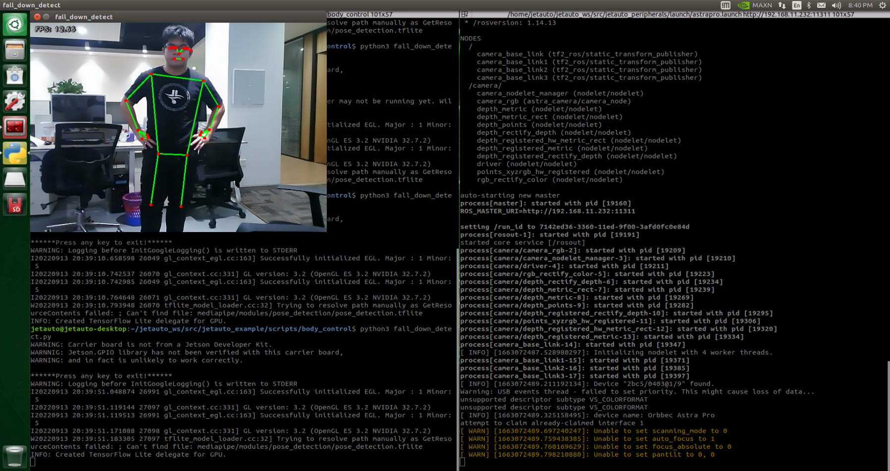


* **Program Analysis**

The program file is saved in [ros2_ws/src/example/example/body_control/include/fall_down_detect.py](../_static/source_code/fall_down_detect.zip)


:::{Note}
Prior to making any alterations to the program, ensure to create a backup of the original factory program. Modify it only after creating the backup. Directly editing the source code file is prohibited to prevent inadvertent parameter modifications that could render the robot dysfunctional and irreparable!
:::
Based on the game's effectiveness, the procedural logic is delineated as follows:


The car captures images via the camera, identifies the key feature points of the human body, and assesses whether the current posture indicates a "**fall**". If a fall is detected, the car's buzzer will emit a continuous "**beep**" sound while the car moves backward. Otherwise, the buzzer will only emit a single "**beep**" sound.

The program logic flow chart obtained from the program files is depicted in the figure below.


(1) Function

Main：

{lineno-start=202}

```python
def main():
    node = FallDownDetectNode('fall_down_detect')
    rclpy.spin(node)
    node.destroy_node()
```

Used to start the body sensation control node.

get_joint_landmarks:

{lineno-start=44}

```python
def get_joint_landmarks(img, landmarks):
    """
    将landmarks从medipipe的归一化输出转为像素坐标(Convert landmarks from medipipe's normalized output to pixel coordinates)
    :param img: 像素坐标对应的图片(picture corresponding to pixel coordinate)
    :param landmarks: 归一化的关键点(normalized keypoint)
    :return:
    """
    h, w, _ = img.shape
    landmarks = [(lm.x * w, lm.y * h) for lm in landmarks]
    return np.array(landmarks)
```

Used to convert the recognized information into pixel coordinates.

height_cal:

{lineno-start=55}

```python
def height_cal(landmarks):
    y = []
    for i in landmarks:
        y.append(i[1])
    height = sum(y)/len(y)

    return height
```

Calculates the height of the limbs based on the recognized information.

(2) Class

{lineno-start=63}

```python
class FallDownDetectNode(Node):
    def __init__(self, name):
        rclpy.init()
        super().__init__(name, allow_undeclared_parameters=True, automatically_declare_parameters_from_overrides=True)
        self.name = name
        self.drawing = mp.solutions.drawing_utils
        self.body_detector = mp_pose.Pose(
            static_image_mode=False,
            min_tracking_confidence=0.5,
            min_detection_confidence=0.5)
        self.running = True
        self.fps = fps.FPS()  # fps计算器(FPS calculator)
        
        self.fall_down_count = []
        self.move_finish = True
        self.stop_flag = False
        signal.signal(signal.SIGINT, self.shutdown)
        self.image_queue = queue.Queue(maxsize=2)
```

This class is the fall detection node.

Init:

{lineno-start=63}

```python
class FallDownDetectNode(Node):
    def __init__(self, name):
        rclpy.init()
        super().__init__(name, allow_undeclared_parameters=True, automatically_declare_parameters_from_overrides=True)
        self.name = name
        self.drawing = mp.solutions.drawing_utils
        self.body_detector = mp_pose.Pose(
            static_image_mode=False,
            min_tracking_confidence=0.5,
            min_detection_confidence=0.5)
        self.running = True
        self.fps = fps.FPS()  # fps计算器(FPS calculator)
        
        self.fall_down_count = []
```

Initialize the parameters required for body control, read the camera's image callback node, initialize nodes such as chassis, buzzers, and others, and finally start the main function within the class.

get_node_state:

{lineno-start=97}

```python
    def get_node_state(self, request, response):
        response.success = True
        return response
```

Set the initialization state of the current node.

shutdown:

{lineno-start=101}

```python
    def shutdown(self, signum, frame):
        self.running = False
```

Program exit callback function used to terminate recognition.

image_callback:

{lineno-start=104}

```python
    def image_callback(self, ros_image):
        rgb_image = np.ndarray(shape=(ros_image.height, ros_image.width, 3), dtype=np.uint8, buffer=ros_image.data)  # 将自定义图像消息转化为图像(convert the custom image message into image)age))
        if self.image_queue.full():
            # 如果队列已满，丢弃最旧的图像
            self.image_queue.get()
        # 将图像放入队列
        self.image_queue.put(rgb_image)
```

Image node callback function used to process images and enqueue them.

Move:

{lineno-start=112}

```python
    def move(self):
        for i in range(5):
            twist = Twist()
            twist.linear.x = 0.2
            self.mecanum_pub.publish(twist)
            time.sleep(0.2)
            twist = Twist()
            twist.linear.x = -0.2
            self.mecanum_pub.publish(twist)
            time.sleep(0.2)
        self.mecanum_pub.publish(Twist())
        self.stop_flag =True
        self.move_finish = True
```

Movement strategy function that moves the vehicle according to the recognized limb height.

buzzer_warn:

{lineno-start=126}

```python
    def buzzer_warn(self):
        if not self.stop_flag:
            while not self.stop_flag:
                msg = BuzzerState()
                msg.freq = 1000
                msg.on_time = 0.1
                msg.off_time = 0.1
                msg.repeat = 1
                self.buzzer_pub.publish(msg)
                time.sleep(0.2)
        else:
            msg = BuzzerState()
            msg.freq = 1900
            msg.on_time = 0.2
            msg.off_time = 0.01
            msg.repeat = 1
            self.buzzer_pub.publish(msg)
```

Buzzer control function used for buzzer alarms.

image_proc:

{lineno-start=144}

```python
    def image_proc(self, image):
        image_flip = cv2.flip(cv2.cvtColor(image, cv2.COLOR_RGB2BGR), 1)
        results = self.body_detector.process(image)
        if results is not None and results.pose_landmarks:
            if self.move_finish:
                landmarks = get_joint_landmarks(image, results.pose_landmarks.landmark)
                h = height_cal(landmarks)
                if h > 240:
                    self.fall_down_count.append(1)
                else:
                    self.fall_down_count.append(0)
                if len(self.fall_down_count) == 3:
                    count = sum(self.fall_down_count)
```

Function for recognizing limbs, which invokes the model to draw key points of the human body based on the recognized information, and moves according to the recognized height.

Main:

{lineno-start=178}

```python
    def main(self):
        while self.running:
            try:
                image = self.image_queue.get(block=True, timeout=1)
            except queue.Empty:
                if not self.running:
                    break
                else:
                    continue
            try:
                result_image = self.image_proc(np.copy(image))
            except BaseException as e:
                self.get_logger().info('\033[1;32m%s\033[0m' % e)
                result_image = cv2.flip(cv2.cvtColor(image, cv2.COLOR_RGB2BGR), 1)
            self.fps.update()
            result_image = self.fps.show_fps(result_image)
            cv2.imshow(self.name, result_image)
            key = cv2.waitKey(1)
            if key == ord('q') or key == 27:  # 按q或者esc退出
                self.mecanum_pub.publish(Twist())
                self.running = False
```

The main function within the FallDownDetectNode class, used to input image information into the recognition function and display the returned image.

<p id="anchor_7_3"></p>

## 7.4 Map and Props Setup

### 7.4.1 Preface:

This document pertains to the autonomous driving capabilities of our company's vehicle. Before engaging the autonomous driving feature, please verify that the hardware components (such as the depth camera and car chassis motors) installed in the vehicle meet the specified requirements and are operating correctly. Additionally, ensure that the battery is adequately charged.

### 7.4.2 Props Setup & Notices

Prior to commencing autonomous driving, please follow the steps below to set up the map. 

:::{Note}

Tools required for autonomous driving are available for separate purchase. If you are interested, kindly reach out to us at support@hiwonder.com.

:::

* **Setup Instructions**

(1) Map Setup

To begin, ensure that the site is situated on a flat and spacious ground, and verify that there is ample lighting surrounding the area, as illustrated in the image below:


Place the robot at the start point as pictured.


As the robot advances, it will navigate along the yellow line bordering the map, and it can dynamically adjust its posture based on the lane lines in real-time.

(2) Road Signs Setup

In the game of autonomous driving, a total of 4 waypoints need to be placed: 2 for straight driving, 1 for right turn, and 1 for parking. Please refer to the following image for the specific placement positions: (Note: Ensure accurate placement!!)


Go straight: instruct the robot car to go forward.


Turn right: Instruct the robot car to turn right.


Park: Command the robot car to park.


The purpose of the road signs is to guide the car during its journey. Once the car recognizes a road sign, it will perform the appropriate actions. Additionally, the car will slow down as it approaches a pedestrian crosswalk.

(3) Traffic Light Setup

In the game of the autonomous driving function, only one traffic light needs to be placed. The exact placement location is illustrated in the figure below:


Traffic light props are utilized to replicate real-world traffic lights on roads. When the car detects the traffic light, it will adhere to the "**stop on red light, go on green light**" rule.

Once all venue props are arranged, refer to the following picture for setting up the venue environment:


:::{Notice}

* Ensure that the site has adequate lighting, preferably natural ambient light. Avoid strong direct light sources and colored lights, as they may hinder overall recognition. Pay attention to this aspect when setting up the site.

* While laying out and using the equipment, ensure proper care and protection of the props on the site. In case of incomplete maps or signs, or if the traffic light is damaged and cannot function properly, promptly contact our after-sales personnel to purchase replacements to prevent any disruptions to the recognition process

:::

## 7.5 Autonomous Driving

###  7.5.1 Lane Keeping

This lesson focuses on controlling the car to move forward and maintain lane alignment through instructions.


* **Preparation**

(1) Before starting, ensure the map is laid out flat and free of wrinkles, with smooth roads and no obstacles. For specific map laying instructions, please refer to "[**7.3 Map and Props Setup**](#anchor_7_3)" in the same directory as this section for guidance. (In this lesson, we are only experiencing the road driving-line patrol function, so there is no need to place props such as traffic lights and signboards.)

(2) When experiencing this game, ensure it is conducted in a well-lit environment, but avoid direct light shining on the camera to prevent misrecognition.

(3) It is essential to adjust the color threshold beforehand and set the color threshold of the yellow line to avoid misidentification during subsequent recognition. For specific color threshold adjustment, please refer to the "[**6. ROS2+OpenCV Course**](6.ROS2+OpenCV.md)" for reference.

(4) It is recommended to position the car in the middle of the road for easy identification!

* **Program Logic**

Lane keeping involves three main steps: capturing real-time images, processing the images, and comparing the results.

First, we use the camera to capture real-time images of the scene.

Next, we process these images through color recognition, converting them to different color spaces, and applying techniques such as erosion, dilation, and binarization.

In the result comparison phase, we define a Region of Interest (ROI), outline the contours of the processed image, and perform calculations to compare the results.

Finally, based on these comparisons, the robot adjusts its direction to stay centered within the lane.

You can find the source code for this program at: [/home/ubuntu/ros2_ws/src/example/example/self_driving/lane_detect.py](../_static/source_code/lane_detect.zip)

* **Operation Steps**

:::{Note}

The input command should be case sensitive, and keywords can be complemented using Tab key.

:::

Start the robot, and access the robot system desktop using VNC.

* **Enable the model:**

(1) Click-on  to start the command-line terminal.

(2) Execute the command and hit Enter to disable the app auto-start service.

```bash
~/.stop_ros.sh
```

(3) Run the following command and hit Enter key.

```bash
ros2 launch example self_driving.launch.py only_line_follow:=true
```

(4) To close the program, click on the terminal window where it's running and press '**Ctrl+C**'.


* **Program Outcome**

After starting the game, place the robot on the road, and it will automatically detect the yellow line at the edge of the road. The robot will then adjust its position based on the detection results.

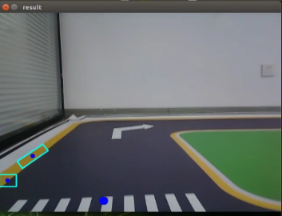

* **Program Analysis**

The source code of this program is saved in [ros2_ws/src/example/example/self_driving/lane_detect.py](../_static/source_code/self_driving.zip)


**Function:**

image_callback：

{lineno-start=179}

```python
	def image_callback(ros_image):
    cv_image = bridge.imgmsg_to_cv2(ros_image, "bgr8")
    bgr_image = np.array(cv_image, dtype=np.uint8)
    if image_queue.full():
        # If the queue is full, remove the oldest image(如果队列已满，丢弃最旧的图像)
        image_queue.get()
        # Put the image into the queue(将图像放入队列)
    image_queue.put(bgr_image)
```

Image callback function is used to read the camera node.

**Class:**

**LaneDetector:**

{lineno-start=19}

```python
	class LaneDetector(object):
    def __init__(self, color):
        # Lane color(车道线颜色)
        self.target_color = color
        # ROI for lane detection(车道线识别的区域)
        self.rois = ((450, 480, 0, 320, 0.7), (390, 420, 0, 320, 0.2), (330, 360, 0, 320, 0.1))
        self.weight_sum = 1.0

    def set_roi(self, roi):
        self.rois = roi
```

**Init:**

{lineno-start=14}

```python
    def __init__(self, color):
        # 车道线颜色
        self.target_color = color
        # 车道线识别的区域
        self.rois = ((450, 480, 0, 320, 0.7), (390, 420, 0, 320, 0.2), (330, 360, 0, 320, 0.1))
        self.weight_sum = 1.0
```

Initialize the required parameters and set the ROI to lock the recognition range.

**set_roi:**

{lineno-start=27}

```python
    def set_roi(self, roi):
        self.rois = roi
```

Used to set the Region of Interest (ROI) for recognition.

**get_area_max_contour:**

{lineno-start=30}

```python
	    @staticmethod
    def get_area_max_contour(contours, threshold=100):
        '''
        Obtain the contour corresponding to the maximum area(获取最大面积对应的轮廓)
        :param contours:
        :param threshold:
        :return:
        '''
        contour_area = zip(contours, tuple(map(lambda c: math.fabs(cv2.contourArea(c)), contours)))
        contour_area = tuple(filter(lambda c_a: c_a[1] > threshold, contour_area))
        if len(contour_area) > 0:
            max_c_a = max(contour_area, key=lambda c_a: c_a[1])
            return max_c_a
        return None
```

Obtains the contour with the maximum area from the list of contours obtained through OpenCV.

**add_horizontal_line:**

{lineno-start=45}

```python
	    def add_horizontal_line(self, image):
        #   |____  --->   |————   ---> ——
        h, w = image.shape[:2]
        roi_w_min = int(w/2)
        roi_w_max = w
        roi_h_min = 0
        roi_h_max = h
        roi = image[roi_h_min:roi_h_max, roi_w_min:roi_w_max]  # Crop the right half(截取右半边)
        flip_binary = cv2.flip(roi, 0)  # Flip upside down(上下翻转)
        max_y = cv2.minMaxLoc(flip_binary)[-1][1]  # Extract the coordinates of the top-left point with a value of 255(提取最上，最左数值为255的点坐标)

        return h - max_y
```

Adds a horizontal recognition line based on the width and height of the frame and the ROI settings.

**add_vertical_line_far:**

{lineno-start=58}

```python
	    def add_vertical_line_far(self, image):
        h, w = image.shape[:2]
        roi_w_min = int(w/8)
        roi_w_max = int(w/2)
        roi_h_min = 0
        roi_h_max = h
        roi = image[roi_h_min:roi_h_max, roi_w_min:roi_w_max]
        flip_binary = cv2.flip(roi, -1)  # Flip the image horizontally and vertically(图像左右上下翻转)
        #cv2.imshow('1', flip_binary)
        # min_val, max_val, min_loc, max_loc = cv2.minMaxLoc(ret)
	        # minVal：The minimum value(最小值)
	        # maxVal：The maximum value(最大值)
	        # minLoc：The location of the minimum value(最小值的位置)
	        # maxLoc：The location of the maximum value(最大值的位置)
        # The order of traversal is: first rows, then columns, with rows from left to right and columns from top to bottom(遍历的顺序，先行再列，行从左到右，列从上到下)
        (x_0, y_0) = cv2.minMaxLoc(flip_binary)[-1]  # Extract the coordinates of the top-left point with a value of 255(提取最上，最左数值为255的点坐标)
        y_center = y_0 + 55
        roi = flip_binary[y_center:, :]
        (x_1, y_1) = cv2.minMaxLoc(roi)[-1]
        down_p = (roi_w_max - x_1, roi_h_max - (y_1 + y_center))
        
        y_center = y_0 + 65
        roi = flip_binary[y_center:, :]
        (x_2, y_2) = cv2.minMaxLoc(roi)[-1]
        up_p = (roi_w_max - x_2, roi_h_max - (y_2 + y_center))

        up_point = (0, 0)
        down_point = (0, 0)
        if up_p[1] - down_p[1] != 0 and up_p[0] - down_p[0] != 0:
            up_point = (int(-down_p[1]/((up_p[1] - down_p[1])/(up_p[0] - down_p[0])) + down_p[0]), 0)
            down_point = (int((h - down_p[1])/((up_p[1] - down_p[1])/(up_p[0] - down_p[0])) + down_p[0]), h)

        return up_point, down_point
```

Adds a recognition vertical line for the part of the frame farther from the robot based on the ROI settings.

**get_binary**

{lineno-start=120}

```python
	    def get_binary(self, image):
        # Recognize color through LAB space(通过lab空间识别颜色)
        img_lab = cv2.cvtColor(image, cv2.COLOR_RGB2LAB)  # Convert RGB to LAB(rgb转lab)
        img_blur = cv2.GaussianBlur(img_lab, (3, 3), 3)  # Gaussian blur denoising(高斯模糊去噪)
        mask = cv2.inRange(img_blur, tuple(lab_data['lab']['Stereo'][self.target_color]['min']), tuple(lab_data['lab']['Stereo'][self.target_color]['max']))  # 二值化(binarization)
        eroded = cv2.erode(mask, cv2.getStructuringElement(cv2.MORPH_RECT, (3, 3)))  # Erode(腐蚀)
        dilated = cv2.dilate(eroded, cv2.getStructuringElement(cv2.MORPH_RECT, (3, 3)))  # Dilate(膨胀)

        return dilated
```

Performs color recognition based on the color space and processes the binarized image.

**add_vertical_line_near:**

{lineno-start=92}

```python
	    def add_vertical_line_near(self, image):
        # ——|         |——        |
        #   |   --->  |     --->
        h, w = image.shape[:2]
        roi_w_min = 0
        roi_w_max = int(w/2)
        roi_h_min = int(h/2)
        roi_h_max = h
        roi = image[roi_h_min:roi_h_max, roi_w_min:roi_w_max]
        flip_binary = cv2.flip(roi, -1)  # Flip the image horizontally and vertically(图像左右上下翻转)
        #cv2.imshow('1', flip_binary)
        (x_0, y_0) = cv2.minMaxLoc(flip_binary)[-1]  # Extract the coordinates of the top-left point with a value of 255(提取最上，最左数值为255的点坐标)
        down_p = (roi_w_max - x_0, roi_h_max - y_0)

        (x_1, y_1) = cv2.minMaxLoc(roi)[-1]
        y_center = int((roi_h_max - roi_h_min - y_1 + y_0)/2)
        roi = flip_binary[y_center:, :] 
        (x, y) = cv2.minMaxLoc(roi)[-1]
        up_p = (roi_w_max - x, roi_h_max - (y + y_center))

        up_point = (0, 0)
        down_point = (0, 0)
        if up_p[1] - down_p[1] != 0 and up_p[0] - down_p[0] != 0:
            up_point = (int(-down_p[1]/((up_p[1] - down_p[1])/(up_p[0] - down_p[0])) + down_p[0]), 0)
            down_point = down_p

        return up_point, down_point, y_center

    def get_binary(self, image):
        # Recognize color through LAB space(通过lab空间识别颜色)
        img_lab = cv2.cvtColor(image, cv2.COLOR_RGB2LAB)  # Convert RGB to LAB(rgb转lab)
        img_blur = cv2.GaussianBlur(img_lab, (3, 3), 3)  # Gaussian blur denoising(高斯模糊去噪)
        mask = cv2.inRange(img_blur, tuple(lab_data['lab']['Stereo'][self.target_color]['min']), tuple(lab_data['lab']['Stereo'][self.target_color]['max']))  # 二值化(binarization)
        eroded = cv2.erode(mask, cv2.getStructuringElement(cv2.MORPH_RECT, (3, 3)))  # Erode(腐蚀)
        dilated = cv2.dilate(eroded, cv2.getStructuringElement(cv2.MORPH_RECT, (3, 3)))  # Dilate(膨胀)

        return dilated
```

Adds a recognition vertical line for the part of the frame closer to the robot based on the ROI and frame width and height settings.

**\_\_call\_\_:**

{lineno-start=130}

```python
	    def __call__(self, image, result_image):
        # Extract line center based on weighted distribution(按比重提取线中心)
        centroid_sum = 0
        h, w = image.shape[:2]
        max_center_x = -1
        center_x = []
        max_area = 0
        min_area = h*w
        f = max_area/min_area
        for roi in self.rois:
            blob = image[roi[0]:roi[1], roi[2]:roi[3]]  # Crop ROI(截取roi)
            contours = cv2.findContours(blob, cv2.RETR_EXTERNAL, cv2.CHAIN_APPROX_TC89_L1)[-2]  # Find contours(找轮廓)
            max_contour_area = self.get_area_max_contour(contours, 30)  # Obtain the contour with the largest area(获取最大面积对应轮廓)
            if max_contour_area is not None:
                rect = cv2.minAreaRect(max_contour_area[0])  # The minimum bounding rectangle(最小外接矩形)
                box = np.intp(cv2.boxPoints(rect))  # Four box points(四个角)
                area = rect[1][0]*rect[1][1]
                if area > max_area:
                    max_area = area
                if area < min_area:
                    min_area = area
                f = max_area/min_area
                for j in range(4):
                    box[j, 1] = box[j, 1] + roi[0]
                cv2.drawContours(result_image, [box], -1, (int(255*roi[-1]), 255, 0), 2)  # Draw the rectangle composed of the four points(画出四个点组成的矩形)

                # Obtain the diagonal points of the rectangle(获取矩形对角点)
                pt1_x, pt1_y = box[0, 0], box[0, 1]
                pt3_x, pt3_y = box[2, 0], box[2, 1]
                # The center point of the line(线的中心点)
                line_center_x, line_center_y = (pt1_x + pt3_x) / 2, (pt1_y + pt3_y) / 2

                cv2.circle(result_image, (int(line_center_x), int(line_center_y)), 5, (0, 0, 255), -1)  # Draw the center point(画出中心点)
                center_x.append(line_center_x)
            else:
                center_x.append(-1)
        for i in range(len(center_x)):
            if center_x[i] != -1:
                if center_x[i] > max_center_x:
                    max_center_x = center_x[i]
                centroid_sum += center_x[i] * self.rois[i][-1]
        if centroid_sum == 0:
            return result_image, None, max_center_x, max_area
        center_pos = centroid_sum / self.weight_sum  # Calculate the center point based on the weight(按比重计算中心点)
        angle = math.degrees(-math.atan((center_pos - (w / 2.0)) / (h / 2.0)))
        
        return result_image, angle, max_center_x, max_area
```

Callback function for the entire class. Performs color recognition here, draws the recognized yellow lines using OpenCV, and then outputs the image, angle, and pixel coordinates X of each ROI recognition contour.

###  7.5.2 Road Sign Detection

* **Preparation**

① Before starting, ensure the map is laid out flat and free of wrinkles, with smooth roads and no obstacles. For specific map laying instructions, please refer to "**Map and Props Setup**" in the same directory as this section for guidance.

② The road sign model used in this section is trained with YOLOv5. For more details on YOLOv5, please refer to '**[7.2 Machine Learning Application](#anchor_7_2)**.'

③ When experiencing this game, ensure it is conducted in a well-lit environment, but avoid direct light shining on the camera to prevent misrecognition.

* **Program Logic**

Firstly, acquire the real-time image from the camera and apply operations such as erosion and dilation.

Next, invoke the YOLOv5 model and compare it with the target screen image.

Finally, execute the appropriate landmark action based on the comparison results.

You can find the source code for this program at: [/home/ubuntu/ros2_ws/src/example/example/yolov5_detect/yolov5_trt.py](../_static/source_code/yolov5_detect.zip)

* **Operation Steps**

:::{Note}

The following steps exclusively activate road sign detection in the return screen, without executing associated actions. Users seeking direct experience with autonomous driving may bypass this lesson and proceed to "**Integrated Application**" within the same file.

Please make sure to enter commands with strict attention to capitalization, spacing, and you can use the "**Tab**" key to autocomplete keywords.

:::

(1) Start the robot, and access the robot system desktop using NoMachine.

(2) Click-on  to start the command-line terminal.

(3) Execute the command, and hit Enter to disable the app service.

```bash
sudo systemctl stop start_app_node.service
```

(4) Run the command to navigate to the directory containing programs.

```bash
cd /home/ubuntu/ros2_ws/src/example/example/yolov5_detect
```

(5) Type the command to open the program source code.

```bash
vim yolov5_trt.py
```

(6) Press the 'i' key to enter insert mode, locate the code highlighted in the red box, uncomment line 403, and comment out line 404. Then, find line 415 and replace './yolov5s.engine' with 'traffic_signs_640s_7_0.engine.' Once finished, press the 'ESC' key, type '', and hit Enter to save and exit.

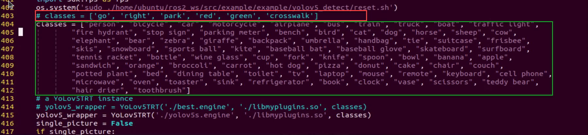

(7) Run the command to initiate game program.

```
python3 yolov5_trt.py
```

(8) Place the marker in front of the camera, and it will be recognized and highlighted on the screen. To exit this mode, press **"Ctrl+C"** in the terminal. If it does not close successfully, please try again.

:::{Note}

In the event that the model struggles to recognize traffic-related signs, it may be necessary to lower the confidence level. Conversely, if the model consistently misidentifies traffic-related signs, raising the confidence level might be advisable.

:::

(9) Run the command to navigate to the directory containing programs.

```bash
cd /home/ubuntu/ros2_ws/src/example/example/self_driving
```

(10) Enter the command to access the game program.

```bash
vim self_driving.launch.py
```

The red box represents the confidence value, which can be adjusted to modify the effectiveness of target detection.


* **Program Outcome**

After initiating the game, place the robot on the road within the map. Once the robot identifies landmarks, it will highlight the detected landmarks and annotate them based on the highest confidence level learned from the model.


### 7.5.3 Traffic Light Recognition

* **Preparation**

① Before starting, ensure the map is laid out flat and free of wrinkles, with smooth roads and no obstacles. For specific map laying instructions, please refer to "[**7.3 Map and Props Setup**](#anchor_7_3)" in the same directory as this section for guidance.

② The road sign model used in this section is trained with YOLOv5. For more details on YOLOv5, please refer to '[**7.2 Machine Learning Application**](#anchor_7_2)'

③ When experiencing this game, ensure it is conducted in a well-lit environment, but avoid direct light shining on the camera to prevent misrecognition.

* **Program Logic**

Firstly, capture a real-time image from the camera and apply operations such as erosion and dilation.

Next, invoke the YOLOv5 model to compare it with the target screen image.

Finally, execute corresponding landmark actions based on the comparison results.

The source code for this program can be found at : [/home/ubuntu/ros2_ws/src/example/example/yolov5_detect/yolov5_trt.py](../_static/source_code/yolov5_detect.zip)

* **Operation Steps**

:::{Note}

The following steps exclusively activate road sign detection in the return screen, without executing associated actions. Users seeking direct experience with autonomous driving may bypass this lesson and proceed to "**Integrated Application**" within the same file.

Please make sure to enter commands with strict attention to capitalization, spacing, and you can use the "**Tab**" key to autocomplete keywords.

:::

(1) Start the robot, and access the robot system desktop using VNC.

(2) Click-on  to open the command-line terminal.

(3) Execute the command, and hit Enter to disable the app service.

```bash
sudo systemctl stop start_app_node.service
```

(4) Run the command to navigate to the directory containing programs.

```bash
cd /home/ubuntu/ros2_ws/src/example/example/yolov5_detect
```

(5)Type the command to open the program source code.

```bash
vim yolov5_trt.py
```

(6) Press the 'i' key to enter insert mode, locate the code highlighted in the red box, uncomment line 403, and comment out line 404. Then find line 415 and replace './yolov5s.engine' with 'traffic_signs_640s_7_0.engine.' Once you're done, press the 'ESC' key, type '', and hit Enter to save and exit.

(7) Run the command to initiate game program.

```bash
python3 yolov5_trt.py
```

(8) Position the road sign in front of the camera, and the robot will recognize the road sign automatically. If you need to terminate this game, press '**Ctrl+C**'.

:::{Note}

 In the event that the model struggles to recognize traffic-related signs, it may be necessary to lower the confidence level. Conversely, if the model consistently misidentifies traffic-related signs, raising the confidence level might be advisable.

:::

(9) Run the command to navigate to the directory containing programs.

```
cd /home/ubuntu/ros2_ws/src/example/example/self_driving
```

(10) Enter the command to access the game program.

```
vim self_driving.launch.py
```

The red box represents the confidence value, which can be adjusted to modify the effectiveness of target detection.


* **Program Outcome**

After initiating the game, position the robot on the road depicted on the map. Upon recognizing the traffic signal, the robot will assess the color of the signal light and identify frames corresponding to red and green signal lights accordingly.

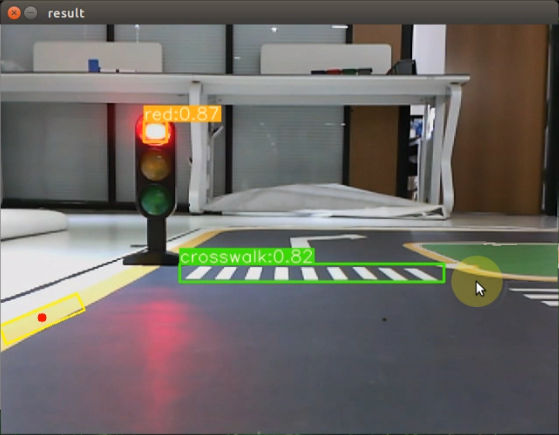

###  7.5.4 Turning Decision Making

* **Preparation**

① Before starting, ensure the map is laid out flat and free of wrinkles, with smooth roads and no obstacles. For specific map laying instructions, please refer to "[**7.3 Map and Props Setup**](#anchor_7_3)" in the same directory as this section for guidance.

② The roadmap model discussed in this section is trained using YOLOv5. For further information on YOLOv5 and related content, please refer to "[**7.2 Machine Learning Application**](#anchor_7_2)".

③ When experiencing this game, ensure it is conducted in a well-lit environment, but avoid direct light shining on the camera to prevent misrecognition.

* **Program Logic**

Firstly, capture the real-time image from the camera and apply operations such as erosion and dilation.

Next, invoke the YOLOv5 model to compare the obtained image with the target screen image.

Finally, based on the comparison outcomes, recognize the steering sign and direct the car accordingly.

The source code of this program is saved in [/home/ubuntu/ros2_ws/src/example/example/yolov5_detect/yolov5_trt.py](../_static/source_code/yolov5_detect.zip)

* **Operation Steps**

:::{Note}

* The following steps exclusively activate road sign detection in the return screen, without executing associated actions. Users seeking direct experience with autonomous driving may bypass this lesson and proceed to "**Integrated Application**" within the same file.
* Please make sure to enter commands with strict attention to capitalization, spacing, and you can use the "**Tab**" key to autocomplete keywords.

:::

(1) Start the robot, and access the robot system desktop using NoMachine.

(2) Click-on  to open the command-line terminal.

(3) Execute the command, and hit Enter to disable the app service.

```bash
sudo systemctl stop start_app_node.service
```

(4) Run the command to navigate to the directory containing programs.

```bash
cd /home/ubuntu/ros2_ws/src/example/example/yolov5_detect
```

(5) Type the command to open the program source code.

```bash
vim yolov5_trt.py
```

(6) Press the 'i' key to enter insert mode, locate the code highlighted in the red box, uncomment line 403, and comment out line 404. Next, find line 415 and replace './yolov5s.engine' with 'traffic_signs_640s_7_0.engine.' Once done, press the 'ESC' key, type '', and then hit Enter to save and exit.


(7) Run the command to initiate game program.

```bash
python3 yolov5_trt.py
```

(8) Place the marker in front of the camera, and it will be recognized and highlighted on the screen. To exit this mode, press **"Ctrl+C"** in the terminal. If it does not close successfully, please try again.

:::{Note}

In the event that the model struggles to recognize traffic-related signs, it may be necessary to lower the confidence level. Conversely, if the model consistently misidentifies traffic-related signs, raising the confidence level might be advisable.

(1) Run the command to navigate to the directory containing programs.

```bash
cd /home/ubuntu/ros2_ws/src/example/example/self_driving
```

(2) Enter the command to access the game program.

```bash
vim self_driving.launch.py
```

The red box represents the confidence value, which can be adjusted to modify the effectiveness of target detection.


:::

* **Program Outcome**

Once the game begins, position the robot onto the road within the map. As the robot approaches a turning road sign, it will adjust its direction in accordance with the instructions provided by the sign.


###  7.5.5 Autonomous Parking

* **Preparation**

① Before starting, ensure the map is laid out flat and free of wrinkles, with smooth roads and no obstacles. For specific map laying instructions, please refer to "[**7.3 Map and Props Setup**](#anchor_7_3)" in the same directory as this section for guidance.

② The roadmap model discussed in this section is trained using YOLOv5. For further information on YOLOv5 and related content, please refer to "[**7.2 Machine Learning Application**](#anchor_7_2)".

③ When experiencing this game, ensure it is conducted in a well-lit environment, but avoid direct light shining on the camera to prevent misrecognition.

* **Program Logic**

Begin by capturing the real-time image from the camera and applying operations such as erosion and dilation.

Next, invoke the YOLOv5 model to compare the obtained image with the target screen image.

Finally, based on the comparison results, identify the parking road sign and autonomously guide the car to park in the designated parking space.

The source code of this program is saved in [/home/ubuntu/ros2_ws/src/example/example/yolov5_detect/yolov5_trt.py](../_static/source_code/yolov5_detect.zip)

<p id="anchor_7_4_5_3"></p>

* **Operation Steps**

:::{Note}

* The following steps exclusively activate road sign detection in the return screen, without executing associated actions. Users seeking direct experience with autonomous driving may bypass this lesson and proceed to "**Integrated Application**" within the same file.

* Please make sure to enter commands with strict attention to capitalization, spacing, and you can use the **"Tab"** key to autocomplete keywords.

:::

(1) Start the robot, and access the robot system desktop using NoMachine.

(2) Click-on  to open the command-line terminal.

(3) Execute the command, and hit Enter to disable the app service.

```bash
sudo systemctl stop start_app_node.service
```

(4) Run the command to navigate to the directory containing programs.

```bash
cd /home/ubuntu/ros2_ws/src/example/example/yolov5_detect
```

(5) Type the command to open the program source code.

```bash
vim yolov5_trt.py
```

(6) Press the 'i' key to enter insert mode, locate the code highlighted in the red box, uncomment line 403, and comment out line 404. Then, find line 415 and replace './yolov5s.engine' with 'traffic_signs_640s_7_0.engine.' Once you've completed this, press the 'ESC' key, type '', and hit Enter to save and exit.

(7) Run the command to initiate game program.

```
python3 yolov5_trt.py
```

(8) Place the marker in front of the camera, and it will be recognized and highlighted on the screen. To exit this mode, press "**Ctrl+C**" in the terminal. If it does not close successfully, please try again.

:::{Note}

In the event that the model struggles to recognize traffic-related signs, it may be necessary to lower the confidence level. Conversely, if the model consistently misidentifies traffic-related signs, raising the confidence level might be advisable.

(1) Run the command to navigate to the directory containing programs.

```bash
cd /home/ubuntu/ros2_ws/src/example/example/self_driving
```

(8) Enter the command to access the game program.

```bash
vim self_driving.launch.py
```

The red box represents the confidence value, which can be adjusted to modify the effectiveness of target detection.


:::

* **Program Outcome**

After initiating the game, position the robot on the road within the map. As the robot progresses towards the parking sign, it will automatically park in the designated parking space based on the instructions provided by the road sign.

<p id="anchor_7_4_5_5"></p>

* **Parameter Adjustment**

If the robot stops upon recognizing the parking sign and the parking position is not optimal, adjustments to the parameters in the program source code can be made.

(1) Click-on  to start the command-line terminal.

(2) Execute the command to navigate to the directory containing game programs.

```bash
cd ros2_ws/src/example/example/self_driving/
```

(3) Run the command to access the source code.

```bash
vim self_driving.py
```

(4) Press the "**i**" key to enter insert mode and locate the code within the red box. Adjusting the parameters within the red box allows you to control the starting position for the robot to initiate the parking operation. Decreasing the parameters will result in the robot stopping closer to the zebra crossing, while increasing them will cause the robot to stop further away. Once adjustments are made, press the "**ESC**" key, type "**:wq**", and press Enter to save and exit.


You can adjust the parking processing function to alter the parking position of the robot. Initially, the parking action sets the linear speed in the negative direction of the Y-axis (right of the robot) to 0.2 meters per second, with a forward movement time of (0.38/2) seconds. To position the robot in the ideal location on the left side of the parking space, modify the speed and time accordingly.


###  7.5.6 Integrated Application

This lesson provides instructions for implementing comprehensive driverless game on the robot, covering lane keeping, road sign detection, traffic light recognition, steering decision-making, and self-parking.

* **Preparation**

(1) Map Setup

To ensure accurate navigation, place the map on a flat, smooth surface, free of wrinkles and obstacles. Position all road signs and traffic lights at designated locations on the map, facing clockwise. The starting point and locations of road signs are indicated below:

:::{Note}

Tools required for autonomous driving are available for separate purchase. If you are interested, kindly reach out to us at support@hiwonder.com.

:::


* **Color Threshold Adjustment**

Due to variations in light sources, it's essential to adjust the color thresholds for 'black, white, red, green, blue, and yellow' based on the guidelines provided in the '[**6. ROS2+OpenCV Course**](6.ROS2+OpenCV.md)' prior to starting. If the robot encounter inaccurate recognition while moving forward, readjust the color threshold specifically in the map area where recognition fails.

* **Program Logic**


Actions implemented so far include:

(1) Following the yellow line in the outermost circle of the patrol map.

(2) Slowing down and passing if a zebra crossing is detected.

(3) Making a turn upon detection of a turn sign.

(4) Parking the vehicle and entering the parking lot upon detection of a stop sign.

(5) Halting when a red light is detected.

(6) Slowing down when passing a detected street light.

First, load the model file trained by YOLOv5 and the required library files, obtain real-time camera images, and perform operations such as erosion and dilation on the images. Next, identify the target color line segment in the image and gather information such as size and center point of the target image. Then, invoke the model through YOLOv5 and compare it with the target screen image. Finally, adjust the forward direction based on the offset comparison of the target image's center point to keep the robot in the middle of the road. Additionally, perform corresponding actions based on different recognized landmark information during map traversal.

The source code for this program can be found at: [/home/ubuntu/ros2_ws/src/example/example/self_driving/self_driving.py](../_static/source_code/self_driving.zip)

* **Operation Steps**

:::{Note}

The input command should be case sensitive, and keywords can be implemented using Tab key.

:::

Start the robot, and access the robot system desktop using NoMachine.

**Enable the model:**

(1) Click-on  to start the command-line terminal.

(2) Execute the command, and hit Enter to disable the app service.

```bash
sudo systemctl stop start_app_node.service
```

(3) Run the command to enable the autonomous driving service.

```bash
ros2 launch example self_driving.launch.py
```

(4) If you need to close the program, simply click on the corresponding terminal window of the program and use the shortcut "**Ctrl+C**" to exit the program.


* **Program Outcome**

(1) Lane Keeping

Upon initiating the game, the car will track the line and identify the yellow line at the road's edge. It will execute forward and turning actions based on the straightness or curvature of the yellow line to maintain lane position.

(2) Traffic Light Recognition

When the car encounters a traffic light, it will halt if the light is red and proceed if it's green. Upon approaching a zebra crossing, the car will automatically decelerate and proceed cautiously.

(3) Turn and Parking Signs

Upon detecting traffic signs while moving forward, the car will respond accordingly. If it encounters a right turn sign, it will execute a right turn and continue forward. In the case of a parking sign, it will execute a parking maneuver.

Following these rules, the robot will continuously progress forward within the map.

* **Program Analysis**

The source code of this program is saved in: [ros2_ws/src/example/example/self_driving/self_driving.py](../_static/source_code/self_driving.zip)


(1) Function:

{lineno-start=396}

```python
def main():
    node = SelfDrivingNode('self_driving')
    executor = MultiThreadedExecutor()
    executor.add_node(node)
    executor.spin()
    node.destroy_node()
```

Initiate autonomous driving class.

(2) Class:

{lineno-start=30}

```python
class SelfDrivingNode(Node):
    def __init__(self, name):
        rclpy.init()
        super().__init__(name, allow_undeclared_parameters=True, automatically_declare_parameters_from_overrides=True)
        self.name = name
        self.is_running = True
        self.pid = pid.PID(0.01, 0.0, 0.0)
        self.param_init()
```

**init:**

{lineno-start=33}

```python
        super().__init__(name, allow_undeclared_parameters=True, automatically_declare_parameters_from_overrides=True)
        self.name = name
        self.is_running = True
        self.pid = pid.PID(0.01, 0.0, 0.0)
        self.param_init()

        self.image_queue = queue.Queue(maxsize=2)
        self.classes = ['go', 'right', 'park', 'red', 'green', 'crosswalk']
        self.display = True
        self.bridge = CvBridge()
        self.lock = threading.RLock()
        self.colors = common.Colors()
        self.machine_type = os.environ['MACHINE_TYPE']
        # signal.signal(signal.SIGINT, self.shutdown)
        self.lane_detect = lane_detect.LaneDetector("yellow")

        self.mecanum_pub = self.create_publisher(Twist, '/controller/cmd_vel', 1)
        self.joints_pub = self.create_publisher(ServosPosition, '/servo_controller', 1) # Servo control(舵机控制)
        self.result_publisher = self.create_publisher(Image, '~/image_result', 1)

        self.create_service(Trigger, '~/enter', self.enter_srv_callback) # Enter the game(进入玩法)
        self.create_service(Trigger, '~/exit', self.exit_srv_callback) # Exit the game(退出玩法)
        self.create_service(SetBool, '~/set_running', self.set_running_srv_callback)
        # self.heart = Heart(self.name + '/heartbeat', 5, lambda _: self.exit_srv_callback(None))
        timer_cb_group = ReentrantCallbackGroup()
        self.client = self.create_client(Trigger, '/controller_manager/init_finish')
        self.client.wait_for_service()
        self.client = self.create_client(Trigger, '/yolov5/init_finish')
        self.client.wait_for_service()
        self.start_yolov5_client = self.create_client(Trigger, '/yolov5/start', callback_group=timer_cb_group)
        self.start_yolov5_client.wait_for_service()
        self.stop_yolov5_client = self.create_client(Trigger, '/yolov5/stop', callback_group=timer_cb_group)
        self.stop_yolov5_client.wait_for_service()

        self.timer = self.create_timer(0.0, self.init_process, callback_group=timer_cb_group)
```

Initialize the required parameters, obtain the current robot category, set the line-following color to yellow, start the chassis control, servo control, and image reading. Set up three types of services: enter, exit, and start, and read the YOLOv5 node.

**init_process:**

{lineno-start=69}

```python
    def init_process(self):
        self.timer.cancel()

        self.mecanum_pub.publish(Twist())
        if not self.get_parameter('only_line_follow').value:
            self.send_request(self.start_yolov5_client, Trigger.Request())
            set_servo_position(self.joints_pub, 1, ((10, 500), (5, 500), (4, 250), (3, 0), (2, 750), (1, 500)))  # Initial position(初始姿态)
        time.sleep(1)
        
        if self.get_parameter('start').value:
            self.display = True
            self.enter_srv_callback(Trigger.Request(), Trigger.Response())
            request = SetBool.Request()
            request.data = True
            self.set_running_srv_callback(request, SetBool.Response())

        #self.park_action() 
        threading.Thread(target=self.main, daemon=True).start()
        self.create_service(Trigger, '~/init_finish', self.get_node_state)
        self.get_logger().info('\033[1;32m%s\033[0m' % 'start')
```

Initialize the current robotic arm and start the main function.

**param_init:**

{lineno-start=90}

```python
    def param_init(self):
        self.start = False
        self.enter = False

        self.have_turn_right = False
        self.detect_turn_right = False
        self.detect_far_lane = False
        self.park_x = -1  # Obtain the x-pixel coordinate of a parking sign(停车标识的x像素坐标)

        self.start_turn_time_stamp = 0
        self.count_turn = 0
        self.start_turn = False  # Start to turn(开始转弯)
```

Initialize parameters required for position recognition or usage.

**get_node_state:**

{lineno-start=127}

```python
    def get_node_state(self, request, response):
        response.success = True
        return response
```

Obtain the current state of the node.

**send_request:**

{lineno-start=131}

```python
    def send_request(self, client, msg):
        future = client.call_async(msg)
        while rclpy.ok():
            if future.done() and future.result():
                return future.result()
```

Used to publish service requests.

**enter_srv_callback:**

{lineno-start=137}

```python
    def enter_srv_callback(self, request, response):
        self.get_logger().info('\033[1;32m%s\033[0m' % "self driving enter")
        with self.lock:
            self.start = False
            camera = 'depth_cam'#self.get_parameter('depth_camera_name').value
            if self.get_parameter('use_depth_cam').value:
                self.camera = 'depth_cam'
                self.image_sub = self.create_subscription(Image, '/%s/rgb/image_raw' % self.camera, self.image_callback, 1)  # Subscribe to the camera(摄像头订阅)
            else:
                self.camera = 'usb_cam'
                self.image_sub = self.create_subscription(Image, '/%s/image_raw' % self.camera, self.image_callback, 1)  # Subscribe to the camera(摄像头订阅)
            self.create_subscription(ObjectsInfo, '/yolov5/object_detect', self.get_object_callback, 1)
            self.mecanum_pub.publish(Twist())
            self.enter = True
        response.success = True
        response.message = "enter"
        return response
```

Service for entering autonomous driving gameplay, start reading images and YOLOv5 recognition content, initialize speed.

**exit_srv_callback:**

{lineno-start=155}

```python
    def exit_srv_callback(self, request, response):
        self.get_logger().info('\033[1;32m%s\033[0m' % "self driving exit")
        with self.lock:
            try:
                if self.image_sub is not None:
                    self.image_sub.unregister()
                if self.object_sub is not None:
                    self.object_sub.unregister()
            except Exception as e:
                self.get_logger().info('\033[1;32m%s\033[0m' % str(e))
            self.mecanum_pub.publish(Twist())
        self.param_init()
        response.success = True
        response.message = "exit"
        return response
```

Service for exiting autonomous driving gameplay, stop reading images and YOLOv5 recognition content, initialize speed, reset parameters.

**set_running_srv_callback:**

{lineno-start=171}

```python
    def set_running_srv_callback(self, request, response):
        self.get_logger().info('\033[1;32m%s\033[0m' % "set_running")
        with self.lock:
            self.start = request.data
            if not self.start:
                self.mecanum_pub.publish(Twist())
        response.success = True
        response.message = "set_running"
        return response
```

Start autonomous driving game, set the start parameter to True.

**Shutdown:**

{lineno-start=181}

```python
    def shutdown(self, signum, frame):  # Press 'ctrl+c' to close the program(ctrl+c关闭处理)
        self.is_running = False
```

Callback function after closing the program, used to stop the currently running program.

**image_callback:**

{lineno-start=184}

```python
    def image_callback(self, ros_image):  # Callback target checking(目标检查回调)
        cv_image = self.bridge.imgmsg_to_cv2(ros_image, "rgb8")
        rgb_image = np.array(cv_image, dtype=np.uint8)
        if self.image_queue.full():
            # If the queue is full, remove the oldest image(如果队列已满，丢弃最旧的图像)
            self.image_queue.get()
        # Put the image into the queue(将图像放入队列)
        self.image_queue.put(rgb_image)
```

Image callback function, enqueues images and discards expired ones.

**park_action:**

{lineno-start=193}

```python
    # Parking processing(泊车处理)
    def park_action(self):
        twist = Twist()
        twist.linear.y = -0.2
        self.mecanum_pub.publish(twist)
        time.sleep(0.38/0.2)
        self.mecanum_pub.publish(Twist())
```

Parking logic, runs three different parking strategies according to three different chassis types.

**get_object_callback:**

{lineno-start=366}

```python
    # Obtain the target detection result(获取目标检测结果)
    def get_object_callback(self, msg):
        self.objects_info = msg.objects
        if self.objects_info == []:  # If it is not recognized, reset the variable(没有识别到时重置变量)
            self.traffic_signs_status = None
            self.crosswalk_distance = 0
        else:
            min_distance = 0
            for i in self.objects_info:
                class_name = i.class_name
                center = (int((i.box[0] + i.box[2])/2), int((i.box[1] + i.box[3])/2))
                
                if class_name == 'crosswalk':  
                    if center[1] > min_distance:  # Obtain recent y-axis pixel coordinate of the crosswalk(获取最近的人行道y轴像素坐标)
                        min_distance = center[1]
                elif class_name == 'right':  # Obtain the right turning sign(获取右转标识)
                    if not self.turn_right:
                        self.count_right += 1
                        self.count_right_miss = 0
                        if self.count_right >= 1:  # If it is detected multiple times, take the right turning sign to true(检测到多次就将右转标志至真)
                            self.have_turn_right = True
                            self.detect_turn_right = True
                            self.count_right = 0
                elif class_name == 'park':  # Obtain the center coordinate of the parking sign(获取停车标识中心坐标)
                    self.park_x = center[0]
                elif class_name == 'red' or class_name == 'green':  # Obtain the status of the traffic light(获取红绿灯状态)
                    self.traffic_signs_status = i
        
            self.crosswalk_distance = min_distance
```

Callback function for reading YOLOv5, obtains the categories currently recognized by YOLOv5.

**Main:**

{lineno-start=201}

```python
    def main(self):
        while self.is_running:
            time_start = time.time()
            try:
                image = self.image_queue.get(block=True, timeout=1)
            except queue.Empty:
                if not self.is_running:
                    break
                else:
                    continue
            result_image = image.copy()
            if self.start:
                h, w = image.shape[:2]

                # Obtain the binary image of the lane(获取车道线的二值化图)
                binary_image = self.lane_detect.get_binary(image)
                # If detecting the zebra crossing, start to slow down(检测到斑马线,开启减速标志)
                if 450 < self.crosswalk_distance and not self.start_slow_down:  # The robot starts to slow down only when it is close enough to the zebra crossing, which is determined by judging the y-axis pixel distance of the zebra crossing(只有离斑马线足够近时才开始减速，通过判断斑马线的y轴像素距离)
                    self.count_crosswalk += 1
                    if self.count_crosswalk == 3:  # Judge multiple times to prevent false detection(多次判断，防止误检测)
                        self.count_crosswalk = 0
                        self.start_slow_down = True  # Sign for slowing down(减速标识)
                        self.count_slow_down = time.time()  # Start timestamp for slowing down(减速开始时间戳)
                else:  # Need to detect continuously, otherwise reset(需要连续检测，否则重置)
                    self.count_crosswalk = 0

                twist = Twist()
                # Deceleration processing(减速行驶处理)
                if self.start_slow_down:
                    if self.traffic_signs_status is not None:
                        # Determine the distance to the traffic lights through the area. If the distance is too close, the robot will not stop even if the traffic light is red(通过面积判断离灯灯远近，如果太近那么即使是红灯也不会停)
                        area = abs(self.traffic_signs_status.box[0] - self.traffic_signs_status.box[2])*abs(self.traffic_signs_status.box[1] - self.traffic_signs_status.box[3])
                        if self.traffic_signs_status.class_name == 'red' and area < 1000:  # If the robot detects a red traffic light, it will stop; if the distance is too close, it will not stop(如果遇到红灯就停车, 如果太近不停)
                            self.mecanum_pub.publish(Twist())
                            self.stop = True
                        elif self.traffic_signs_status.class_name == 'green':  # If the traffic light is green, the robot will slow down and pass through(遇到绿灯，速度放缓通过)
                            twist.linear.x = self.slow_down_speed
                            self.stop = False
                    if not self.stop:  # In other cases where the robot is not stopped, slow down the speed and calculate the time needed to pass through the crosswalk. The time needed is equal to the length of the crosswalk divided by the driving speed(其他非停止的情况速度放缓， 同时计时，时间=斑马线的长度/行驶速度)
                        twist.linear.x = self.slow_down_speed
                        if time.time() - self.count_slow_down > self.crosswalk_length/twist.linear.x:
                            self.start_slow_down = False
                else:
                    twist.linear.x = self.normal_speed  # Normal speed(正常速度)

                # If the robot detects a stop sign and a crosswalk, it will slow down to ensure stable recognition(检测到 停车标识+斑马线 就减速, 让识别稳定)
                # self.get_logger().info(str(self.crosswalk_distance))
                if 0 < self.park_x and 200 < self.crosswalk_distance:
                    twist.linear.x = self.slow_down_speed
                    if not self.start_park and 340 < self.crosswalk_distance:  # When the robot is close enough to the crosswalk, it will start parking(离斑马线足够近时就开启停车)
                        self.mecanum_pub.publish(Twist())
                        self.start_park = True
                        self.stop = True
                        threading.Thread(target=self.park_action).start() # Start the parking thread(开启停车线程)
                
                # Turning right and parking line correction strategy(右转及停车补线策略)
                if self.detect_turn_right: # If the robot detects a right turn sign and is close enough to the crosswalk, it will activate the right turn strategy(检测到右转标识且离斑马线足够近，就开启右转策略)
                    if 430 < self.crosswalk_distance:
                        self.detect_turn_right = False
                        self.turn_right = True
                # self.get_logger().info(str(self.turn_right))
                if self.turn_right:
                    # Set the ROI of the dectecion line(设置检测线的roi)
                    self.lane_detect.set_roi(((430, 460, 0, 320, 0.7), (370, 400, 0, 320, 0.2), (310, 340, 0, 320, 0.1)))
                    y = self.lane_detect.add_horizontal_line(binary_image)
                    if 0 < y < 400 :
                        roi = [(0, y), (w, y), (w, 0), (0, 0)]
                        cv2.fillPoly(binary_image, [np.array(roi)], [0, 0, 0])  # Fill the above area with black to prevent interference(将上面填充为黑色，防干扰)
                        min_x = cv2.minMaxLoc(binary_image)[-1][0]  # Get the coordinates of the leftmost point(获取最左边的点坐标)
                        cv2.line(binary_image, (min_x, y - 60), (w, y - 60), (255, 255, 255), 50)  # Draw a virtual line to drive the turn, the timing of the turn can be controlled by adjusting the value of y(画虚拟线来驱使转弯, 可以通过调整y的大小来控制转弯的时机)
                        # cv2.imshow('bin_image',binary_image)
                    self.lane_detect.set_roi(((390, 420, 0, 320, 0.7), (330, 360, 0, 320, 0.2), (270, 300, 0, 320, 0.1)))
                elif (0 < self.park_x or self.have_turn_right) and not self.start_turn:  # If the robot detects a stop sign and needs to fill in the line to keep going straight, it will do so(检测到停车标识需要填补线，使其保持直走)
                    if not self.detect_far_lane:
                        up, down, center = self.lane_detect.add_vertical_line_near(binary_image)
                        binary_image[:, :] = 0  # Set all to black to prevent interference(全置黑，防止干扰)
                        if 50 < center < 90:  # When the lane is about to be out of sight, switch to detecting the far lane(当将要看不到车道线时切换到识别较远车道线)
                            self.detect_far_lane = True
                    else:
                        up, down = self.lane_detect.add_vertical_line_far(binary_image)
                        binary_image[:, :] = 0
                    if up != down:
                        cv2.line(binary_image, up, down, (255, 255, 255), 20)  # Manually draw the lane(手动画车道线)

                result_image, lane_angle, lane_x, max_area = self.lane_detect(binary_image, image.copy())  # Obtain the center of the lane on the processed image(在处理后的图上提取车道线中心)
                # cv2.imshow('image', image)
                # Line following processing(巡线处理)
                if not self.stop:
                    # self.get_logger().info(str([lane_x, max_area]))
                    if self.turn_right:
                        if max_area > 6000:
                            if self.count_turn == 1:
                                self.lane_detect.set_roi(((450, 480, 0, 320, 0.7), (390, 420, 0, 320, 0.2), (330, 360, 0, 320, 0.1)))
                            self.count_turn += 1
                            if self.count_turn > 1 and not self.start_turn:  # Stable turning(稳定转弯)
                                self.start_turn = True
                                self.turn_right = False
                                self.count_turn = 0
                                self.start_turn_time_stamp = time.time()
                            twist.angular.z = -0.45  # Turning speed(转弯速度)
                        else:  # Use PID algorithm to correct turns on a straight road(直道由pid计算转弯修正)
                            self.count_turn = 0
                            if time.time() - self.start_turn_time_stamp > 2 and self.start_turn:
                                self.turn_right = False
                                self.start_turn = False
                            if not self.start_turn:
                                self.pid.SetPoint = 100  # The coordinate of the line while the robot is in the middle of the lane(在车道中间时线的坐标)
                                if abs(lane_x - 100) < 20:
                                    lane_x = 100
                                self.pid.update(lane_x)
                                twist.angular.z = common.set_range(self.pid.output, -0.8, 0.8)
                    else:
                        if lane_x > 150:
                            self.count_turn += 1
                            if self.count_turn > 5 and not self.start_turn:  # Stable turning(稳定转弯)
                                self.start_turn = True
                                self.count_turn = 0
                                self.start_turn_time_stamp = time.time()
                            twist.angular.z = -0.45  # Turning speed(转弯速度)
                        else:  # Use PID algorithm to correct turns on a straight road(直道由pid计算转弯修正)
                            self.count_turn = 0
                            if time.time() - self.start_turn_time_stamp > 2 and self.start_turn:
                                self.start_turn = False
                            if not self.start_turn:
                                self.pid.SetPoint = 100  # The coordinate of the line while the robot is in the middle of the lane(在车道中间时线的坐标)
                                if abs(lane_x - 100) < 20:
                                    lane_x = 100
                                self.pid.update(lane_x)
                                twist.angular.z = common.set_range(self.pid.output, -0.8, 0.8)
                    self.mecanum_pub.publish(twist)
                    if not self.start:
                        self.mecanum_pub.publish(geo_msg.Twist())
                else:
                    self.pid.clear()

                # When drawing the recognized object, the drawn box may deviate from the actual position due to the slower speed of object detection compared to line detection(绘制识别的物体，由于物体检测的速度小于线检测的速度，所以绘制的框会有所偏离)
                if self.objects_info != []:
                    for i in self.objects_info:
                        box = i.box
                        class_name = i.class_name
                        cls_conf = i.score
                        cls_id = self.classes.index(class_name)
                        color = colors(cls_id, True)
                        plot_one_box(
                            box,
                            result_image,
                            color=color,
                            label="{}:{:.2f}".format(class_name, cls_conf),
                        )
            else:
                time.sleep(0.01)

            bgr_image = cv2.cvtColor(result_image, cv2.COLOR_RGB2BGR)
            if self.display:
                cv2.imshow('result', bgr_image)
                key = cv2.waitKey(1)
                if key == ord('q') or key == 27:  # Press Q or Esc to quit(按q或者esc退出)
                    self.is_running = False
            self.result_publisher.publish(self.bridge.cv2_to_imgmsg(bgr_image, "bgr8"))
            time_d = 0.03 - (time.time() - time_start)
            if time_d > 0:
                time.sleep(time_d)
        self.mecanum_pub.publish(Twist())
        rclpy.shutdown()

    # Obtain the target detection result(获取目标检测结果)
    def get_object_callback(self, msg):
        self.objects_info = msg.objects
        if self.objects_info == []:  # If it is not recognized, reset the variable(没有识别到时重置变量)
            self.traffic_signs_status = None
            self.crosswalk_distance = 0
        else:
            min_distance = 0
            for i in self.objects_info:
                class_name = i.class_name
                center = (int((i.box[0] + i.box[2])/2), int((i.box[1] + i.box[3])/2))
                
                if class_name == 'crosswalk':  
                    if center[1] > min_distance:  # Obtain recent y-axis pixel coordinate of the crosswalk(获取最近的人行道y轴像素坐标)
                        min_distance = center[1]
                elif class_name == 'right':  # Obtain the right turning sign(获取右转标识)
                    if not self.turn_right:
                        self.count_right += 1
                        self.count_right_miss = 0
                        if self.count_right >= 1:  # If it is detected multiple times, take the right turning sign to true(检测到多次就将右转标志至真)
                            self.have_turn_right = True
                            self.detect_turn_right = True
                            self.count_right = 0
                elif class_name == 'park':  # Obtain the center coordinate of the parking sign(获取停车标识中心坐标)
                    self.park_x = center[0]
                elif class_name == 'red' or class_name == 'green':  # Obtain the status of the traffic light(获取红绿灯状态)
                    self.traffic_signs_status = i
        
            self.crosswalk_distance = min_distance
```

The main function within the class, runs different line-following strategies according to different chassis types.

### 7.5.7 FAQ

(1) The robot exhibits inconsistent performance during line patrolling, often veering off course.

Adjust the color threshold to better suit the lighting conditions of the actual scene. For precise instructions on color threshold adjustment, please consult "[**6. ROS+OpenCV Lesson**](6.ROS2+OpenCV.md)" for detailed guidance.

(2) The robot's turning radius appears to be either too large or too small.

①  Ensure correct adjustment of the robot arm deviation. For detailed instructions on robot arm deviation adjustment, please refer to "**[8. ROS2-Robot Arm Control Course](8.robot_arm_control.md)**" for comprehensive learning.

② Modify the line patrol processing code

Navigate to the game program path by entering the command:

```bash
cd ~/ros2_ws/src/example/example/self_driving/
```

Open the game program by entering the command:

```bash
vim self_driving.py
```

The red box denotes the lane's center point, which can be adjusted to fine-tune the turning effect. Decreasing the value will result in earlier turns, while increasing it will cause later turns.


(3) The parking location is suboptimal.

You can adjust the parking processing function or modify the starting position of the parking operation. For detailed instructions, please consult "[**7.5.5 Autonomous Parking->Parameter Adjustment**](#anchor_7_4_5_5)" for reference and learning.

(4) Inaccurate traffic sign recognition.

Adjust the target detection confidence. For detailed instructions, please refer to "[**7.5.5 Autonomous Parking->Operation Steps**](#anchor_7_4_5_3) " for comprehensive learning.